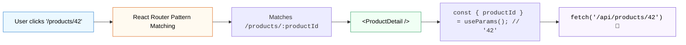

## 🚏 1. Dynamic Routing Architecture



---

## 🛠️ 2. កូដគំរូ: `useParams` & `useNavigate`

```jsx
import { useParams, useNavigate } from 'react-router-dom';

export default function ProductDetail() {
  const { productId } = useParams();
  const navigate = useNavigate();

  const handleBuyNow = () => {
    // ធ្វើការទូទាត់ប្រាក់...
    alert("ការទិញបានជោគជ័យ!");
    
    // បញ្ជា Redirect ទៅកាន់ទំព័រជោគជ័យ
    navigate('/checkout/success', { replace: true });
  };

  return (
    <div className="p-6 max-w-md mx-auto border rounded-2xl bg-white shadow-sm">
      <button 
        onClick={() => navigate(-1)} // ត្រឡប់ក្រោយ (Go Back)
        className="text-sm text-blue-600 font-bold mb-4"
      >
        ← ត្រឡប់ក្រោយ
      </button>

      <h2 className="text-2xl font-bold">ព័ត៌មានលម្អិតផលិតផល #{productId}</h2>
      <p className="text-gray-600 my-4">នេះជាទំព័របង្ហាញព័ត៌មានជាក់លាក់តាម ID...</p>

      <button 
        onClick={handleBuyNow}
        className="w-full py-2.5 bg-emerald-600 text-white font-bold rounded-xl hover:bg-emerald-700"
      >
        ទិញឥឡូវនេះ
      </button>
    </div>
  );
}
```
