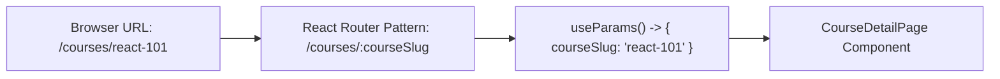

## 📍 1. Dynamic Route Matching



---

## 🔗 2. URL Parameters in Code

### 🌐 Normal HTML Links:

```html
<!-- HTML Product Links with Dynamic IDs -->
<a href="/products/1">iPhone 15</a>
<a href="/products/2">MacBook Pro</a>
```

### 💻 React Router Code:

```jsx
// src/pages/ProductDetail.jsx
import { useParams, useNavigate } from 'react-router-dom';

export function ProductDetail() {
  // 1. ទាញយក dynamic parameter ':id' ពី URL
  const { id } = useParams();
  
  // 2. Navigation Hook
  const navigate = useNavigate();

  return (
    <div className="p-4 bg-white dark:bg-slate-800 rounded-2xl shadow">
      <h3 className="font-bold">📱 ព័ត៌មានលម្អិតទំនិញ ID: #{id}</h3>
      <button
        onClick={() => navigate('/products')} // Programmatic Navigation
        className="mt-3 px-3 py-1 bg-slate-100 dark:bg-slate-700 text-xs rounded font-bold"
      >
        ← ត្រឡប់ក្រោយ
      </button>
    </div>
  );
}
```

### 🔍 ការពន្យល់មួយជួរៗ (Line-by-Line Explanation):

1. `const { id } = useParams();`
   - ទាញយកតម្លៃពី URL Path។ បើ User បើក `/products/42` នោះ `id` នឹងមានតម្លៃស្មើ `'42'`។
2. `const navigate = useNavigate();`
   - ផ្តល់ Function សម្រាប់ប្តូរទំព័រតាមរយៈ JavaScript Code (ដូចជា ក្រោយ submit form ឬចុចប៊ូតុង Back)។
3. `navigate('/products')`
   - នាំ User ត្រឡប់ទៅកាន់បញ្ជី Products វិញភ្លាមៗ។
