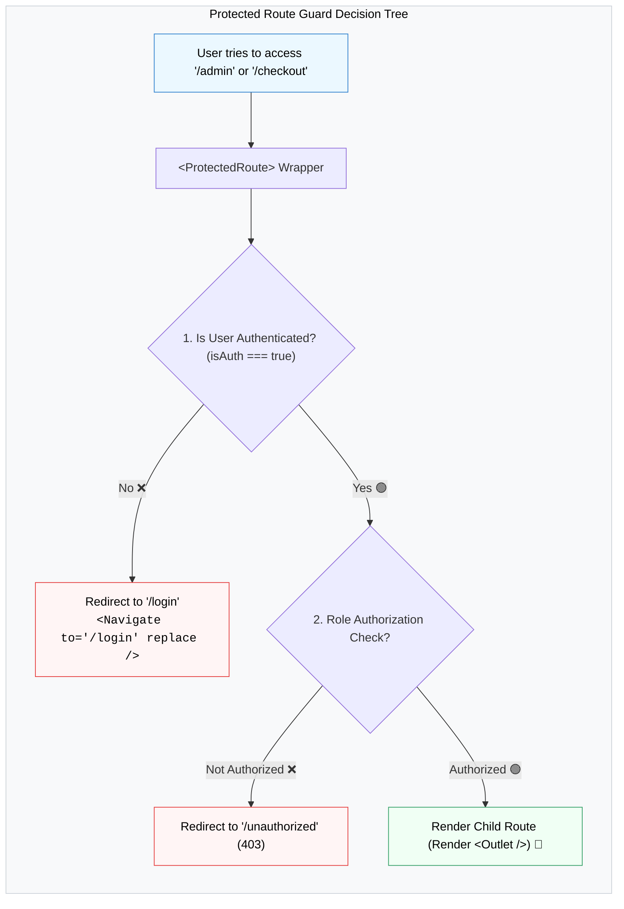

## 🛡️ 1. Protected Route Guard Architecture



---

## 🛠️ 2. កូដគំរូអនុវត្តជាក់ស្តែង

### ក. បង្កើត `ProtectedRoute.jsx`
```jsx
import { Navigate, Outlet, useLocation } from 'react-router-dom';

export function ProtectedRoute({ isAuthenticated }) {
  const location = useLocation();

  if (!isAuthenticated) {
    // Redirect ទៅ login page និងរក្សាទុកទំព័រដែលចង់ទៅក្នុង state
    return <Navigate to="/login" state={{ from: location }} replace />;
  }

  return <Outlet />;
}
```

### ខ. កំណត់ Route ក្នុង `App.jsx`
```jsx
import { BrowserRouter, Routes, Route } from 'react-router-dom';
import { ProtectedRoute } from './components/ProtectedRoute';

export default function App() {
  const isAuth = true; // ឧទាហរណ៍ពី Auth State

  return (
    <BrowserRouter>
      <Routes>
        {/* Public Routes */}
        <Route path="/" element={<Home />} />
        <Route path="/login" element={<Login />} />

        {/* Protected Routes Wrapper */}
        <Route element={<ProtectedRoute isAuthenticated={isAuth} />}>
          <Route path="/dashboard" element={<Dashboard />} />
          <Route path="/profile" element={<Profile />} />
        </Route>

        {/* 404 Catch-all */}
        <Route path="*" element={<NotFound />} />
      </Routes>
    </BrowserRouter>
  );
}
```
