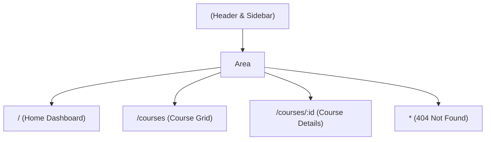

## 🗺️ 1. Portal Application Architecture



---

## 🎨 2. Normal HTML Multi-Page Structure vs React Router Outlet

### 🌐 Normal HTML Master Layout:

```html
<!-- HTML Master Layout -->
<header>
  <h1>Portal Header</h1>
</header>
<div class="layout-body">
  <aside>Sidebar Navigation</aside>
  <!-- Content Area Changes -->
  <main id="content">Dashboard Content</main>
</div>
```

---

## 🚀 3. Complete Integrated Multi-Page Portal

```jsx
import { BrowserRouter, Routes, Route, Link, NavLink, useParams, Outlet } from 'react-router-dom';

// 1. DATA
const COURSES = [
  { id: 'react', title: 'React Mastery', desc: 'Hooks, State, Architecture' },
  { id: 'nextjs', title: 'Next.js 15 Fullstack', desc: 'App Router & SSR' },
];

// 2. ROOT LAYOUT
function AppLayout() {
  return (
    <div className="min-h-screen bg-slate-50 dark:bg-slate-900">
      <header className="p-4 bg-white dark:bg-slate-800 border-b flex justify-between items-center">
        <h1 className="font-black text-lg text-blue-600">🎓 Portal App</h1>
        <nav className="flex gap-4 text-xs font-bold">
          <NavLink to="/" className={({ isActive }) => (isActive ? 'text-blue-600' : 'text-slate-500')}>
            Home
          </NavLink>
          <NavLink to="/courses" className={({ isActive }) => (isActive ? 'text-blue-600' : 'text-slate-500')}>
            Courses
          </NavLink>
        </nav>
      </header>

      <main className="p-6 max-w-2xl mx-auto">
        {/* Child routes render here */}
        <Outlet />
      </main>
    </div>
  );
}

// 3. PAGES
function Home() {
  return <div><h2 className="text-xl font-bold mb-2">👋 Welcome Home!</h2><p className="text-xs text-slate-500">ស្វាគមន៍មកកាន់ Learning Portal</p></div>;
}

function CourseList() {
  return (
    <div>
      <h2 className="text-xl font-bold mb-4">📚 Available Courses</h2>
      <div className="space-y-2">
        {COURSES.map((c) => (
          <div key={c.id} className="p-4 bg-white dark:bg-slate-800 rounded-xl shadow border flex justify-between items-center">
            <div>
              <h4 className="font-bold text-sm">{c.title}</h4>
              <p className="text-xs text-slate-400">{c.desc}</p>
            </div>
            <Link to={`/courses/${c.id}`} className="px-3 py-1 bg-blue-600 text-white rounded-lg text-xs font-bold">
              View Details →
            </Link>
          </div>
        ))}
      </div>
    </div>
  );
}

function CourseDetail() {
  const { id } = useParams();
  const course = COURSES.find((c) => c.id === id);

  if (!course) return <p className="text-red-500 text-xs">Course មិនមានឡើយ!</p>;

  return (
    <div className="p-6 bg-white dark:bg-slate-800 rounded-2xl shadow border space-y-2">
      <h2 className="text-xl font-black text-blue-600">{course.title}</h2>
      <p className="text-sm text-slate-600 dark:text-slate-300">{course.desc}</p>
      <Link to="/courses" className="inline-block mt-4 text-xs font-bold text-slate-500 hover:underline">
        ← Back to all courses
      </Link>
    </div>
  );
}

function NotFound() {
  return <div className="text-center py-12"><h2 className="text-3xl font-black text-red-500 mb-2">404</h2><p className="text-xs text-slate-400">រកមិនឃើញទំព័រនេះឡើយ!</p></div>;
}

export default function PortalMiniProject() {
  return (
    <BrowserRouter>
      <Routes>
        <Route path="/" element={<AppLayout />}>
          <Route index element={<Home />} />
          <Route path="courses" element={<CourseList />} />
          <Route path="courses/:id" element={<CourseDetail />} />
          <Route path="*" element={<NotFound />} />
        </Route>
      </Routes>
    </BrowserRouter>
  );
}
```
