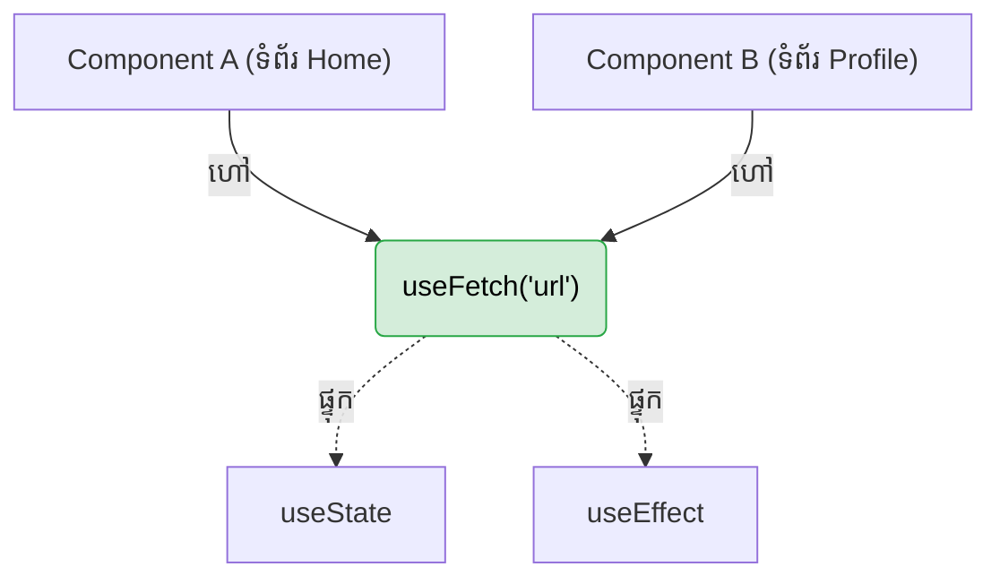

## 🪝 អ្វីទៅជា Custom Hooks?

នៅក្នុងមេរៀនមុនៗ (មេរៀន API) អ្នកបានឃើញហើយថា ដើម្បីហៅទិន្នន័យពី Internet ម្តងៗ យើងត្រូវសរសេរកូដ `useState` ៣ ដង និង `useEffect` យ៉ាងវែងអន្លាយ។
ចុះបើអ្នកមាន Component ចំនួន ៥ ដែលត្រូវការហៅទិន្នន័យដូចគ្នា? អ្នកមិនអាចចម្លង (Copy-Paste) កូដវែងនោះ ៥ ដងទេ!

នៅពេលនេះហើយដែល **Custom Hooks** ចូលខ្លួនមកដោះស្រាយ។ វាគឺជាអនុគមន៍ JavaScript ធម្មតាមួយ ប៉ុន្តែវាអាចអោបក្រសោប Hooks ផ្សេងៗរបស់ React នៅខាងក្នុងវាបាន។



---

## 📜 ច្បាប់មាសនៃ Hooks (Rules of Hooks)

មុននឹងបង្កើតវា អ្នកត្រូវចាំច្បាប់ចំនួន ២ សិន៖
1. **ត្រូវផ្តើមដោយពាក្យ `use` ជានិច្ច:** ឧទាហរណ៍ `useFetch`, `useWindowSize`, `useAuth`។ បើអ្នកមិនដាក់វា React នឹងមិនដឹងថាវាជា Hook ទេ ហើយនឹងលោត Error បើអ្នកដាក់ State ខាងក្នុងវា។
2. **ហាមហៅ Hooks នៅខាងក្នុងលក្ខខណ្ឌ (`if`), `loops`, ឫអនុគមន៍ធម្មតា:** Hooks ត្រូវតែស្ថិតនៅជួរខាងលើគេបង្អស់នៃ Component ឫ Custom Hook របស់អ្នកជានិច្ច។

---

## 🛠️ ការបង្កើត `useFetch` ផ្ទាល់ខ្លួន

នេះជារបៀបដែលយើងដកស្រង់កូដ API ដ៏វែងអន្លាយ មកធ្វើជា Custom Hook:

```jsx
// ឯកសារ: hooks/useFetch.js
import { useState, useEffect } from 'react';

// 1. បង្កើតអនុគមន៍ផ្តើមដោយ use
export function useFetch(url) {
  // 2. ផ្ទុក State
  const [data, setData] = useState(null);
  const [loading, setLoading] = useState(true);
  const [error, setError] = useState(null);

  // 3. ផ្ទុក Effect
  useEffect(() => {
    const fetchData = async () => {
      try {
        setLoading(true);
        const response = await fetch(url);
        if (!response.ok) throw new Error("មានបញ្ហា!");
        const json = await response.json();
        setData(json);
      } catch (err) {
        setError(err.message);
      } finally {
        setLoading(false);
      }
    };

    fetchData();
  }, [url]); // រត់សារថ្មីបើ URL ផ្លាស់ប្តូរ

  // 4. បញ្ជូនទិន្នន័យត្រលប់ទៅវិញ (អាចបញ្ជូនជា Array ឫ Object)
  return { data, loading, error };
}
```

### ភាពស្រស់ស្អាតនៃការប្រើប្រាស់ (Usage)

ពេលនេះ Component របស់អ្នកនឹងខ្លី និងស្រស់ស្អាតមែនទែន!

```jsx
import { useFetch } from './hooks/useFetch';

function UserList() {
  // គ្រាន់តែហៅមួយជួរ គឺចប់! វានឹងទទួលបានទិន្នន័យពី Hook ដោយស្វ័យប្រវត្តិ
  const { data: users, loading, error } = useFetch('https://api.example.com/users');

  if (loading) return <p>Loading...</p>;
  if (error) return <p>Error: {error}</p>;

  return (
    <ul>
      {users.map(user => <li key={user.id}>{user.name}</li>)}
    </ul>
  );
}
```
> **⚡ ចំណាំ:** Custom Hooks ចែករំលែក **"តក្កវិទ្យា (Stateful Logic)"** មិនមែនចែកចាយ **"ទិន្នន័យ (State តែមួយ)"** ទេ។ ប្រសិនបើ Component ២ ផ្សេងគ្នាហៅ `useFetch`, វានឹងបង្កើតប្រអប់ State (Data, Loading, Error) ចំនួន ២ ដាច់ដោយឡែកពីគ្នា!
