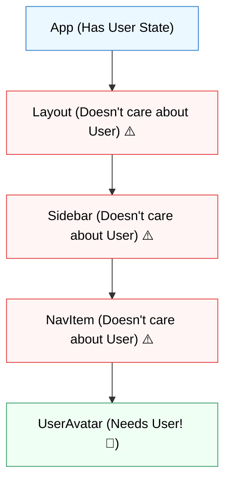

## 🕳️ 1. The Prop Drilling Hierarchy Problem



---

## 💻 2. Prop Drilling in Code vs Direct Context Access

### ❌ Code បង្ហាញពី Prop Drilling Problem:

```jsx
// App.jsx (Top)
function App() {
  const [user] = useState({ name: 'Sok Dara', avatar: '/dara.jpg' });
  // ⚠️ ត្រូវបាញ់ user កាត់ Layout
  return <Layout user={user} />;
}

// Layout.jsx (Middle — មិនត្រូវការ user ទេតែត្រូវបញ្ជូនបន្ត)
function Layout({ user }) {
  return <Sidebar user={user} />;
}

// Sidebar.jsx (Middle — មិនត្រូវការ user ទេតែត្រូវបញ្ជូនបន្ត)
function Sidebar({ user }) {
  return <UserAvatar user={user} />;
}

// UserAvatar.jsx (Target Leaf Node)
function UserAvatar({ user }) {
  return ;
}
```

### 🔍 ការពន្យល់មួយជួរៗ (Line-by-Line Explanation):

1. `Layout({ user })` និង `Sidebar({ user })`
   - Components នៅកណ្តាលមិនបានយក `user` មកប្រើប្រាស់ផ្ទាល់ខ្លួនឡើយ តែត្រូវបង្ខំចិត្តសរសេរ `user={user}` គ្រប់ទីកន្លែង។
2. **Maintenance Nightmare:** ប្រសិនបើយើងចង់ប្តូរឈ្មោះ prop ពី `user` ទៅ `currentUser` យើងត្រូវតាមកែប្រែគ្រប់ intermediate files ទាំងអស់!

---

## 🚀 3. Solution Preview: React Context API

ជាមួយ React Context API ឬ Zustand យើងអាចបង្កើត **Direct Tunnel**:

```jsx
// 1. UserAvatar អាចទាញយកទិន្នន័យផ្ទាល់ពី Context ដោយមិនឆ្លងកាត់ Layout/Sidebar ឡើយ!
function UserAvatar() {
  const user = useUser(); // ✅ Direct Access (0 Intermediate Props!)
  return ;
}
```
