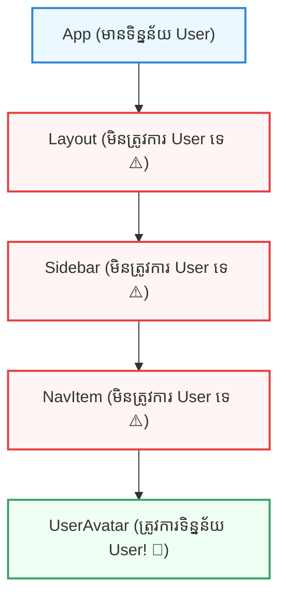

## 🕳️ ១. Prop Drilling ជាអ្វី? (បញ្ហា Component ច្រើនជាន់)

ស្រមៃមើលស្ថានភាពមួយ៖ អ្នកចង់ផ្ញើកញ្ចប់ឥវ៉ាន់មួយទៅកាន់មិត្តភក្តិនៅជាន់ទី ៤ នៃអគារមួយ។  
ប៉ុន្តែអ្នកមិនអាចដើរឡើងទៅជាន់ទី ៤ ដោយផ្ទាល់បានទេ — អ្នកត្រូវហុចឥវ៉ាន់ទៅឱ្យអ្នកជាន់ទី ១ ➔ អ្នកជាន់ទី ១ ហុចបន្តទៅអ្នកជាន់ទី ២ ➔ អ្នកជាន់ទី ២ ហុចទៅអ្នកជាន់ទី ៣ ➔ ទើបដល់ដៃមិត្តភក្តិរបស់អ្នក!



> [!IMPORTANT]
> **និយមន័យ Prop Drilling ៖**  
> គឺជាដំណើរការនៃការបញ្ជូន `props` ពី Component មេខាងលើ ឆ្លងកាត់ Components កូនៗជាច្រើននៅកណ្តាល ដែល **មិនត្រូវការប្រើប្រាស់ Props ទាំងនោះសោះ** ដោយគ្រាន់តែធ្វើជាស្ពានចម្លងទៅឱ្យ Component ខាងក្រោមបង្អស់!

---

## 🎮 ២. Interactive Simulator — សាកល្បង Prop Drilling vs Context API

ខាងក្រោមនេះជា Simulator បង្ហាញភាពខុសគ្នារវាងការបញ្ជូនតាម Prop Drilling ធៀបនឹងការប្រើ Context API៖

```reactdiagram
ContextAPI
```

> [!TIP]
> **សាកល្បងពិសោធន៍:**
> 1. ចុចជ្រើសរើស **"Props"** រួចចុច **"Pass Data"** ➔ សង្កេតមើលទិន្នន័យត្រូវធ្វើដំណើរម្តងមួយកម្រិតឆ្លងកាត់ Layout, Sidebar, និង NavItem យ៉ាងយឺត។
> 2. ចុចជ្រើសរើស **"Context"** រួចចុច **"Pass Data"** ➔ ទិន្នន័យធ្វើដំណើរដូច **Teleportation** ផ្ទាល់ពី Top Provider ទៅដល់ UserAvatar ភ្លាមៗតែម្តង!

---

## 💻 ៣. ឧទាហរណ៍កូដ Prop Drilling និងផលប៉ះពាល់

### ❌ កូដដែលមានបញ្ហា Prop Drilling:

```jsx
// 1. App.jsx (Top Component)
function App() {
  const [user] = useState({ name: 'Sok Dara', avatar: '/dara.jpg' });

  // ⚠️ ត្រូវបាញ់ user ទៅ Layout
  return <Layout user={user} />;
}

// 2. Layout.jsx (កណ្តាល — មិនប្រើ user ទេ តែត្រូវទទួលបន្ត)
function Layout({ user }) {
  return (
    <div className="layout">
      <Sidebar user={user} />
    </div>
  );
}

// 3. Sidebar.jsx (កណ្តាល — មិនប្រើ user ទេ តែត្រូវទទួលបន្ត)
function Sidebar({ user }) {
  return (
    <aside>
      <UserAvatar user={user} />
    </aside>
  );
}

// 4. UserAvatar.jsx (Target — ត្រូវការ user ពិតប្រាកដ)
function UserAvatar({ user }) {
  return ;
}
```

### 💣 ហេតុអ្វីបានជារបៀបនេះជាបញ្ហា?
1. **កូដចង្អៀត និងស្ទួន (Boilerplate):** Components នៅកណ្តាល (`Layout`, `Sidebar`) ត្រូវបង្ខំចិត្តប្រកាស props ដែលខ្លួនមិនប្រើ។
2. **ពិបាកកែសម្រួល (Refactoring Nightmare):** បើថ្ងៃក្រោយអ្នកចង់ប្តូរឈ្មោះ prop ពី `user` ទៅ `currentUser` អ្នកត្រូវតាមកែប្រែគ្រប់ files ទាំងអស់នៅកណ្តាល!

---

## 🚀 ៤. ដំណោះស្រាយ ៖ Direct Access ជាមួយ Context API

ជាមួយ **React Context API** យើងបង្កើត **Direct Tunnel (ផ្លូវកាត់ផ្ទាល់)** ៖

```jsx
// UserAvatar.jsx អាចអានទិន្នន័យពី UserContext ដោយផ្ទាល់ 0 Prop Drilling!
import { useUser } from './context/UserContext';

function UserAvatar() {
  const user = useUser(); // ✅ ទាញយកដោយផ្ទាល់ មិនបាច់ឆ្លងកាត់ Layout ឬ Sidebar ឡើយ!

  return ;
}
```

---

## 🧠 ៥. សង្ខេប Mental Model ងាយចាំ (Cheat Sheet)

| ចំណុចប្រៀបធៀប | Prop Drilling (Props ធម្មតា) | Context API (Global State) |
| :--- | :--- | :--- |
| **ទម្រង់បញ្ជូន** | បញ្ជូនពីលើចុះក្រោមតាមជាន់នីមួយៗ | បង្កើត Provider នៅលើ ➔ Consumer ចាប់យកផ្ទាល់ |
| **កម្រិតសមស្រប** | សមស្របសម្រាប់ Component ១ ទៅ ២ ជាន់ | សមស្របសម្រាប់ Component លើសពី ៣ ជាន់ឡើងទៅ |
| **ការកែប្រែកូដ** | ពិបាកកែព្រោះជាប់ពាក់ព័ន្ធច្រើន files | ងាយស្រួល ព្រោះកែតែ Consumer និង Provider |
| **ករណីប្រើប្រាស់ទូទៅ** | បញ្ជូនទិន្នន័យក្នុង Component កូនៗផ្ទាល់ខ្លួន | User Auth, Theme (Dark/Light), Cart, Language |
