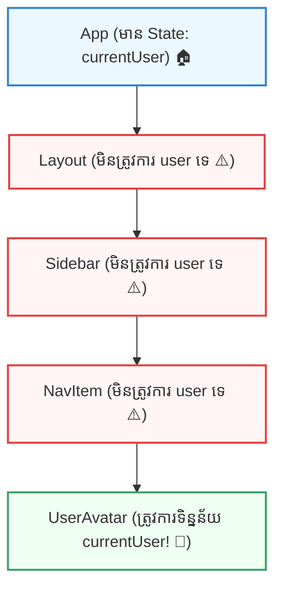
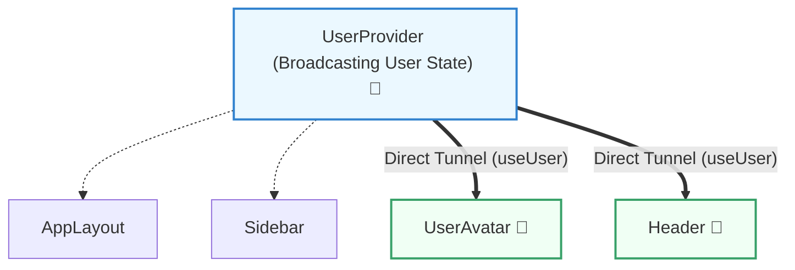

## 🕳️ ១. Prop Drilling ជាអ្វី? (The Intermediate Component Problem)

នៅក្នុង React ទិន្នន័យតែងតែធ្វើដំណើរក្នុងទិសដៅតែមួយពីលើចុះក្រោម ហៅថា **Unidirectional Data Flow** (Top-down)។ នៅពេលដែល App របស់អ្នករីកធំឡើង Component Tree នឹងកាន់តែមានជម្រៅជ្រៅ។

ស្រមៃមើលស្ថានភាពជាក់ស្តែង៖ អ្នកមានទិន្នន័យ `currentUser` នៅលើកំពូលគេ (`App`) ហើយអ្នកចង់បង្ហាញរូប Profile នៅលើ `UserAvatar` ដែលស្ថិតនៅជាន់ទី ៤ ខាងក្នុងគេបង្អស់។



> [!IMPORTANT]
> **និយមន័យ Prop Drilling ៖**  
> គឺជាដំណើរការនៃការបញ្ជូន `props` ពី Parent Component ខាងលើ ឆ្លងកាត់ Components កូនៗជាច្រើននៅកណ្តាល (Intermediate Components) ដែល **មិនត្រូវការប្រើប្រាស់ Props ទាំងនោះសោះ** ដោយគ្រាន់តែធ្វើជាស្ពានចម្លងបន្តទៅឱ្យ Component ខាងក្រោមបង្អស់!

---

## 🎮 ២. Interactive Simulator — សាកល្បង Prop Drilling vs Context API

ខាងក្រោមនេះជា Simulator បង្ហាញភាពខុសគ្នារវាងការបញ្ជូនតាម Prop Drilling ធៀបនឹងការប្រើ Context API៖

```reactdiagram
ContextAPI
```

> [!TIP]
> **ការពិសោធន៍ជាក់ស្តែង:**
> 1. ចុចជ្រើសរើស **"Props"** រួចចុច **"Pass Data"** ➔ សង្កេតមើលទិន្នន័យត្រូវធ្វើដំណើរម្តងមួយកម្រិតឆ្លងកាត់ Layout, Sidebar, និង NavItem យ៉ាងយឺត។
> 2. ចុចជ្រើសរើស **"Context"** រួចចុច **"Pass Data"** ➔ ទិន្នន័យធ្វើដំណើរដូច **Teleportation** ផ្ទាល់ពី Top Provider ទៅដល់ UserAvatar ភ្លាមៗតែម្តង!

---

## 💻 ៣. ឧទាហរណ៍កូដ Prop Drilling និងផលប៉ះពាល់ជាក់ស្តែង

### ❌ កូដដែលមានបញ្ហា Prop Drilling (៤ ជាន់):

```jsx
// 1. App.jsx (Top Component — កន្លែងបង្កើត State)
import { useState } from 'react';

export default function App() {
  const [user, setUser] = useState({
    name: 'Sok Dara',
    role: 'Frontend Developer',
    avatar: 'https://images.unsplash.com/photo-1534528741775-53994a69daeb?w=100',
  });

  // ⚠️ ត្រូវបាញ់ user និង onLogout ទៅកាន់ Layout
  return <AppLayout user={user} onLogout={() => setUser(null)} />;
}

// 2. AppLayout.jsx (Intermediate Component ១)
function AppLayout({ user, onLogout }) {
  // ⚠️ Layout ខ្លួនឯងមិនត្រូវការ user ទេ ប៉ុន្តែត្រូវទទួលបន្តដើម្បីហុចទៅ Sidebar
  return (
    <div className="flex h-screen bg-slate-100">
      <Sidebar user={user} onLogout={onLogout} />
      <main className="flex-1 p-6">Main Content Area</main>
    </div>
  );
}

// 3. Sidebar.jsx (Intermediate Component ២)
function Sidebar({ user, onLogout }) {
  // ⚠️ Sidebar ក៏មិនត្រូវការ user ដែរ តែត្រូវហុចទៅ NavProfile
  return (
    <aside className="w-64 bg-white border-r p-4 flex flex-col justify-between">
      <nav>Sidebar Navigation Links</nav>
      <NavProfile user={user} onLogout={onLogout} />
    </aside>
  );
}

// 4. NavProfile.jsx (Intermediate Component ៣)
function NavProfile({ user, onLogout }) {
  // ⚠️ NavProfile ក៏គ្រាន់តែជា Container ហុចបន្ត
  return (
    <div className="border-t pt-4">
      <UserAvatar user={user} />
      <button onClick={onLogout} className="text-xs text-rose-500 mt-2">
        Logout
      </button>
    </div>
  );
}

// 5. UserAvatar.jsx (Target Component — ត្រូវការទិន្នន័យ user ពិតប្រាកដ)
function UserAvatar({ user }) {
  if (!user) return <div className="text-xs text-slate-400">Guest User</div>;

  return (
    <div className="flex items-center gap-3">
      
      <div>
        <p className="text-sm font-bold text-slate-800">{user.name}</p>
        <p className="text-xs text-slate-500">{user.role}</p>
      </div>
    </div>
  );
}
```

### 💣 ហេតុអ្វីបានជា Prop Drilling បង្កជាបញ្ហាធ្ងន់ធ្ងរ?

1. **កូដចង្អៀត និងស្ទួន (Boilerplate Bloat):** Components នៅកណ្តាល (`AppLayout`, `Sidebar`, `NavProfile`) ត្រូវបង្ខំចិត្តប្រកាស props ក្នុង parameter list និង forward បន្ត ដែលធ្វើឱ្យកូដស្មុគស្មាញដោយឥតប្រយោជន៍។
2. **ពិបាកកែសម្រួល (Refactoring Nightmare):** ប្រសិនបើអ្នកចង់ប្តូរឈ្មោះ prop ពី `user` ទៅ `currentUser` ឬចង់បន្ថែម `theme` prop មួយទៀត អ្នកត្រូវបើកកែប្រែគ្រប់ files ទាំងអស់នៅកណ្តាល!
3. **បាត់បង់ភាពឯករាជ្យនៃ Component (Tight Coupling):** Components នៅកណ្តាលមិនអាចយកទៅ reuse នៅកន្លែងផ្សេងបានដោយងាយស្រួលឡើយ ព្រោះវាជាប់ជំពាក់នឹង props ដែលខ្លួនមិនបានប្រើ។
4. **ងាយនឹងបាត់បង់ទិន្នន័យ (Prop Loss):** ប្រសិនបើ developer ម្នាក់ភ្លេច pass prop នៅជាន់ណាមួយ កម្មវិធីនឹង crash ឬកើត error `Cannot read properties of undefined`។

---

## 🧩 ៤. ដំណោះស្រាយបឋម ៖ Component Composition (Children / Slots Pattern)

មុននឹងប្រញាប់ប្រញាល់បង្កើត Global State ឬ Context API ជានិច្ច សូមចងចាំថា **Component Composition** គឺជាដំណោះស្រាយស្អាតបំផុតក្នុង React!

ជំនួសឱ្យការបញ្ជូន data កាត់ intermediate components យើងអាចបញ្ជូន **JSX Component ផ្ទាល់** តាមរយៈ `children` prop៖

```jsx
// App.jsx (Top Component)
export default function App() {
  const [user, setUser] = useState({ name: 'Sok Dara', avatar: '/dara.jpg' });

  return (
    <AppLayout
      sidebar={
        <Sidebar>
          {/* ✅ UserAvatar ទទួល user ដោយផ្ទាល់ពី App! */}
          <UserAvatar user={user} onLogout={() => setUser(null)} />
        </Sidebar>
      }
    >
      <main>Content</main>
    </AppLayout>
  );
}

// AppLayout.jsx — មិនបាច់ស្គាល់ user prop ឡើយ!
function AppLayout({ sidebar, children }) {
  return (
    <div className="flex">
      {sidebar}
      {children}
    </div>
  );
}

// Sidebar.jsx — គ្រាន់តែ render children
function Sidebar({ children }) {
  return <aside>{children}</aside>;
}
```

> [!TIP]
> **ពេលណាគួរប្រើ Component Composition?**  
> នៅពេលដែលទិន្នន័យត្រូវបានប្រើប្រាស់ដោយ Component តែមួយ ឬពីរ ប៉ុន្តែវាគ្រាន់តែស្ថិតនៅជ្រៅក្នុង Layout Hierarchy។ វិធីនេះជួយលុបបំបាត់ Prop Drilling ដោយមិនបាច់បង្កើត Context ឡើយ!

---

## 🚀 ៥. ដំណោះស្រាយកម្រិតខ្ពស់ ៖ Direct Access ជាមួយ Context API

នៅពេលដែលទិន្នន័យត្រូវប្រើប្រាស់ដោយ Components ជាច្រើននៅរាយប៉ាយពេញកម្មវិធី (ដូចជា Current User, Theme, Cart, Multi-language) **React Context API** គឺជាដំណោះស្រាយដ៏មានឥទ្ធិពលបំផុត៖



```jsx
// ក្នុង UserAvatar.jsx — អាន State ដោយផ្ទាល់ 0 Prop Drilling!
import { useUser } from '../context/UserContext';

function UserAvatar() {
  const { user } = useUser(); // ✨ ទាញយកទិន្នន័យដោយផ្ទាល់

  if (!user) return <span>Guest</span>;
  return ;
}
```

---

## 🧠 ៦. តារាងប្រៀបធៀបយុទ្ធសាស្ត្រគ្រប់គ្រង State (Decision Matrix)

| លក្ខណៈវិនិច្ឆ័យ | Props ធម្មតា | Component Composition | Context API | External State Library (Zustand/Redux) |
| :--- | :--- | :--- | :--- | :--- |
| **ជម្រៅ Component Tree** | ១ ទៅ ២ ជាន់ | ២ ទៅ ៣ ជាន់ | ៣ ជាន់ឡើងទៅ | ទូទាំង App ធំៗ |
| **ចំនួន Consumer** | ១ ទៅ ២ Components | ១ Component | ច្រើន Components ក្នុង Subtree | រាប់សិប Components ពេញ App |
| **កម្រិតភាពស្មុគស្មាញ** | ទាបបំផុត (Zero overhead) | ទាប (ប្រើប្រាស់ JSX) | មធ្យម (Provider + Hook) | ខ្ពស់ (Store + Selectors) |
| **ការ Re-render** | កើតលើ Component ដែលទទួល | កើតលើ Component ដែលទទួល | កើតលើរាល់ Consumer ដែល Subscribe | កើតតែលើ Selector ជាក់លាក់ |
| **ករណីប្រើប្រាស់ល្អបំផុត** | Local UI State, Buttons, Inputs | Layouts, Modal dialogs, Drawers | Auth, Theme, Language, Notifications | E-Commerce Cart, Complex Caching |

---

## 📋 ៧. សង្ខេបចំណុចសំខាន់ៗ (Key Takeaways)

- **Prop Drilling** មិនមែនជា Bug ទេ តែជា Code Smell ដែលកើតឡើងនៅពេល Component Tree ជ្រៅ ហើយធ្វើឱ្យកូដពិបាកកែសម្រួល (Tightly Coupled)។
- កុំប្រញាប់ប្រញាល់បង្កើត Global State គ្រប់ពេល! សាកល្បង **Component Composition (`children` prop)** ជាមុនសិន។
- ប្រើ **Context API** នៅពេលដែលទិន្នន័យពិតជា "Global" (មាន Consumers ច្រើននៅទីតាំងខុសៗគ្នា) ដូចជា Auth Session, Theme Mode, ឬ Shopping Cart។
