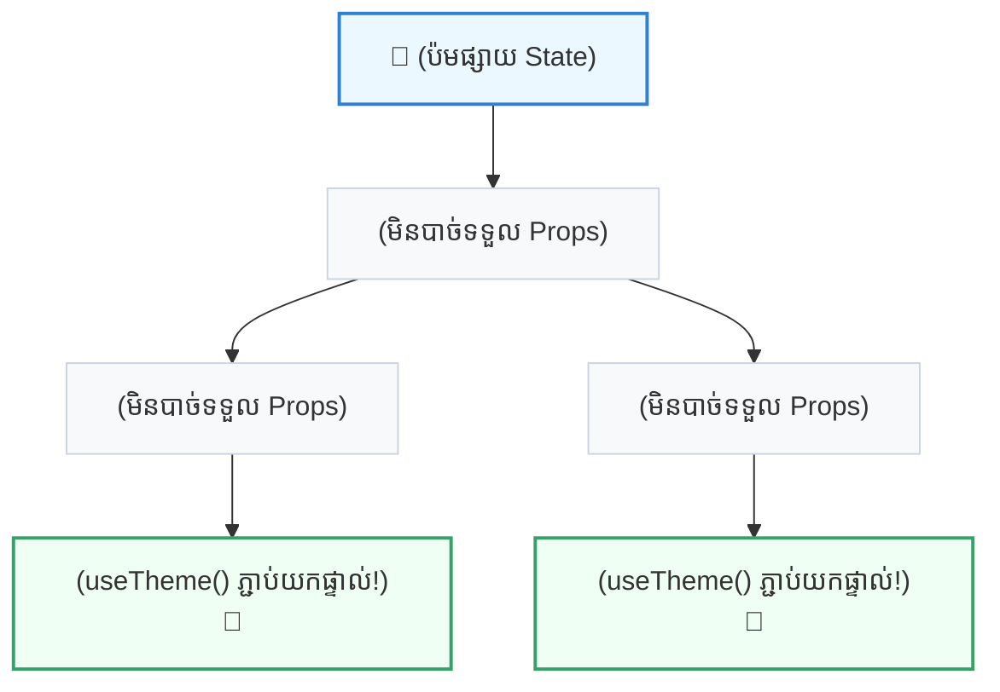

## 🌐 ១. គោលការណ៍ Provider & Consumer (Mental Model)

ដើម្បីយល់ពីដំណើរការនៃ Context API សូមស្រមៃមើល **«ប៉មផ្សាយសញ្ញា Wi-Fi»** 📶 នៅក្នុងអគារមួយ៖
- **Provider (ប៉មបញ្ជូនសញ្ញា):** ដាក់នៅជាន់លើគេនៃអគារ ហើយធ្វើការផ្សាយរលកសញ្ញា (State & Functions) ចេញមកក្រៅ។
- **Consumers (ទូរស័ព្ទ / កុំព្យូទ័រ):** គ្រប់ឧបករណ៍ដែលស្ថិតនៅក្នុងរង្វង់គ្របដណ្តប់នៃអគារនោះ អាចភ្ជាប់យកសញ្ញា Wi-Fi (`useContext`) មកប្រើប្រាស់បានភ្លាមៗ ដោយមិនចាំបាច់តខ្សែឆ្លងកាត់ជាន់នីមួយៗឡើយ!



---

## 🛠️ ២. សសរស្តម្ភទាំង ៣ នៃ Context API (The 3 Core Pillars)

```
[ជំហាន ១: createContext] ➔ [ជំហាន ២: Context.Provider] ➔ [ជំហាន ៣: useContext]
    (បង្កើតបំពង់បង្ហូរ)              (ផ្សាយទិន្នន័យ)                 (ទាញយកមកប្រើប្រាស់)
```

### ១. `createContext(defaultValue)`
បង្កើត Context Object មួយ។ `defaultValue` គឺសម្រាប់ជា **Fallback** ក្នុងករណី Component មួយហៅប្រើ Context ដោយមិនមាន Provider រុំព័ទ្ធពីលើ។ ជាទូទៅគេកំណត់វាជា `null` ដើម្បីងាយស្រួលឆែក Error។

### ២. `<Context.Provider value={currentValue}>`
ជា React Component ដែលរុំព័ទ្ធ Subtree នៃ Components របស់អ្នក។ រាល់ Consumer ទាំងអស់ដែលនៅខាងក្រោម Provider នេះ នឹងទទួលបានតម្លៃដែលបញ្ជូនតាមរយៈ `value` prop។

### ៣. `useContext(ContextObject)`
ជា React Hook ដែលអនុញ្ញាតឱ្យ Functional Component ណាមួយអាចអានតម្លៃបច្ចុប្បន្នពី Provider ដែលនៅជិតបំផុតពីខាងលើ។

---

## 💻 ៣. ការអនុវត្តជាក់ស្តែង ៖ បង្កើត `ThemeContext.jsx`

យើងរៀបចំ Context ឱ្យមានស្តង់ដារ Clean Architecture ក្នុងឯកសារដាច់ដោយឡែក `src/context/ThemeContext.jsx`៖

```jsx
// src/context/ThemeContext.jsx
import { createContext, useContext, useState, useMemo } from 'react';

// ១. បង្កើត Context Container
export const ThemeContext = createContext(null);

// ២. បង្កើត Custom Provider Component
export function ThemeProvider({ children }) {
  const [theme, setTheme] = useState('light'); // 'light' | 'dark'

  // Function សម្រាប់ Toggle Theme
  const toggleTheme = () => {
    setTheme((prevTheme) => (prevTheme === 'light' ? 'dark' : 'light'));
  };

  // ✅ ប្រើ useMemo ដើម្បីការពារ Unnecessary Re-renders
  const contextValue = useMemo(() => {
    return {
      theme,
      isDark: theme === 'dark',
      toggleTheme,
    };
  }, [theme]);

  return (
    <ThemeContext.Provider value={contextValue}>
      {children}
    </ThemeContext.Provider>
  );
}

// ៣. បង្កើត Safe Custom Hook (Fail-fast pattern)
export function useTheme() {
  const context = useContext(ThemeContext);

  // 🛡️ Error Safety Guard: បញ្ជាក់ប្រាប់ Developer ភ្លាមៗបើភ្លេច Provider
  if (!context) {
    throw new Error('useTheme() ត្រូវតែប្រើប្រាស់នៅខាងក្នុង <ThemeProvider> ប៉ុណ្ណោះ!');
  }

  return context;
}
```

---

## 🚀 ៤. ការផ្គុំ Components និងការហៅប្រើប្រាស់ក្នុង App

ខាងក្រោមនេះជា App ពេញលេញដែលបង្ហាញពីរបៀបប្រើ `ThemeProvider` រួមជាមួយ Child Components ជាច្រើន៖

```jsx
// src/App.jsx
import { ThemeProvider, useTheme } from './context/ThemeContext';

// ── COMPONENT ១: HEADER ──
function Header() {
  const { theme, isDark, toggleTheme } = useTheme();

  return (
    <header className="p-4 border-b border-slate-200 dark:border-slate-800 flex justify-between items-center bg-white dark:bg-slate-900 transition-colors">
      <div className="flex items-center gap-2">
        <span className="text-xl">🌐</span>
        <h1 className="font-bold text-slate-800 dark:text-white text-sm">
          React Global Theme Switcher
        </h1>
      </div>

      <button
        onClick={toggleTheme}
        className="px-4 py-2 bg-indigo-600 hover:bg-indigo-700 text-white rounded-xl text-xs font-bold transition shadow flex items-center gap-2"
      >
        <span>{isDark ? '☀️' : '🌙'}</span>
        <span>ប្តូរទៅ {isDark ? 'Light Mode' : 'Dark Mode'}</span>
      </button>
    </header>
  );
}

// ── COMPONENT ២: MAIN CONTENT CARD ──
function ProfileCard() {
  const { theme, isDark } = useTheme();

  return (
    <div
      className={`p-6 rounded-2xl m-4 border transition-all duration-300 ${
        isDark
          ? 'bg-slate-800 border-slate-700 text-white shadow-2xl'
          : 'bg-white border-slate-200 text-slate-800 shadow-md'
      }`}
    >
      <div className="flex items-center gap-4">
        <div className="w-12 h-12 rounded-full bg-indigo-500/20 text-indigo-500 flex items-center justify-center font-bold text-lg">
          JD
        </div>
        <div>
          <h2 className="font-bold text-base">John Doe</h2>
          <p className="text-xs opacity-70">Senior React Engineer</p>
        </div>
      </div>

      <div className="mt-4 pt-4 border-t border-slate-200/50 dark:border-slate-700/50 flex justify-between items-center text-xs">
        <span className="opacity-75">ស្ថានភាព Theme បច្ចុប្បន្ន:</span>
        <span className="font-black uppercase tracking-wider px-2.5 py-1 rounded-full bg-indigo-100 dark:bg-indigo-900/40 text-indigo-600 dark:text-indigo-400">
          {theme}
        </span>
      </div>
    </div>
  );
}

// ── ROOT APP COMPONENT ──
export default function App() {
  return (
    <ThemeProvider>
      <div className="min-h-[400px] max-w-md mx-auto my-8 bg-slate-50 dark:bg-slate-950 rounded-3xl overflow-hidden shadow-2xl border border-slate-200 dark:border-slate-800">
        <Header />
        <main className="p-2">
          <ProfileCard />
        </main>
      </div>
    </ThemeProvider>
  );
}
```

---

## 🔍 ៥. ការពន្យល់កូដមួយជំហានៗ (Line-by-Line Breakdown)

1. `export const ThemeContext = createContext(null);`
   - បង្កើត Context Container។ យើងដាក់ `null` ជា default ដើម្បីឱ្យ Custom Hook អាចឆែកដឹងថា តើ component កំពុងរត់ក្នុង Provider ឬអត់។
2. `const [theme, setTheme] = useState('light');`
   - រក្សាទុក State ពិតប្រាកដនៅខាងក្នុង `ThemeProvider`។
3. `const contextValue = useMemo(() => ({ theme, isDark, toggleTheme }), [theme]);`
   - ចងក្រង State និង Handlers ចូលក្នុង Object តែមួយ។ ដោយសារមាន `useMemo` Object នេះនឹងមិនត្រូវបានបង្កើតឡើងវិញរាល់ពេល Parent component re-render ឡើយ ដរាបណា `theme` មិនទាន់ផ្លាស់ប្តូរ។
4. `if (!context) throw new Error(...)`
   - **Fail-Fast Error Handling:** បើ Developer ម្នាក់ភ្លេច wrap `<ThemeProvider>` នៅពីលើ ហើយព្យាយាមហៅ `useTheme()` កម្មវិធីនឹងផ្តល់សារព្រមានច្បាស់លាស់ភ្លាមៗ មិនបណ្តោយឱ្យកើត Bug ស្ងាត់ៗឡើយ។

---

## ⚡ ៦. ការយល់ដឹងពី Re-render Gotcha & Best Practices

> [!WARNING]
> **Context Re-render Pitfall ៖**  
> នៅពេលតម្លៃ `value` ក្នុង Provider ផ្លាស់ប្តូរ **រាល់ Component ទាំងអស់ដែលហៅ `useContext` នឹងត្រូវ Re-render ឡើងវិញដោយស្វ័យប្រវត្តិ** ទោះបីជា Component នោះប្រើប្រាស់តែមួយចំណែកតូចនៃ Data ក៏ដោយ!

### 💡 ដំណោះស្រាយដើម្បីបង្កើន Performance:
1. **កុំដាក់ State ទាំងអស់ចូលក្នុង Context តែមួយ:** បំបែកជា Contexts តូចៗតាមមុខងារ (ឧ. `AuthContext`, `ThemeContext`, `CartContext`)។
2. **បំបែក State និង Dispatch (Actions):** បង្កើត `ThemeStateContext` សម្រាប់តែទិន្នន័យ និង `ThemeDispatchContext` សម្រាប់តែ Functions ដូចជា `toggleTheme`។ វិធីនេះ Components ដែលត្រូវការតែប៊ូតុងចុច នឹងមិនចាំបាច់ Re-render ពេល State ផ្លាស់ប្តូរឡើយ!
3. **ប្រើ `useMemo` សម្រាប់ Object Value:** តែងតែរុំ Object នៃ `value` prop ដោយ `useMemo` ជានិច្ច។

---

## 🧠 ៧. សង្ខេប Mental Model ងាយចាំ (Quick Reference)

| ធាតុផ្សំ | កូដសរសេរ | តួនាទីជាក់ស្តែង |
| :--- | :--- | :--- |
| **Context Instance** | `const Ctx = createContext(null)` | បំពង់បង្ហូរទិន្នន័យ (Data Channel) |
| **Provider** | `<Ctx.Provider value={value}>` | អ្នកផ្សាយ និងគ្រប់គ្រង State ទៅកាន់ Subtree |
| **Consumer Hook** | `const data = useContext(Ctx)` | អ្នកចាប់សញ្ញា និង Subscribe យក State |
| **Custom Hook Guard** | `export function useMyCtx() { ... }` | ផ្តល់ Developer Experience ល្អ និងសុវត្ថិភាពខ្ពស់ |
