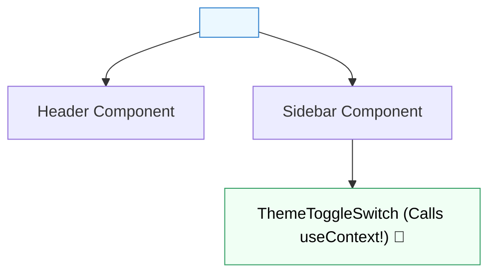

## 🌐 1. Provider-Consumer Mental Model



---

## 💻 2. ThemeContext Setup Step by Step

### 💻 Code សម្រាប់បង្កើត `ThemeContext.jsx`:

```jsx
// src/context/ThemeContext.jsx
import { createContext, useContext, useState } from 'react';

// 1. បង្កើត Context
export const ThemeContext = createContext(null);

// 2. បង្កើត Custom Provider Component
export function ThemeProvider({ children }) {
  const [theme, setTheme] = useState('light');

  const toggleTheme = () => {
    setTheme((prev) => (prev === 'light' ? 'dark' : 'light'));
  };

  return (
    <ThemeContext.Provider value={{ theme, toggleTheme }}>
      {children}
    </ThemeContext.Provider>
  );
}

// 3. Custom Hook ងាយស្រួល Consume
export function useTheme() {
  const context = useContext(ThemeContext);
  if (!context) {
    throw new Error('useTheme must be used within a ThemeProvider');
  }
  return context;
}
```

### 🔍 ការពន្យល់មួយជួរៗ (Line-by-Line Explanation):

1. `createContext(null)`
   - បង្កើត Context Container ថ្មីមួយ។
2. `<ThemeContext.Provider value={{ theme, toggleTheme }}>`
   - បញ្ជូន Object `{ theme, toggleTheme }` ទៅគ្រប់ Components ទាំងអស់ដែលស្ថិតក្រោម `{children}`។
3. `export function useTheme()`
   - បង្កើត Hook ជួយឱ្យ Child Components មិនបាច់សរសេរ `useContext(ThemeContext)` ដដែលៗឡើយ។

---

## 🚀 3. Complete Integrated Theme Switcher App

```jsx
import { ThemeProvider, useTheme } from './context/ThemeContext';

function Header() {
  const { theme, toggleTheme } = useTheme();

  return (
    <header className="p-4 border-b flex justify-between items-center">
      <h1 className="font-bold text-sm">🌐 Global Theme Context</h1>
      <button
        onClick={toggleTheme}
        className="px-3 py-1 bg-blue-600 text-white rounded-lg text-xs font-bold"
      >
        Toggle: {theme === 'light' ? '🌙 Dark' : '☀️ Light'}
      </button>
    </header>
  );
}

function Content() {
  const { theme } = useTheme();

  return (
    <div className={`p-6 rounded-2xl m-4 text-center ${theme === 'dark' ? 'bg-slate-900 text-white' : 'bg-slate-100 text-slate-800'}`}>
      <h3 className="font-black text-lg">Current Theme: {theme}</h3>
      <p className="text-xs opacity-75 mt-1">Component នេះអាន Theme ពី Context ដោយផ្ទាល់ 0 Prop Drilling!</p>
    </div>
  );
}

export default function App() {
  return (
    <ThemeProvider>
      <div className="max-w-md mx-auto bg-white dark:bg-slate-800 rounded-3xl shadow border overflow-hidden">
        <Header />
        <Content />
      </div>
    </ThemeProvider>
  );
}
```
