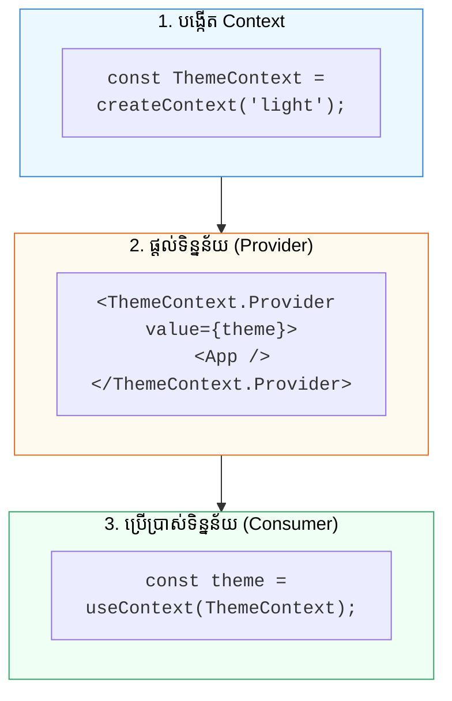

## ⚙️ 1. ជំហានទាំង ៣ នៃ Context API



---

## 🛠️ 2. កូដគំរូអនុវត្តជាក់ស្តែង: Theme Switcher

```jsx
import { createContext, useContext, useState } from 'react';

// 1. បង្កើត Context
const ThemeContext = createContext();

// 2. Child Component ហៅប្រើដោយផ្ទាល់
function ThemeButton() {
  const { isDark, toggleTheme } = useContext(ThemeContext);

  return (
    <button
      onClick={toggleTheme}
      className={`px-4 py-2 rounded-xl font-bold transition ${
        isDark ? 'bg-amber-400 text-slate-900' : 'bg-slate-900 text-white'
      }`}
    >
      {isDark ? '☀️ របៀបពន្លឺ (Light)' : '🌙 របៀបងងឹត (Dark)'}
    </button>
  );
}

// 3. Root App ផ្តល់ Provider
export default function App() {
  const [isDark, setIsDark] = useState(false);
  const toggleTheme = () => setIsDark(!isDark);

  return (
    <ThemeContext.Provider value={{ isDark, toggleTheme }}>
      <div className={`min-h-screen flex items-center justify-center p-8 transition-colors ${
        isDark ? 'bg-slate-950 text-white' : 'bg-slate-50 text-slate-900'
      }`}>
        <div className="text-center space-y-4">
          <h1 className="text-3xl font-black">React Context API Theme Demo</h1>
          <ThemeButton />
        </div>
      </div>
    </ThemeContext.Provider>
  );
}
```
