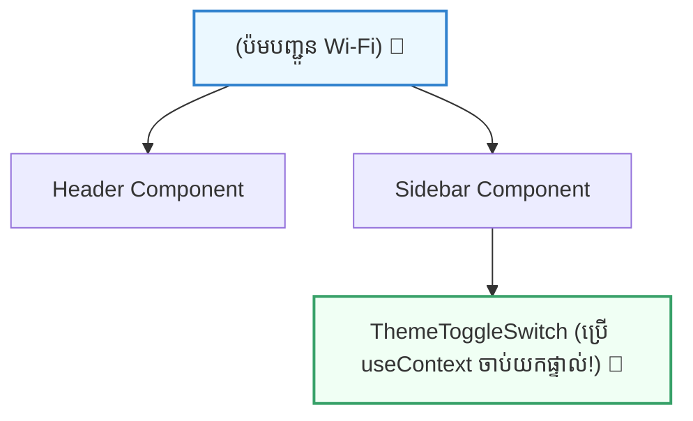

## 🌐 ១. គោលការណ៍ Provider & Consumer (Mental Model)

ដើម្បីយល់ពី Context API សូមស្រមៃមើល **«ប៉មផ្សាយសញ្ញា Wi-Fi»** 📶៖
- **Provider (ប៉មបញ្ជូនសញ្ញា):** ដាក់នៅកណ្តាលផ្ទះ ហើយផ្សាយសញ្ញា Wi-Fi (State) ចេញមកក្រៅ។
- **Consumer (ទូរស័ព្ទ/កុំព្យូទ័រ):** គ្រប់ឧបករណ៍ណាដែលនៅក្នុងផ្ទះនោះ អាចភ្ជាប់យក Wi-Fi (useContext) មកប្រើប្រាស់បានគ្រប់ពេល ដោយមិនបាច់តខ្សែឆ្លងកាត់បន្ទប់ឡើយ!



---

## 🛠️ ២. ជំហានទាំង ៣ ក្នុងការបង្កើត Context (The 3 Steps)

```
[ជំហាន ១: createContext] ➔ [ជំហាន ២: Provider Wrap] ➔ [ជំហាន ៣: useContext]
    (បង្កើតបំពង់បង្ហូរ)           (បញ្ជូនទិន្នន័យ)              (ទាញយកមកប្រើ)
```

1. **`createContext()` :** បង្កើត Context Container ថ្មីមួយ។
2. **`<Context.Provider value={...}>` :** រុំព័ទ្ធ Component Tree ហើយបញ្ជូន State តាមរយៈ `value` prop។
3. **`useContext(Context)` :** Component កូនទាញយកទិន្នន័យពី Context មកប្រើផ្ទាល់។

---

## 💻 ៣. កូដជាក់ស្តែង ៖ បង្កើត `ThemeContext.jsx`

រៀបចំ Context ឱ្យស្អាតក្នុង file ដាច់ដោយឡែក (ឧ. `src/context/ThemeContext.jsx`)៖

```jsx
// src/context/ThemeContext.jsx
import { createContext, useContext, useState } from 'react';

// ១. បង្កើត Context
export const ThemeContext = createContext(null);

// ២. បង្កើត Provider Component
export function ThemeProvider({ children }) {
  const [theme, setTheme] = useState('light');

  const toggleTheme = () => {
    setTheme((prev) => (prev === 'light' ? 'dark' : 'light'));
  };

  return (
    <ThemeContext.Provider value={{ theme, toggleTheme }}>
      {children}
    </ThemeContext.Provider>
  );
}

// ៣. បង្កើត Custom Hook ងាយស្រួលហៅប្រើ
export function useTheme() {
  const context = useContext(ThemeContext);
  if (!context) {
    throw new Error('useTheme ត្រូវតែប្រើនៅក្នុង <ThemeProvider>');
  }
  return context;
}
```

---

## 🚀 ៤. កូដពេញលេញ ៖ Theme Switcher App

```jsx
import { ThemeProvider, useTheme } from './context/ThemeContext';

function Header() {
  const { theme, toggleTheme } = useTheme();

  return (
    <header className="p-4 border-b flex justify-between items-center">
      <h1 className="font-bold text-sm">🌐 Global Theme Context</h1>
      <button
        onClick={toggleTheme}
        className="px-3.5 py-1.5 bg-blue-600 hover:bg-blue-700 text-white rounded-xl text-xs font-bold transition shadow"
      >
        ប្តូរពណ៌: {theme === 'light' ? '🌙 Dark Mode' : '☀️ Light Mode'}
      </button>
    </header>
  );
}

function MainContent() {
  const { theme } = useTheme();

  return (
    <div
      className={`p-8 rounded-2xl m-4 text-center transition-colors ${
        theme === 'dark'
          ? 'bg-slate-900 text-white border border-slate-700'
          : 'bg-slate-100 text-slate-800 border border-slate-200'
      }`}
    >
      <h3 className="font-black text-xl">Current Theme: {theme.toUpperCase()}</h3>
      <p className="text-xs opacity-75 mt-2">
        Component នេះអាន Theme ពី Context ដោយផ្ទាល់ មិនបាច់ឆ្លងកាត់ Props ឡើយ!
      </p>
    </div>
  );
}

export default function App() {
  return (
    <ThemeProvider>
      <div className="max-w-md mx-auto bg-white dark:bg-slate-800 rounded-3xl shadow-xl border border-slate-200 dark:border-slate-700 overflow-hidden">
        <Header />
        <MainContent />
      </div>
    </ThemeProvider>
  );
}
```

---

## 🧠 ៥. សង្ខេប Mental Model ងាយចាំ

| មុខងារ | កូដសរសេរ | តួនាទីជាក់ស្តែង |
| :--- | :--- | :--- |
| **បង្កើត Context** | `createContext(null)` | បង្កើតបំពង់បង្ហូរទិន្នន័យ |
| **បញ្ជូនទិន្នន័យ** | `<Context.Provider value={{...}}>` | រុំព័ទ្ធ Component Tree ហើយបញ្ជូនតម្លៃ |
| **ទាញយកទិន្នន័យ** | `useContext(Context)` | អានទិន្នន័យពី Provider ខាងលើ |
| **Custom Hook** | `export function useTheme() { ... }` | ផ្តល់ភាពងាយស្រួល និងសុវត្ថិភាពខ្ពស់ |
