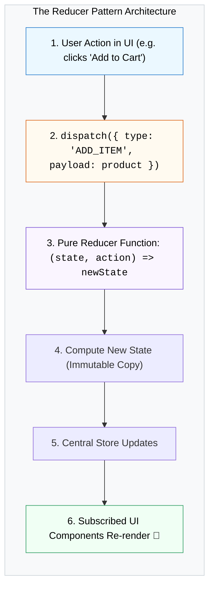

## ⚙️ 1. The Reducer Pattern Loop



---

## 🛠️ 2. កូដអនុវត្តជាក់ស្តែង: Shopping Cart Reducer

```jsx
import { useReducer } from 'react';

const initialState = { items: [], totalAmount: 0 };

function cartReducer(state, action) {
  switch (action.type) {
    case 'ADD_ITEM': {
      const updatedItems = [...state.items, action.payload];
      return {
        items: updatedItems,
        totalAmount: state.totalAmount + action.payload.price,
      };
    }
    case 'REMOVE_ITEM': {
      const updatedItems = state.items.filter((i) => i.id !== action.payload.id);
      return {
        items: updatedItems,
        totalAmount: state.totalAmount - action.payload.price,
      };
    }
    case 'CLEAR_CART':
      return initialState;
    default:
      return state;
  }
}

export default function CartApp() {
  const [cart, dispatch] = useReducer(cartReducer, initialState);

  return (
    <div className="p-6 max-w-md mx-auto border rounded-2xl">
      <h2 className="text-xl font-bold mb-4">កន្ត្រកទំនិញ (${cart.totalAmount})</h2>
      <button
        onClick={() => dispatch({ type: 'ADD_ITEM', payload: { id: Date.now(), name: 'Mouse', price: 25 } })}
        className="px-4 py-2 bg-blue-600 text-white font-bold rounded-lg"
      >
        + បន្ថែមទំនិញ ($25)
      </button>
      <ul className="mt-4 divide-y">
        {cart.items.map((item) => (
          <li key={item.id} className="py-2 flex justify-between">
            <span>{item.name} (${item.price})</span>
            <button 
              onClick={() => dispatch({ type: 'REMOVE_ITEM', payload: item })}
              className="text-red-500 text-xs font-bold"
            >
              លុប
            </button>
          </li>
        ))}
      </ul>
    </div>
  );
}
```
