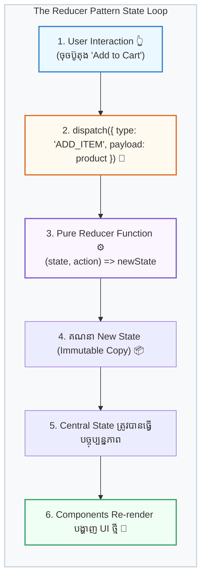

## ⚙️ ១. គោលការណ៍នៃ Reducer Pattern (Mental Model)

ដើម្បីយល់ពី `useReducer` សូមស្រមៃមើល **«តុបញ្ជរធនាគារ»** 🏦៖
1. **អ្នក (User / UI Component):** ដើរទៅកាន់តុបញ្ជរហើយប្រាប់បុគ្គលិកថា៖ *«ខ្ញុំចង់ដកប្រាក់ $50»* (`dispatch({ type: 'WITHDRAW', payload: 50 })`)។ អ្នកមិនមានសិទ្ធិដើរចូលទៅបើកទូដែកដកលុយដោយខ្លួនឯងទេ!
2. **បុគ្គលិកធនាគារ (Reducer Function):** ពិនិត្យមើលច្បាប់ធនាគារ ពិនិត្យសមតុល្យក្នុងគណនីរបស់អ្នក រួចកាត់ប្រាក់តាមរូបមន្តច្បាស់លាស់ (`(state, action) => newState`)។
3. **សមតុល្យគណនីថ្មី (New State):** គណនីរបស់អ្នកត្រូវបានកត់ត្រាតម្លៃថ្មី ហើយធនាគារចេញបង្កាន់ដៃជូនអ្នក (UI Re-render)។



---

## 🧩 ២. ធាតុផ្សំទាំង ៤ នៃ `useReducer`

```jsx
const [state, dispatch] = useReducer(reducer, initialState, init);
```

| ធាតុផ្សំ | តួនាទីជាក់ស្តែង | ឧទាហរណ៍ |
| :--- | :--- | :--- |
| **`state`** | ទិន្នន័យបច្ចុប្បន្នដែលផ្ទុកក្នុង Component | `{ items: [], discount: 0, total: 0 }` |
| **`dispatch`** | Function សម្រាប់បញ្ជូន Action ទៅកាន់ Reducer | `dispatch({ type: 'ADD_ITEM', payload: item })` |
| **`reducer`** | Pure Function សម្រាប់គណនា State ថ្មី | `function cartReducer(state, action) { ... }` |
| **`action`** | Object ដែលពិពណ៌នាពីអ្វីដែលបានកើតឡើង | `{ type: 'REMOVE_ITEM', payload: { id: 101 } }` |
| **`init` (Optional)** | Function សម្រាប់ Lazy Initialize State ដំបូង | `(initialArgs) => ({ ...initialArgs })` |

---

## 📜 ៣. ច្បាប់មាស ៣ យ៉ាងនៃ Reducer Function

> [!IMPORTANT]
> **ច្បាប់មាសទាំង ៣ (Golden Rules):**
> 1. **Immutable State:** ហាមកែប្រែ (`mutate`) `state` parameter ដើមជាដាច់ខាត។ ត្រូវបង្កើត Object/Array ថ្មីតាមរយៈ Spread Operator (`...`) ឬ Immutable methods (`.filter()`, `.map()`)។
> 2. **Deterministic (Predictable):** បញ្ជូន State ដដែល និង Action ដដែល ត្រូវតែទទួលបាន New State ដូចគ្នាជានិច្ច។
> 3. **No Side-Effects:** ហាមសរសេរ API calls (`fetch`), ហាមហៅ `setTimeout`, និងហាមប្រើ Non-deterministic functions ដូចជា `Math.random()` ឬ `Date.now()` នៅខាងក្នុង Reducer។

---

## 💻 ៤. ការអនុវត្តជាក់ស្តែង ៖ Shopping Cart State Management

ដើម្បីងាយស្រួលយល់ និងរៀបចំកូដឱ្យមានរបៀប យើងបំបែកការអនុវត្ត `useReducer` ជាជំហានៗ ដោយភ្ជាប់ Logic នីមួយៗជាមួយ HTML/JSX ជាក់ស្តែង ៖

### ជំហានទី ១ ៖ កំណត់ Initial State & ការ Render ទិន្នន័យក្នុង HTML/JSX
កំណត់រចនាសម្ព័ន្ធ State ដំបូង និងរបៀបយកបញ្ជីទំនិញមកបង្ហាញ (Render) លើ HTML ៖

```javascript
// 1. Initial State Definition
const initialCartState = {
  items: [
    { id: 1, name: 'Mechanical Keyboard RGB', price: 85, quantity: 1 },
    { id: 2, name: 'Wireless Gaming Mouse', price: 45, quantity: 2 },
  ],
  discountCode: '',
  discountPercent: 0, // ឧទាហរណ៍: 10 = 10%
};
```

```jsx
// 2. HTML/JSX Rendering for initialCartState
<ul>
  {cart.items.map((item) => (
    <li key={item.id}>
      <span>{item.name}</span>
      <span>${item.price} × {item.quantity} = ${item.price * item.quantity}</span>
    </li>
  ))}
</ul>
```

---

### ជំហានទី ២ ៖ បង្កើត Pure Reducer Function & Action Handlers

មុននឹងសរសេរ Logic នៃ Action នីមួយៗ យើងត្រូវបង្កើតទម្រង់ **Reducer Function Signature** ជាមុនសិន ៖

```javascript
// ⚙️ រចនាសម្ព័ន្ធ Function របស់ Reducer
function cartReducer(state, action) {
  switch (action.type) {
    // ករណី Action Cases នីមួយៗនឹងត្រូវសរសេរនៅខាងក្រោមនេះ...
    default:
      return state;
  }
}
```

---

#### ២.១ — បន្ថែមទំនិញថ្មីចូលកន្ត្រក (`ADD_ITEM`)

- **១. Reducer Logic (ក្នុង `cartReducer` function) ៖**
```javascript
case 'ADD_ITEM': {
  const existingItem = state.items.find((item) => item.id === action.payload.id);

  // បើមានរួចហើយ ➔ បង្កើនចំនួន quantity + 1
  if (existingItem) {
    return {
      ...state,
      items: state.items.map((item) =>
        item.id === action.payload.id
          ? { ...item, quantity: item.quantity + 1 }
          : item
      ),
    };
  }

  // បើជាទំនិញថ្មី ➔ បន្ថែមចូល Array
  return {
    ...state,
    items: [...state.items, { ...action.payload, quantity: 1 }],
  };
}
```

- **២. Handler Function (ក្នុង Component) ៖**
```javascript
const handleAddItem = (product) => {
  dispatch({
    type: 'ADD_ITEM',
    payload: product,
  });
};
```

- **៣. HTML / JSX Trigger ៖**
```jsx
<button onClick={() => handleAddItem({ id: 3, name: 'USB-C Fast Charger', price: 30 })}>
  + ថែម Fast Charger ($30)
</button>
```

---

#### ២.២ — កែសម្រួលចំនួនទំនិញ (`UPDATE_QUANTITY`)

- **១. Reducer Logic (ក្នុង `cartReducer` function) ៖**
```javascript
case 'UPDATE_QUANTITY': {
  const { id, quantity } = action.payload;

  // បើចំនួនធ្លាក់ដល់ <= 0 ➔ លុប item នោះចេញដោយស្វ័យប្រវត្តិ
  if (quantity <= 0) {
    return {
      ...state,
      items: state.items.filter((item) => item.id !== id),
    };
  }

  return {
    ...state,
    items: state.items.map((item) =>
      item.id === id ? { ...item, quantity } : item
    ),
  };
}
```

- **២. Handler Function (ក្នុង Component) ៖**
```javascript
const handleUpdateQuantity = (id, newQuantity) => {
  dispatch({
    type: 'UPDATE_QUANTITY',
    payload: { id, quantity: newQuantity },
  });
};
```

- **៣. HTML / JSX Trigger ៖**
```jsx
<div>
  <button onClick={() => handleUpdateQuantity(item.id, item.quantity - 1)}>-</button>
  <span>{item.quantity}</span>
  <button onClick={() => handleUpdateQuantity(item.id, item.quantity + 1)}>+</button>
</div>
```

---

#### ២.៣ — លុបទំនិញចេញពីកន្ត្រក (`REMOVE_ITEM`)

- **១. Reducer Logic (ក្នុង `cartReducer` function) ៖**
```javascript
case 'REMOVE_ITEM':
  return {
    ...state,
    items: state.items.filter((item) => item.id !== action.payload.id),
  };
```

- **២. Handler Function (ក្នុង Component) ៖**
```javascript
const handleRemoveItem = (id) => {
  dispatch({
    type: 'REMOVE_ITEM',
    payload: { id },
  });
};
```

- **៣. HTML / JSX Trigger ៖**
```jsx
<button onClick={() => handleRemoveItem(item.id)}>
  🗑️ លុបទំនិញ
</button>
```

---

#### ២.៤ — ប្រើប្រាស់កូដបញ្ចុះតម្លៃ (`APPLY_COUPON`)

- **១. Reducer Logic (ក្នុង `cartReducer` function) ៖**
```javascript
case 'APPLY_COUPON': {
  const code = action.payload.trim().toUpperCase();
  const discounts = { DISCOUNT10: 10, VIP20: 20 };

  return {
    ...state,
    discountCode: code,
    discountPercent: discounts[code] || 0,
  };
}
```

- **២. Handler Function (ក្នុង Component) ៖**
```javascript
const handleApplyCoupon = (code) => {
  dispatch({
    type: 'APPLY_COUPON',
    payload: code,
  });
};
```

- **៣. HTML / JSX Trigger ៖**
```jsx
<button onClick={() => handleApplyCoupon('DISCOUNT10')}>
  ប្រើកូដ DISCOUNT10 (-10%)
</button>
```

---

#### ២.៥ — សំអាតកន្ត្រកទាំងមូល (`CLEAR_CART`)

- **១. Reducer Logic (ក្នុង `cartReducer` function) ៖**
```javascript
case 'CLEAR_CART':
  return {
    ...state,
    items: [],
    discountCode: '',
    discountPercent: 0,
  };
```

- **២. Handler Function (ក្នុង Component) ៖**
```javascript
const handleClearCart = () => {
  dispatch({ type: 'CLEAR_CART' });
};
```

- **៣. HTML / JSX Trigger ៖**
```jsx
<button onClick={handleClearCart}>
  សំអាតកន្ត្រក
</button>
```

---

### ជំហានទី ៣ ៖ ផ្គុំចូលជា Pure Reducer Function ពេញលេញ

```javascript
function cartReducer(state, action) {
  switch (action.type) {
    case 'ADD_ITEM': {
      const existingItem = state.items.find((item) => item.id === action.payload.id);
      if (existingItem) {
        return {
          ...state,
          items: state.items.map((item) =>
            item.id === action.payload.id ? { ...item, quantity: item.quantity + 1 } : item
          ),
        };
      }
      return {
        ...state,
        items: [...state.items, { ...action.payload, quantity: 1 }],
      };
    }

    case 'UPDATE_QUANTITY': {
      const { id, quantity } = action.payload;
      if (quantity <= 0) {
        return { ...state, items: state.items.filter((item) => item.id !== id) };
      }
      return {
        ...state,
        items: state.items.map((item) =>
          item.id === id ? { ...item, quantity } : item
        ),
      };
    }

    case 'REMOVE_ITEM':
      return {
        ...state,
        items: state.items.filter((item) => item.id !== action.payload.id),
      };

    case 'APPLY_COUPON': {
      const code = action.payload.trim().toUpperCase();
      const discounts = { DISCOUNT10: 10, VIP20: 20 };
      return {
        ...state,
        discountCode: code,
        discountPercent: discounts[code] || 0,
      };
    }

    case 'CLEAR_CART':
      return {
        ...state,
        items: [],
        discountCode: '',
        discountPercent: 0,
      };

    default:
      return state;
  }
}
```

---

### ជំហានទី ៤ ៖ ភ្ជាប់ `useReducer` & Render Derived State ក្នុង HTML
ហៅប្រើ Hook `useReducer` និងគណនាតម្លៃសរុបចេញពី State ដោយផ្ទាល់ រួចបង្ហាញក្នុង HTML Summary ៖

```jsx
import { useReducer } from 'react';

export default function CartManager() {
  const [cart, dispatch] = useReducer(cartReducer, initialCartState);

  // 🧮 Derived State: គណនាតម្លៃចេញពី cart.items ដោយផ្ទាល់
  const subtotal = cart.items.reduce(
    (sum, item) => sum + item.price * item.quantity,
    0
  );
  const discountAmount = (subtotal * cart.discountPercent) / 100;
  const grandTotal = Math.max(0, subtotal - discountAmount);

  // HTML / JSX Rendering for Derived Totals
  return (
    <div className="cart-summary">
      <p>តម្លៃដើម (Subtotal): ${subtotal.toFixed(2)}</p>
      {cart.discountPercent > 0 && (
        <p>បញ្ចុះតម្លៃ ({cart.discountPercent}%): -${discountAmount.toFixed(2)}</p>
      )}
      <h3>សរុបត្រូវទូទាត់: ${grandTotal.toFixed(2)}</h3>
    </div>
  );
}
```

---

### ជំហានទី ៥ ៖ Component ពេញលេញ (Clean & Semantic JSX)
ការផ្គុំបញ្ចូលគ្នារវាង State, Reducer, Dispatch, និង HTML/JSX ទាំងអស់ ៖

```jsx
export default function CartApp() {
  const [cart, dispatch] = useReducer(cartReducer, initialCartState);

  const subtotal = cart.items.reduce((sum, item) => sum + item.price * item.quantity, 0);
  const discountAmount = (subtotal * cart.discountPercent) / 100;
  const grandTotal = Math.max(0, subtotal - discountAmount);

  return (
    <div className="cart-container">
      <h2>🛒 កន្ត្រកទំនិញ ({cart.items.length})</h2>

      {/* បញ្ជីទំនិញ */}
      <ul>
        {cart.items.map((item) => (
          <li key={item.id}>
            <span>{item.name} (${item.price})</span>
            <button onClick={() => dispatch({ type: 'UPDATE_QUANTITY', payload: { id: item.id, quantity: item.quantity - 1 } })}>-</button>
            <span>{item.quantity}</span>
            <button onClick={() => dispatch({ type: 'UPDATE_QUANTITY', payload: { id: item.id, quantity: item.quantity + 1 } })}>+</button>
            <button onClick={() => dispatch({ type: 'REMOVE_ITEM', payload: { id: item.id } })}>🗑️</button>
          </li>
        ))}
      </ul>

      {/* Actions */}
      <button onClick={() => dispatch({ type: 'ADD_ITEM', payload: { id: 3, name: 'Charger', price: 30 } })}>
        + ថែម Charger ($30)
      </button>
      <button onClick={() => dispatch({ type: 'APPLY_COUPON', payload: 'DISCOUNT10' })}>
        កូដ: DISCOUNT10
      </button>
      <button onClick={() => dispatch({ type: 'CLEAR_CART' })}>
        សំអាតកន្ត្រក
      </button>

      {/* Summary */}
      <div className="summary">
        <p>Subtotal: ${subtotal.toFixed(2)}</p>
        {cart.discountPercent > 0 && <p>បញ្ចុះតម្លៃ: -${discountAmount.toFixed(2)}</p>}
        <h3>សរុប: ${grandTotal.toFixed(2)}</h3>
      </div>
    </div>
  );
}
```

---

## ⚡ ៥. Lazy Initialization ជាមួយ `init` Argument

នៅពេលដែល Initial State ត្រូវទាញយកពីប្រភពខាងក្រៅ (ដូចជា `localStorage`) ឬត្រូវការការគណនាធ្ងន់ធ្ងរ យើងគួរប្រើ **Lazy Initializer (Argument ទី ៣)** ដើម្បីកុំឱ្យដំណើរការគណនានោះម្តងទៀតរាល់ពេល Re-render ៖

```javascript
// Function សម្រាប់ Initialize State តែម្តងគត់នៅពេល Mount
function initCartState(initialArg) {
  try {
    const savedCart = localStorage.getItem('shopping_cart');
    return savedCart ? JSON.parse(savedCart) : initialArg;
  } catch (error) {
    return initialArg;
  }
}

// ការហៅប្រើប្រាស់ក្នុង Component
function CartApp() {
  // useReducer(reducer, initialArg, initFunction)
  const [cart, dispatch] = useReducer(cartReducer, initialCartState, initCartState);
  
  // ...
}
```

---

## 🔍 ៦. ការវិភាគចំណុចគន្លឹះនៃ Reducer Logic

1. **ការចៀសវាង Array Mutation ពេល Update Quantity:**  
   យើងប្រើ `state.items.map(...)` ដើម្បីបង្កើត Object Item ថ្មីសម្រាប់តែ item ដែលត្រូវ update `{ ...item, quantity }` និងរក្សាទុក items ផ្សេងទៀតដដែល។
2. **ការគ្រប់គ្រង Quantity ធ្លាក់ដល់ 0:**  
   ប្រសិនបើ User ចុចដករហូតដល់ `quantity <= 0` Reducer នឹងដំណើរការ `.filter()` ដោយស្វ័យប្រវត្តិដើម្បីដក item នោះចេញពីបញ្ជី។
3. **Derived State (តម្លៃគណនាបន្ត):**  
   យើងមិនរក្សាទុក `subtotal` ឬ `grandTotal` ក្នុង state ផ្ទាល់ឡើយ ព្រោះវាអាចគណនាបានដោយផ្ទាល់ចេញពី `cart.items` និង `cart.discountPercent` (ចៀសវាងបញ្ហា Out-of-sync State)។

---

## ⚖️ ៧. តារាងប្រៀបធៀប ៖ ពេលណាគួរប្រើ `useState` vs `useReducer`?

| លក្ខណៈវិនិច្ឆ័យ | ជ្រើសរើសប្រើ `useState` | ជ្រើសរើសប្រើ `useReducer` |
| :--- | :--- | :--- |
| **ទម្រង់ State** | Primitive values (String, Number, Boolean) | Objects, Arrays, ឬ Nested Data Structures |
| **ភាពស្មុគស្មាញនៃ Logic** | ១ ទៅ ២ សកម្មភាពសាមញ្ញ (Toggle, Increment) | ច្រើន Actions ដែលមានច្បាប់ Business Logic ស្មុគស្មាញ |
| **ទំនាក់ទំនងរវាង State** | State fields ដំណើរការឯករាជ្យពីគ្នា | ការផ្លាស់ប្តូរ field មួយជះឥទ្ធិពលលើ field ផ្សេងទៀត |
| **ការធ្វើ Unit Test** | ពិបាក Test logic ដោយគ្មាន UI component | ងាយស្រួល Test ព្រោះ Reducer ជា Pure Function ដាច់ដោយឡែក |
| **Refactoring & Debugging** | Event Handlers រាយប៉ាយពេញ JSX | Logic ទាំងអស់ប្រមូលផ្តុំនៅកន្លែងតែមួយក្នុង Reducer |

---

## 📋 ៨. សង្ខេបចំណុចសំខាន់ៗ (Key Takeaways)

- `useReducer` គឺជាជម្រើសដ៏ល្អបំផុតសម្រាប់ State ដែលមានភាពស្មុគស្មាញ និងមាន State Transitions ច្រើន។
- Reducer Function ត្រូវតែជា **Pure Function** ជានិច្ច (គ្មាន side-effects និងគោរព Immutability ១០០%)។
- `dispatch(action)` ផ្តល់ភាពងាយស្រួលក្នុងការបញ្ជូនសារពី UI ទៅកាន់ Reducer ដោយមិនចាំបាច់ដឹងពីរបៀបគណនា State ខាងក្នុងឡើយ។
- ប្រើ `init` function (Lazy Initialization) នៅពេលត្រូវការទាញយក State ដំបូងពី `localStorage` ឬគណនាទិន្នន័យធ្ងន់ធ្ងរ។
