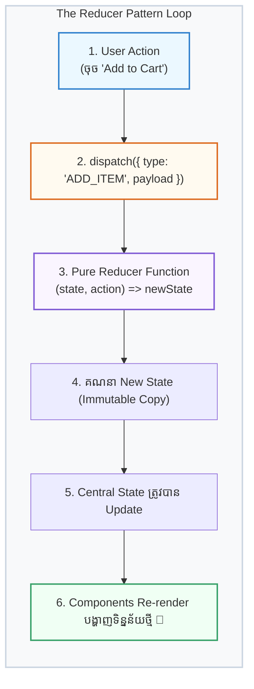

## ⚙️ ១. គោលការណ៍នៃ Reducer Pattern (Mental Model)

ដើម្បីយល់ពី `useReducer` សូមស្រមៃមើល **«តុកុងទ័រធនាគារ»** 🏦៖
1. **អ្នក (User / Component):** ដើរទៅកុងទ័រហើយប្រាប់បុគ្គលិកថា៖ *«ខ្ញុំចង់ដកប្រាក់ $50»* (`dispatch({ type: 'WITHDRAW', payload: 50 })`)។
2. **បុគ្គលិកធនាគារ (Reducer Function):** ពិនិត្យច្បាប់ និងគណនាតុល្យភាពថ្មី (`(state, action) => newState`)។
3. **តុល្យភាពកុងថ្មី (New State):** គណនីរបស់អ្នកត្រូវបានកាត់ប្រាក់ ស្របតាមច្បាប់ធនាគារ។



---

## 🧩 ២. ធាតុផ្សំទាំង ៤ នៃ `useReducer`

```jsx
const [state, dispatch] = useReducer(reducer, initialState);
```

| ធាតុផ្សំ | តួនាទីជាក់ស្តែង | ឧទាហរណ៍ |
| :--- | :--- | :--- |
| **`state`** | ទិន្នន័យបច្ចុប្បន្ន | `{ items: [], total: 0 }` |
| **`dispatch`** | Function សម្រាប់បញ្ជូន Action ទៅ Reducer | `dispatch({ type: 'ADD', payload: item })` |
| **`action`** | Object ដែលពិពណ៌នាពីអ្វីដែលបានកើតឡើង | `{ type: 'REMOVE_ITEM', payload: id }` |
| **`reducer`** | Pure Function គណនា New State | `(state, action) => newState` |

---

## 💻 ៣. កូដជាក់ស្តែង ៖ Shopping Cart ជាមួយ `useReducer`

```jsx
import { useReducer } from 'react';

// ១. INITIAL STATE
const initialState = { items: [], totalAmount: 0 };

// ២. REDUCER FUNCTION (Pure Function នៅក្រៅ Component)
function cartReducer(state, action) {
  switch (action.type) {
    case 'ADD_ITEM': {
      const updatedItems = [...state.items, action.payload];
      return {
        items: updatedItems,
        totalAmount: state.totalAmount + action.payload.price,
      };
    }
    case 'REMOVE_ITEM': {
      const updatedItems = state.items.filter((i) => i.id !== action.payload.id);
      return {
        items: updatedItems,
        totalAmount: state.totalAmount - action.payload.price,
      };
    }
    case 'CLEAR_CART':
      return initialState;
    default:
      return state;
  }
}

// ៣. COMPONENT
export default function CartApp() {
  const [cart, dispatch] = useReducer(cartReducer, initialState);

  return (
    <div className="p-6 max-w-md mx-auto border border-slate-200 dark:border-slate-700 bg-white dark:bg-slate-800 rounded-3xl shadow-xl space-y-4">
      <div className="flex justify-between items-center pb-3 border-b">
        <h2 className="text-lg font-bold text-slate-800 dark:text-white">កន្ត្រកទំនិញ</h2>
        <span className="text-sm font-black text-blue-600 dark:text-blue-400">
          សរុប៖ ${cart.totalAmount}
        </span>
      </div>

      <div className="flex gap-2">
        <button
          onClick={() =>
            dispatch({
              type: 'ADD_ITEM',
              payload: { id: Date.now(), name: 'Mouse Wireless', price: 25 },
            })
          }
          className="flex-1 py-2 bg-blue-600 hover:bg-blue-700 text-white font-bold rounded-xl text-xs transition shadow"
        >
          + ថែម Mouse ($25)
        </button>

        <button
          onClick={() => dispatch({ type: 'CLEAR_CART' })}
          className="px-3 py-2 bg-slate-100 dark:bg-slate-700 hover:bg-slate-200 text-slate-700 dark:text-slate-200 font-bold rounded-xl text-xs transition"
        >
          សំអាតកន្ត្រក
        </button>
      </div>

      <ul className="divide-y divide-slate-100 dark:divide-slate-700 max-h-48 overflow-y-auto">
        {cart.items.length === 0 ? (
          <li className="py-4 text-center text-xs text-slate-400">កន្ត្រកនៅទទេស្អាត</li>
        ) : (
          cart.items.map((item) => (
            <li key={item.id} className="py-2.5 flex justify-between items-center text-xs">
              <span className="font-medium text-slate-700 dark:text-slate-200">{item.name}</span>
              <div className="flex items-center gap-3">
                <span className="font-bold text-slate-900 dark:text-white">${item.price}</span>
                <button
                  onClick={() => dispatch({ type: 'REMOVE_ITEM', payload: item })}
                  className="text-rose-500 hover:text-rose-600 font-bold"
                >
                  លុប
                </button>
              </div>
            </li>
          ))
        )}
      </ul>
    </div>
  );
}
```

---

## ⚖️ ៤. ពេលណាគួរប្រើ `useState` vs `useReducer`?

| លក្ខណៈវិនិច្ឆ័យ | ប្រើ `useState` | ប្រើ `useReducer` |
| :--- | :--- | :--- |
| **ប្រភេទ State** | Primitives (string, number, boolean) | Objects, Arrays ឬ State ដែលមានច្រើន fields |
| **State Transitions** | ១ ទៅ ២ សកម្មភាពសាមញ្ញ (Toggle, Increment) | ច្រើនសកម្មភាព (Add, Remove, Edit, Clear) |
| **Business Logic** | Logic សាមញ្ញក្នុង Event Handler | Logic ស្មុគស្មាញដែលត្រូវផ្តុំគ្នាក្នុង Reducer |
