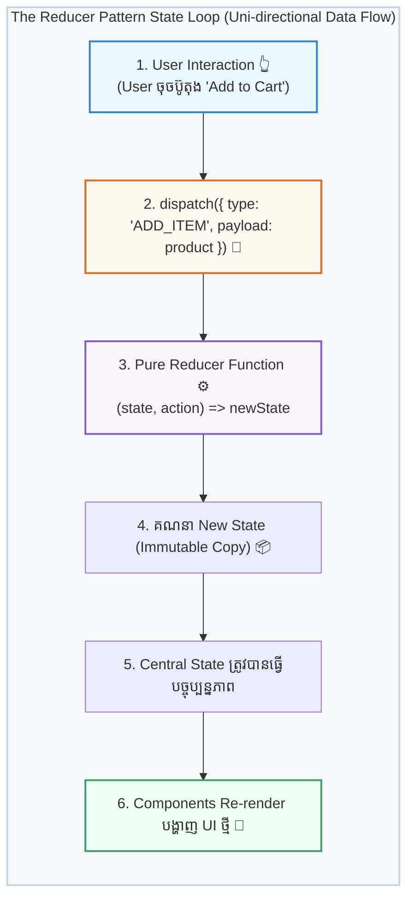

## ⚙️ ១. The Reducer Pattern & Mental Model

> [!IMPORTANT]
> **និយមន័យ Reducer Pattern (Definition) ៖**  
> យោងតាមគេហទំព័រផ្លូវការរបស់ React (**react.dev**), នៅពេល Component មាន State Updates ច្រើនរាយប៉ាយតាម Event Handlers ផ្សេងៗ កូដនឹងក្លាយជាពិបាកគ្រប់គ្រង (Overwhelming)។ **The Reducer Pattern** គឺជាដំណោះស្រាយផ្លូវការដែលអនុញ្ញាតឱ្យយើងប្រមូលផ្តុំ (Consolidate) រាល់ State Update Logic ទាំងអស់យកទៅដាក់នៅក្រៅ Component ក្នុង Function តែមួយហៅថា **Reducer**។
> 
> State មិនអាចកែប្រែដោយផ្ទាល់ (Direct Mutation) បានឡើយ ប៉ុន្តែត្រូវធ្វើឡើងតាមរយៈការបញ្ជូន **Action Object** (តាមរយៈ `dispatch`) រួច Reducer នឹងទទួលយក `(currentState, action)` ដើម្បីគណនា និង return នូវ `newState` (Immutable State Update)។

### 💡 តើឈ្មោះ "Reducer" កើតចេញពីណា? (The Array `.reduce()` Connection)
React ដាក់ឈ្មោះ Hook នេះតាមវិធីសាស្ត្រ **`Array.prototype.reduce()`** ក្នុង JavaScript ៖
```javascript
// 1. JavaScript Array reduce: ទទួលយក (តម្លៃសរុបបច្ចុប្បន្ន, ធាតុថ្មី) => តម្លៃសរុបបន្ទាប់
const numbers = [1, 2, 3];
const sum = numbers.reduce((total, num) => total + num, 0); // ➔ 6

// 2. React useReducer: ទទួលយក (State បច្ចុប្បន្ន, Action ថ្មី) => State បន្ទាប់
function cartReducer(state, action) {
  // (currentState, action) => newState
}
```

---

### 🏦 ឧទាហរណ៍ជាក់ស្តែង ៖ «តុបញ្ជរធនាគារ» (The Bank Teller Analogy)
ដើម្បីយល់ពីលំហូរការងារ សូមស្រមៃមើលធនាគារមួយ ៖
1. **អ្នក (User / UI Component):** ដើរទៅកាន់តុបញ្ជរហើយប្រាប់បុគ្គលិកថា៖ *«ខ្ញុំចង់ដកប្រាក់ $50»* (`dispatch({ type: 'WITHDRAW', payload: 50 })`)។ អ្នកមិនមានសិទ្ធិដើរចូលទៅបើកទូដែកដកលុយដោយខ្លួនឯងទេ!
2. **បុគ្គលិកធនាគារ (Reducer Function):** ពិនិត្យមើលច្បាប់ធនាគារ ពិនិត្យសមតុល្យក្នុងគណនីរបស់អ្នក រួចកាត់ប្រាក់តាមរូបមន្តច្បាស់លាស់ (`(state, action) => newState`)។
3. **សមតុល្យគណនីថ្មី (New State):** គណនីរបស់អ្នកត្រូវបានកត់ត្រាតម្លៃថ្មី ហើយធនាគារចេញបង្កាន់ដៃជូនអ្នក (UI Re-render)។


```mermaid
flowchart TD
    subgraph ReducerLoop["The Reducer Pattern State Loop (Uni-directional Data Flow)"]
        direction TB
        UI["1. User Interaction 👆<br/>(User ចុចប៊ូតុង 'Add to Cart')"] --> Dispatch["2. dispatch({ type: 'ADD_ITEM', payload: product }) 📨"]
        Dispatch --> Reducer["3. Pure Reducer Function ⚙️<br/>(state, action) => newState"]
        Reducer --> NewState["4. គណនា New State (Immutable Copy) 📦"]
        NewState --> Store["5. Central State ត្រូវបានធ្វើបច្ចុប្បន្នភាព"]
        Store --> ReRender["6. Components Re-render បង្ហាញ UI ថ្មី 🚀"]
    end

    style ReducerLoop fill:#f8f9fa,stroke:#cbd5e1,stroke-width:2px
    style UI fill:#ebf8ff,stroke:#3182ce,stroke-width:2px
    style Dispatch fill:#fffaf0,stroke:#dd6b20,stroke-width:2px
    style Reducer fill:#faf5ff,stroke:#805ad5,stroke-width:2px
    style ReRender fill:#f0fff4,stroke:#38a169,stroke-width:2px
```

---

## 🧩 ២. The 4 Core Elements នៃ `useReducer`

> [!NOTE]
> **រូបមន្តផ្លូវការ (Official Hook Signature ពី react.dev) ៖**  
> ```jsx
> const [state, dispatch] = useReducer(reducer, initialArg, init?);
> ```

### 🔄 ជំហានទាំង ៣ ក្នុងការប្តូរពី `useState` ទៅ `useReducer` (Official React Migration)

| ជំហាន (Step) | របៀបចាស់ជាមួយ `useState` | របៀបថ្មីជាមួយ `useReducer` (Best Practice) |
| :--- | :--- | :--- |
| **Step 1: បញ្ជូន Action** | `setItems([...items, newItem])` *(ប្រាប់ React ពីរបៀបកែប្រែ)* | `dispatch({ type: 'ADD_ITEM', payload: newItem })` *(ប្រាប់ពីអ្វីដែល User បានធ្វើ)* |
| **Step 2: សរសេរ Reducer** | Logic រាយប៉ាយតាម `onClick` handlers ក្នុង JSX | ប្រមូលផ្តុំ Logic ទាំងអស់ក្នុង `function cartReducer(state, action)` |
| **Step 3: ភ្ជាប់ក្នុង Component** | `const [items, setItems] = useState([])` | `const [state, dispatch] = useReducer(cartReducer, initialState)` |

---

### 📋 តារាង The 4 Core Elements នៃ useReducer

| Core Element | Role & Functionality | Example |
| :--- | :--- | :--- |
| **`state`** | ទិន្នន័យបច្ចុប្បន្នដែលផ្ទុកក្នុង Component | `{ items: [], discount: 0, total: 0 }` |
| **`dispatch`** | Function សម្រាប់បញ្ជូន Action Object ទៅកាន់ Reducer | `dispatch({ type: 'ADD_ITEM', payload: item })` |
| **`reducer`** | Pure Function សម្រាប់គណនា State ថ្មី `(state, action) => newState` | `function cartReducer(state, action) { ... }` |
| **`action`** | Object ដែលពណ៌នាពីព្រឹត្តិការណ៍ដែលបានកើតឡើង | `{ type: 'REMOVE_ITEM', payload: { id: 101 } }` |
| **`init` (Optional)** | Function សម្រាប់ Lazy Initialize State ដំបូង | `(initialArgs) => ({ ...initialArgs })` |

---

## 📜 ៣. The 3 Golden Rules នៃ Reducer Function

> [!IMPORTANT]
> **The 3 Golden Rules យោងតាមគោលការណ៍ផ្លូវការរបស់ React (react.dev) ៖**
> 1. **Reducers must be pure (Immutability & Predictability) ៖** ហាមកែប្រែ (`mutate`) `state` parameter ដើមជាដាច់ខាត។ បញ្ជូន State និង Action ដដែល ត្រូវតែទទួលបាន New State ដូចគ្នាជានិច្ច។ គ្មាន Side-effects (គ្មាន API calls, គ្មាន `setTimeout`, និងគ្មាន `Math.random()` ឬ `Date.now()`)។
> 2. **Each action describes a single user interaction ៖** Action ត្រូវតែពណ៌នាពី "អ្វីដែល User បានធ្វើ" មិនមែន "របៀបដែលទិន្នន័យត្រូវប្តូរ" ឡើយ។ ឧទាហរណ៍៖ ប្រសិនបើ User ចុចប៊ូតុង Reset Form ដែលត្រូវសម្អាត ៥ fields ចូរ dispatch តែ ១ Action គឺ `{ type: 'RESET_FORM' }` ជាជាង dispatch ៥ Actions ដាច់ដោយឡែកពីគ្នា។
> 3. **Always provide a default fallback ៖** ក្នុង `switch(action.type)` ត្រូវតែមាន `default: return state;` ជានិច្ច ដើម្បីការពារកុំឱ្យ State ក្លាយជា `undefined` នៅពេលមាន Unknown Action។

---

## 💻 ៤. Practical Implementation ៖ Shopping Cart State Management

ដើម្បីងាយស្រួលយល់ និងរៀបចំកូដឱ្យមានរបៀប យើងបំបែកការអនុវត្ត `useReducer` ជាជំហានៗ ដោយភ្ជាប់ Logic នីមួយៗជាមួយ HTML/JSX ជាក់ស្តែង ៖

### Step 1 ៖ Initial State Definition & HTML/JSX Rendering
កំណត់រចនាសម្ព័ន្ធ State ដំបូង និងរបៀបយកបញ្ជីទំនិញមកបង្ហាញ (Render) លើ HTML ៖

```javascript
// 1. Initial State Definition
const initialCartState = {
  items: [
    { id: 1, name: 'Mechanical Keyboard RGB', price: 85, quantity: 1 },
    { id: 2, name: 'Wireless Gaming Mouse', price: 45, quantity: 2 },
  ],
  discountCode: '',
  discountPercent: 0, // ឧទាហរណ៍: 10 = 10%
};
```

```jsx
// 2. HTML/JSX Rendering for initialCartState
<ul>
  {cart.items.map((item) => (
    <li key={item.id}>
      <span>{item.name}</span>
      <span>${item.price} × {item.quantity} = ${item.price * item.quantity}</span>
    </li>
  ))}
</ul>
```

---

### Step 2 ៖ Pure Reducer Function & Action Handlers

មុននឹងសរសេរ Logic នៃ Action នីមួយៗ យើងត្រូវបង្កើតទម្រង់ **Reducer Function Signature** ជាមុនសិន ៖

```javascript
// ⚙️ រចនាសម្ព័ន្ធ Function របស់ Reducer
function cartReducer(state, action) {
  switch (action.type) {
    // ករណី Action Cases នីមួយៗនឹងត្រូវសរសេរនៅខាងក្រោមនេះ...
    default:
      return state;
  }
}
```

---

#### ២.១ — បន្ថែមទំនិញថ្មីចូលកន្ត្រក (`ADD_ITEM`)

- **១. Reducer Logic (ក្នុង `cartReducer` function) ៖**
```javascript
case 'ADD_ITEM': {
  const existingItem = state.items.find((item) => item.id === action.payload.id);

  // បើមានរួចហើយ ➔ បង្កើនចំនួន quantity + 1
  if (existingItem) {
    return {
      ...state,
      items: state.items.map((item) =>
        item.id === action.payload.id
          ? { ...item, quantity: item.quantity + 1 }
          : item
      ),
    };
  }

  // បើជាទំនិញថ្មី ➔ បន្ថែមចូល Array
  return {
    ...state,
    items: [...state.items, { ...action.payload, quantity: 1 }],
  };
}
```

- **២. Handler Function (ក្នុង Component) ៖**
```javascript
const handleAddItem = (product) => {
  dispatch({
    type: 'ADD_ITEM',
    payload: product,
  });
};
```

- **៣. HTML / JSX Trigger ៖**
```jsx
<button onClick={() => handleAddItem({ id: 3, name: 'USB-C Fast Charger', price: 30 })}>
  + ថែម Fast Charger ($30)
</button>
```

---

#### ២.២ — កែសម្រួលចំនួនទំនិញ (`UPDATE_QUANTITY`)

- **១. Reducer Logic (ក្នុង `cartReducer` function) ៖**
```javascript
case 'UPDATE_QUANTITY': {
  const { id, quantity } = action.payload;

  // បើចំនួនធ្លាក់ដល់ <= 0 ➔ លុប item នោះចេញដោយស្វ័យប្រវត្តិ
  if (quantity <= 0) {
    return {
      ...state,
      items: state.items.filter((item) => item.id !== id),
    };
  }

  return {
    ...state,
    items: state.items.map((item) =>
      item.id === id ? { ...item, quantity } : item
    ),
  };
}
```

- **២. Handler Function (ក្នុង Component) ៖**
```javascript
const handleUpdateQuantity = (id, newQuantity) => {
  dispatch({
    type: 'UPDATE_QUANTITY',
    payload: { id, quantity: newQuantity },
  });
};
```

- **៣. HTML / JSX Trigger ៖**
```jsx
<div>
  <button onClick={() => handleUpdateQuantity(item.id, item.quantity - 1)}>-</button>
  <span>{item.quantity}</span>
  <button onClick={() => handleUpdateQuantity(item.id, item.quantity + 1)}>+</button>
</div>
```

---

#### ២.៣ — លុបទំនិញចេញពីកន្ត្រក (`REMOVE_ITEM`)

- **១. Reducer Logic (ក្នុង `cartReducer` function) ៖**
```javascript
case 'REMOVE_ITEM':
  return {
    ...state,
    items: state.items.filter((item) => item.id !== action.payload.id),
  };
```

- **២. Handler Function (ក្នុង Component) ៖**
```javascript
const handleRemoveItem = (id) => {
  dispatch({
    type: 'REMOVE_ITEM',
    payload: { id },
  });
};
```

- **៣. HTML / JSX Trigger ៖**
```jsx
<button onClick={() => handleRemoveItem(item.id)}>
  🗑️ លុបទំនិញ
</button>
```

---

#### ២.៤ — ប្រើប្រាស់កូដបញ្ចុះតម្លៃ (`APPLY_COUPON`)

- **១. Reducer Logic (ក្នុង `cartReducer` function) ៖**
```javascript
case 'APPLY_COUPON': {
  const code = action.payload.trim().toUpperCase();
  const discounts = { DISCOUNT10: 10, VIP20: 20 };

  return {
    ...state,
    discountCode: code,
    discountPercent: discounts[code] || 0,
  };
}
```

- **២. Handler Function (ក្នុង Component) ៖**
```javascript
const handleApplyCoupon = (code) => {
  dispatch({
    type: 'APPLY_COUPON',
    payload: code,
  });
};
```

- **៣. HTML / JSX Trigger ៖**
```jsx
<button onClick={() => handleApplyCoupon('DISCOUNT10')}>
  ប្រើកូដ DISCOUNT10 (-10%)
</button>
```

---

#### ២.៥ — សំអាតកន្ត្រកទាំងមូល (`CLEAR_CART`)

- **១. Reducer Logic (ក្នុង `cartReducer` function) ៖**
```javascript
case 'CLEAR_CART':
  return {
    ...state,
    items: [],
    discountCode: '',
    discountPercent: 0,
  };
```

- **២. Handler Function (ក្នុង Component) ៖**
```javascript
const handleClearCart = () => {
  dispatch({ type: 'CLEAR_CART' });
};
```

- **៣. HTML / JSX Trigger ៖**
```jsx
<button onClick={handleClearCart}>
  សំអាតកន្ត្រក
</button>
```

---

### Step 3 ៖ Complete Pure Reducer Function

```javascript
function cartReducer(state, action) {
  switch (action.type) {
    case 'ADD_ITEM': {
      const existingItem = state.items.find((item) => item.id === action.payload.id);
      if (existingItem) {
        return {
          ...state,
          items: state.items.map((item) =>
            item.id === action.payload.id ? { ...item, quantity: item.quantity + 1 } : item
          ),
        };
      }
      return {
        ...state,
        items: [...state.items, { ...action.payload, quantity: 1 }],
      };
    }

    case 'UPDATE_QUANTITY': {
      const { id, quantity } = action.payload;
      if (quantity <= 0) {
        return { ...state, items: state.items.filter((item) => item.id !== id) };
      }
      return {
        ...state,
        items: state.items.map((item) =>
          item.id === id ? { ...item, quantity } : item
        ),
      };
    }

    case 'REMOVE_ITEM':
      return {
        ...state,
        items: state.items.filter((item) => item.id !== action.payload.id),
      };

    case 'APPLY_COUPON': {
      const code = action.payload.trim().toUpperCase();
      const discounts = { DISCOUNT10: 10, VIP20: 20 };
      return {
        ...state,
        discountCode: code,
        discountPercent: discounts[code] || 0,
      };
    }

    case 'CLEAR_CART':
      return {
        ...state,
        items: [],
        discountCode: '',
        discountPercent: 0,
      };

    default:
      return state;
  }
}
```

---

### Step 4 ៖ Connecting `useReducer` & Rendering Derived State ក្នុង HTML
ហៅប្រើ Hook `useReducer` និងគណនាតម្លៃសរុបចេញពី State ដោយផ្ទាល់ រួចបង្ហាញក្នុង HTML Summary ៖

```jsx
import { useReducer } from 'react';

export default function CartManager() {
  const [cart, dispatch] = useReducer(cartReducer, initialCartState);

  // 🧮 Derived State: គណនាតម្លៃចេញពី cart.items ដោយផ្ទាល់
  const subtotal = cart.items.reduce(
    (sum, item) => sum + item.price * item.quantity,
    0
  );
  const discountAmount = (subtotal * cart.discountPercent) / 100;
  const grandTotal = Math.max(0, subtotal - discountAmount);

  // HTML / JSX Rendering for Derived Totals
  return (
    <div className="cart-summary">
      <p>តម្លៃដើម (Subtotal): ${subtotal.toFixed(2)}</p>
      {cart.discountPercent > 0 && (
        <p>បញ្ចុះតម្លៃ ({cart.discountPercent}%): -${discountAmount.toFixed(2)}</p>
      )}
      <h3>សរុបត្រូវទូទាត់: ${grandTotal.toFixed(2)}</h3>
    </div>
  );
}
```

---

### Step 5 ៖ Complete Component (Clean & Semantic JSX)
ការផ្គុំបញ្ចូលគ្នារវាង State, Reducer, Dispatch, និង HTML/JSX ទាំងអស់ ៖

```jsx
export default function CartApp() {
  const [cart, dispatch] = useReducer(cartReducer, initialCartState);

  const subtotal = cart.items.reduce((sum, item) => sum + item.price * item.quantity, 0);
  const discountAmount = (subtotal * cart.discountPercent) / 100;
  const grandTotal = Math.max(0, subtotal - discountAmount);

  return (
    <div className="cart-container">
      <h2>🛒 កន្ត្រកទំនិញ ({cart.items.length})</h2>

      {/* បញ្ជីទំនិញ */}
      <ul>
        {cart.items.map((item) => (
          <li key={item.id}>
            <span>{item.name} (${item.price})</span>
            <button onClick={() => dispatch({ type: 'UPDATE_QUANTITY', payload: { id: item.id, quantity: item.quantity - 1 } })}>-</button>
            <span>{item.quantity}</span>
            <button onClick={() => dispatch({ type: 'UPDATE_QUANTITY', payload: { id: item.id, quantity: item.quantity + 1 } })}>+</button>
            <button onClick={() => dispatch({ type: 'REMOVE_ITEM', payload: { id: item.id } })}>🗑️</button>
          </li>
        ))}
      </ul>

      {/* Actions */}
      <button onClick={() => dispatch({ type: 'ADD_ITEM', payload: { id: 3, name: 'Charger', price: 30 } })}>
        + ថែម Charger ($30)
      </button>
      <button onClick={() => dispatch({ type: 'APPLY_COUPON', payload: 'DISCOUNT10' })}>
        កូដ: DISCOUNT10
      </button>
      <button onClick={() => dispatch({ type: 'CLEAR_CART' })}>
        សំអាតកន្ត្រក
      </button>

      {/* Summary */}
      <div className="summary">
        <p>Subtotal: ${subtotal.toFixed(2)}</p>
        {cart.discountPercent > 0 && <p>បញ្ចុះតម្លៃ: -${discountAmount.toFixed(2)}</p>}
        <h3>សរុប: ${grandTotal.toFixed(2)}</h3>
      </div>
    </div>
  );
}
```

#### 📋 តារាងពន្យល់កូដ `CartApp` និង `cartReducer` មួយជួរៗ (Line-by-Line Breakdown)

| ផ្នែកនៃកូដ (Code Section) | បន្ទាត់កូដគន្លឹះ (Key Code) | ការពន្យល់លម្អិតបច្ចេកទេស |
| :--- | :--- | :--- |
| **Initial State** | `const initialCartState = { items: [...], ... }` | កំណត់ Data Structure ដំបូងនៃ Cart ដែលផ្ទុក items array, discountCode, និង discountPercent។ |
| **Reducer Function** | `function cartReducer(state, action) {` | Pure Function ដែលទទួល State បច្ចុប្បន្ន និង Action រួចគណនា New State។ ហាមមាន Side Effects ដាច់ខាត។ |
| **ADD_ITEM Case** | `const existing = state.items.find(...)` | ត្រួតពិនិត្យថាទំនិញមានក្នុងកន្ត្រករួចហើយឬនៅ៖ បើមាន បូកបន្ថែម `quantity + 1` បើគ្មាន បញ្ចូល Object ថ្មីជាមួយ `quantity: 1` ដោយប្រើ `[...state.items, newItem]` (Immutability)។ |
| **UPDATE_QUANTITY Case** | `if (quantity <= 0) return { ...filter(...) }` | ប្រសិនបើ Quantity ធ្លាក់ដល់ 0 ឬអវិជ្ជមាន ដក item ចេញពី array ភ្លាមៗ។ បើ > 0 ប្រើ `.map()` បង្កើត object copy ថ្មីដែលមាន quantity ថ្មី។ |
| **REMOVE_ITEM Case** | `items: state.items.filter(i => i.id !== id)` | ប្រើ `.filter()` ដើម្បីបង្កើត Array ថ្មីដោយមិនរាប់បញ្ចូល item ដែលត្រូវលុប (Pure Immutable Operation)។ |
| **APPLY_COUPON Case** | `discountPercent: discounts[code] || 0` | ផ្ទៀងផ្ទាត់ Promo Code ជាមួយ Lookup Object និងកំណត់ភាគរយបញ្ចុះតម្លៃទៅក្នុង State។ |
| **CLEAR_CART Case** | `return { ...state, items: [], discountCode: '', ... }` | សម្អាតកន្ត្រកឱ្យត្រឡប់ទៅសភាពទទេស្អាតវិញ។ |
| **Default Fallback** | `default: return state;` | **Golden Rule** ៖ ប្រសិនបើ action type មិនត្រូវនឹង case ណាទាំងអស់ ត្រូវតែ return state ចាស់មកវិញ ដើម្បីកុំឱ្យ state ក្លាយជា `undefined`។ |
| **Hook Initialization** | `const [cart, dispatch] = useReducer(...)` | ចុះឈ្មោះ Reducer ក្នុង Component ៖ ទទួលបាន `cart` (State snapshot) និង `dispatch` (Function សម្រាប់បាញ់ Action)។ |
| **Derived State** | `const subtotal = cart.items.reduce(...)` | គណនាតម្លៃសរុបចេញពី State ដោយផ្ទាល់ក្នុង Render cycle ដោយមិនចាំបាច់បង្កើត State ស្ទួនឡើយ (Avoid Redundant State)។ |
| **Dispatch in UI** | `onClick={() => dispatch({ type: 'ADD_ITEM', ... })}` | Event Handler គ្រាន់តែប្រាប់ពី **"ចេតនារបស់ User (Intent)"** តាមរយៈ Action Object ដោយមិនបាច់ខ្វល់ពី Logic នៃការ Update ឡើយ។ |

---

## ⚡ ៥. Lazy Initialization with `init` Argument

នៅពេលដែល Initial State ត្រូវទាញយកពីប្រភពខាងក្រៅ (ដូចជា `localStorage`) ឬត្រូវការការគណនាធ្ងន់ធ្ងរ យើងគួរប្រើ **Lazy Initializer (Argument ទី ៣)** ដើម្បីកុំឱ្យដំណើរការគណនានោះម្តងទៀតរាល់ពេល Re-render ៖

```javascript
// Function សម្រាប់ Initialize State តែម្តងគត់នៅពេល Mount
function initCartState(initialArg) {
  try {
    const savedCart = localStorage.getItem('shopping_cart');
    return savedCart ? JSON.parse(savedCart) : initialArg;
  } catch (error) {
    return initialArg;
  }
}

// ការហៅប្រើប្រាស់ក្នុង Component
function CartApp() {
  // useReducer(reducer, initialArg, initFunction)
  const [cart, dispatch] = useReducer(cartReducer, initialCartState, initCartState);
  
  // ...
}
```

---

## 🔍 ៦. Key Architectural Insights នៃ Reducer Logic

1. **ការចៀសវាង Array Mutation ពេល Update Quantity:**  
   យើងប្រើ `state.items.map(...)` ដើម្បីបង្កើត Object Item ថ្មីសម្រាប់តែ item ដែលត្រូវ update `{ ...item, quantity }` និងរក្សាទុក items ផ្សេងទៀតដដែល។
2. **ការគ្រប់គ្រង Quantity ធ្លាក់ដល់ 0:**  
   ប្រសិនបើ User ចុចដករហូតដល់ `quantity <= 0` Reducer នឹងដំណើរការ `.filter()` ដោយស្វ័យប្រវត្តិដើម្បីដក item នោះចេញពីបញ្ជី។
3. **Derived State (តម្លៃគណនាបន្ត):**  
   យើងមិនរក្សាទុក `subtotal` ឬ `grandTotal` ក្នុង state ផ្ទាល់ឡើយ ព្រោះវាអាចគណនាបានដោយផ្ទាល់ចេញពី `cart.items` និង `cart.discountPercent` (ចៀសវាងបញ្ហា Out-of-sync State)។

---

## ⚖️ ៧. Comparison ៖ ពេលណាគួរប្រើ `useState` vs `useReducer`?

យោងតាមការប្រៀបធៀបផ្លូវការនៅលើ **react.dev**, `useState` និង `useReducer` មានសមត្ថភាពគ្រប់គ្រង State ដូចគ្នា ប៉ុន្តែមានចំណុច Trade-offs ដូចខាងក្រោម ៖

| វិនិច្ឆ័យ (Criteria ពី react.dev) | ជ្រើសរើសប្រើ `useState` | ជ្រើសរើសប្រើ `useReducer` |
| :--- | :--- | :--- |
| **១. Code Size (ទំហំកូដ)** | សរសេរកូដតិចជាងមុននៅពេលចាប់ផ្តើម (តិច boilerplate) | ត្រូវសរសេរទាំង Reducer function និង Actions ប៉ុន្តែកាត់បន្ថយបន្ទាត់កូដបានច្រើននៅពេល Event Handlers មានចំនួនច្រើន |
| **២. Readability (ភាពងាយអាន)** | ងាយអានពេល State សាមញ្ញ ប៉ុន្តែពិបាកយល់ពេល Component មានទំហំធំ និងមាន setter ច្រើន | បំបែកយ៉ាងដាច់ស្រឡះរវាង "អ្វីដែលបានកើតឡើង (Intent/Action)" និង "របៀបធ្វើបច្ចុប្បន្នភាព State (Update Logic)" |
| **៣. Debugging (ការដោះស្រាយបញ្ហា)** | ពិបាកដឹងថាតើ `setState` មួយណាបានបង្ក Error ប្រសិនបើមាន Event ច្រើនក្នុងពេលតែមួយ | ងាយស្រួលបំផុត! គ្រាន់តែ `console.log(action)` ក្នុង Reducer អ្នកនឹងឃើញប្រវត្តិ Action និង State Transition គ្រប់ជំហាន |
| **៤. Testing (ការធ្វើតេស្តកូដ)** | ពិបាកសរសេរ Unit Test ដោយគ្មាន React Component ឬ DOM environment | ងាយស្រួល Test ១០០%! Reducer ជា Pure Function ធម្មតា អាច Export ទៅសរសេរ Unit Test (Jest/Vitest) ដោយមិនបាច់ Render Component |
| **៥. State Structure (ទម្រង់ទិន្នន័យ)** | សមស្របសម្រាប់ Primitive values (String, Number, Boolean) | សមស្របសម្រាប់ Objects, Arrays, ឬ Nested Data Structures ដែល Sub-values អាស្រ័យគ្នាទៅវិញទៅមក |

---

## 📋 ៨. Key Takeaways & Summary

- `useReducer` គឺជាជម្រើសដ៏ល្អបំផុតសម្រាប់ State ដែលមានភាពស្មុគស្មាញ និងមាន State Transitions ច្រើន។
- Reducer Function ត្រូវតែជា **Pure Function** ជានិច្ច (គ្មាន side-effects និងគោរព Immutability ១០០%)។
- `dispatch(action)` ផ្តល់ភាពងាយស្រួលក្នុងការបញ្ជូន Action Object ពី UI ទៅកាន់ Reducer ដោយមិនចាំបាច់ដឹងពីរបៀបគណនា State ខាងក្នុងឡើយ។
- ប្រើ `init` function (Lazy Initialization) នៅពេលត្រូវការទាញយក State ដំបូងពី `localStorage` ឬគណនាទិន្នន័យធ្ងន់ធ្ងរ។
