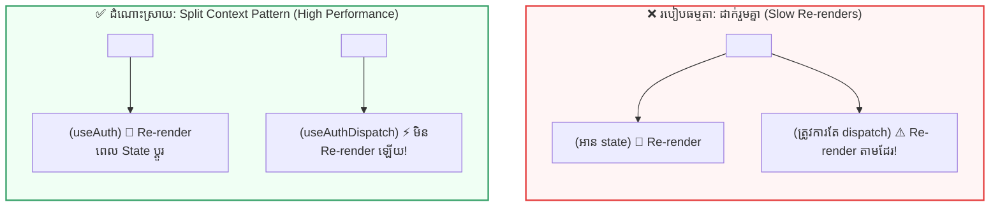

## 💡 ១. ហេតុអ្វីបានជាត្រូវរៀនមេរៀននេះ? (The Big Picture)

នៅក្នុងមេរៀនមុនៗ យើងបានសិក្សាឧបករណ៍សំខាន់ៗចំនួនពីររួចមកហើយ ៖
1. **Context API (មេរៀនទី ២) ៖** ជួយចែករំលែកទិន្នន័យពីលើចុះក្រោម ដោយមិនបាច់ឆ្លងកាត់ Prop Drilling។
2. **useReducer (មេរៀនទី ៣) ៖** ជួយគ្រប់គ្រង Business Logic ស្មុគស្មាញឱ្យមានរបៀបរៀបរយតាមរយៈ Actions & Reducer Function។

> [!IMPORTANT]
> **សំណួរគន្លឹះ ៖**  
> ចុះប្រសិនបើនៅក្នុង Real-world App យើងមាន State ស្មុគស្មាញ (ដូចជា **User Authentication** ឬ **Shopping Cart**) ហើយយើងចង់ចែករំលែកទិន្នន័យនោះទៅកាន់គ្រប់ Component ពេញមួយ App តើយើងគួរធ្វើដូចម្តេច?  
> 👉 **ដំណោះស្រាយដ៏ពេញនិយមបំផុត ៖** គឺការដាក់ **`useReducer` ចូលទៅខាងក្នុង `Context Provider`!** វិធីនេះផ្តល់ឱ្យយើងនូវ Global State Architecture មួយកម្រិតស្មើនឹង Redux ដោយមិនចាំបាច់ Install Library បន្ថែមឡើយ។

---

## 🏛️ ២. បញ្ហាធំៗ ២ ដែលយើងត្រូវដោះស្រាយក្នុងមេរៀននេះ

```
┌──────────────────────────────────────────────┐
│  បញ្ហាទី ១: Spaghetti Code ក្នុង App.jsx      │ ➔ ដំណោះស្រាយ: Dedicated Context Module
├──────────────────────────────────────────────┤
│  បញ្ហាទី ២: ប៊ូតុងចុច Re-render ឥតប្រយោជន៍   │ ➔ ដំណោះស្រាយ: The Split Context Pattern
└──────────────────────────────────────────────┘
```

### បញ្ហាទី ១ ៖ Spaghetti Code ក្នុង `App.jsx`
ប្រសិនបើយើងសរសេរ `createContext`, `useReducer`, `useEffect`, និង Function Handlers ទាំងអស់ញាត់ចូលក្នុង `App.jsx` នោះ `App.jsx` នឹងរីកទំហំរាប់រយបន្ទាត់ ពិបាកអាន និងពិបាកថែទាំ។  
👉 **ដំណោះស្រាយ ៖** បង្កើត **Dedicated Context Module** មួយដាច់ដោយឡែកក្នុង Folder `src/context/` (ឧទាហរណ៍ ៖ `src/context/AuthContext.jsx`)។

```
src/
├── context/
│   ├── AuthContext.jsx      # 🔐 គ្រប់គ្រង Login/Logout, Token, User Session
│   ├── ThemeContext.jsx     # 🎨 គ្រប់គ្រង Dark/Light Mode
│   ├── CartContext.jsx      # 🛒 គ្រប់គ្រង Shopping Cart + useReducer
│   └── AppProviders.jsx     # 🧩 Provider Combiner (កន្លែងប្រមូលផ្តុំ Providers)
```

---

### បញ្ហាទី ២ ៖ ប៊ូតុងចុច Re-render ដោយឥតប្រយោជន៍ (The Split Context Solution)

ដើម្បីយល់ពីបញ្ហានេះ សូមស្រមៃមើល **«កញ្ចក់ទូរទស្សន៍»** និង **«តេឡេបញ្ជា»** 📺៖
- **កញ្ចក់ទូរទស្សន៍ (State):** ត្រូវបង្ហាញរូបភាព និងសំឡេង (ដូចជា ProfileCard / UserAvatar) ➔ ត្រូវតែផ្លាស់ប្តូររូបភាព (Re-render) រាល់ពេលដែល State ប្តូរ។
- **តេឡេបញ្ជា (Dispatch):** មានតែប៊ូតុងចុចបញ្ជា (ដូចជា Logout Button) ➔ តេឡេខ្លួនឯង **មិនគួរត្រូវ Re-render ឬកន្ត្រាក់ឡើយ** នៅពេលដែលទូរទស្សន៍ផ្លាស់ប្តូររូបភាព!



> [!TIP]
> **ច្បាប់នៃ Stable Identity ក្នុង React ៖**  
> `dispatch` function ពី `useReducer` មិនដែលផ្លាស់ប្តូរ Reference ឡើយរវាង Render។  
> នៅពេលយើងបំបែកវាជា `AuthStateContext` និង `AuthDispatchContext` នោះ Components ណាដែលត្រូវការត្រឹមតែ `dispatch` (ដូចជាប៊ូតុង Logout) នឹង **មិនត្រូវ Re-render ឡើងវិញជាដាច់ខាត** ទោះបី User Data ផ្លាស់ប្តូររាប់ពាន់ដងក៏ដោយ!

---

## 💻 ៣. ការអនុវត្ត Dedicated AuthContext Module (បំបែកមួយជំហានម្តងៗ)

ដើម្បីឱ្យកូដមានរបៀបរៀបរយតាមស្តង់ដារ Enterprise យើងបំបែកការបង្កើត `AuthContext.jsx` ជាជំហានៗ ៖

### ជំហានទី ១ ៖ បង្កើត Split Context Objects & Initial State
បង្កើត Private Context ចំនួន ២ (State & Dispatch) រួមជាមួយ Initial State ៖

```javascript
// src/context/AuthContext.jsx
import { createContext } from 'react';

// ១. Private Context Instances (មិន Export ទៅក្រៅទេ)
const AuthStateContext = createContext(null);
const AuthDispatchContext = createContext(null);

// ២. Initial Auth State Shape
const initialAuthState = {
  user: null,
  token: null,
  isAuthenticated: false,
  isLoading: true, // សម្រាប់ត្រួតពិនិត្យ Token ដំបូង
  error: null,
};
```

---

### ជំហានទី ២ ៖ បង្កើត Pure Auth Reducer Function
គ្រប់គ្រងការផ្លាស់ប្តូរ State ទៅតាម Action Types នីមួយៗ ៖

```javascript
// src/context/AuthContext.jsx (បន្ត)

// Pure Reducer Function សម្រាប់គ្រប់គ្រង Auth State
function authReducer(state, action) {
  switch (action.type) {
    // ១. ចាប់ផ្តើម Login (បើក Loading និងសម្អាត Error ចាស់)
    case 'LOGIN_START':
      return {
        ...state,
        isLoading: true,
        error: null,
      };

    // ២. Login ជោគជ័យ (រក្សាទុក User, Token និងកំណត់ Authenticated)
    case 'LOGIN_SUCCESS':
      return {
        ...state,
        isLoading: false,
        isAuthenticated: true,
        user: action.payload.user,
        token: action.payload.token,
        error: null,
      };

    // ៣. Login បរាជ័យ (រក្សាទុកសារ Error និងបិទ Loading)
    case 'LOGIN_FAILURE':
      return {
        ...state,
        isLoading: false,
        isAuthenticated: false,
        user: null,
        token: null,
        error: action.payload,
      };

    // ៤. Logout (សម្អាត User Session ទាំងអស់ចេញពី State)
    case 'LOGOUT':
      return {
        ...state,
        isLoading: false,
        isAuthenticated: false,
        user: null,
        token: null,
        error: null,
      };

    // ៥. ស្ដារ Session ឡើងវិញពី LocalStorage ពេល Refresh Browser
    case 'RESTORE_SESSION':
      return {
        ...state,
        isLoading: false,
        isAuthenticated: !!action.payload.user,
        user: action.payload.user,
        token: action.payload.token,
      };

    default:
      throw new Error(`Unhandled action type: ${action.type}`);
  }
}
```

---

### ជំហានទី ៣ ៖ បង្កើត `<AuthProvider>` Component
ផ្គត់ផ្គង់ State និង Dispatch ដាច់ដោយឡែកពីគ្នា (Split Provider) ៖

```jsx
// src/context/AuthContext.jsx
import { useReducer, useEffect } from 'react';

export function AuthProvider({ children }) {
  const [state, dispatch] = useReducer(authReducer, initialAuthState);

  // 🔄 Restore session ពី localStorage ពេល Mount
  useEffect(() => {
    try {
      const savedUser = localStorage.getItem('auth_user');
      const savedToken = localStorage.getItem('auth_token');
      if (savedUser && savedToken) {
        dispatch({
          type: 'RESTORE_SESSION',
          payload: { user: JSON.parse(savedUser), token: savedToken },
        });
      } else {
        dispatch({ type: 'RESTORE_SESSION', payload: { user: null, token: null } });
      }
    } catch {
      dispatch({ type: 'RESTORE_SESSION', payload: { user: null, token: null } });
    }
  }, []);

  // HTML / JSX Provider Wrapper ជាមួយ Split Context
  return (
    <AuthStateContext.Provider value={state}>
      <AuthDispatchContext.Provider value={dispatch}>
        {children}
      </AuthDispatchContext.Provider>
    </AuthStateContext.Provider>
  );
}
```

---

### ជំហានទី ៤ ៖ បង្កើត Custom Hooks ជាមួយ Fail-Safe Guards

```javascript
// src/context/AuthContext.jsx
import { useContext } from 'react';

// ៤.១ Hook សម្រាប់អាន State (User Profile, Auth Status)
export function useAuth() {
  const context = useContext(AuthStateContext);
  if (!context) {
    throw new Error('useAuth() ត្រូវតែប្រើនៅខាងក្នុង <AuthProvider> ប៉ុណ្ណោះ!');
  }
  return context;
}

// ៤.២ Hook សម្រាប់ទាញយក Dispatch Function តែមួយគត់
export function useAuthDispatch() {
  const context = useContext(AuthDispatchContext);
  if (!context) {
    throw new Error('useAuthDispatch() ត្រូវតែប្រើនៅខាងក្នុង <AuthProvider> ប៉ុណ្ណោះ!');
  }
  return context;
}

// ៤.៣ Helper Actions Hook សម្រាប់ Login / Logout
export function useAuthActions() {
  const dispatch = useAuthDispatch();

  const login = async (email, password) => {
    dispatch({ type: 'LOGIN_START' });
    try {
      if (email === 'admin@gmail.com' && password === '123456') {
        const dummyUser = { id: 1, name: 'Sok Dara', email, role: 'Admin' };
        const dummyToken = 'jwt-token-sample-xyz';
        localStorage.setItem('auth_user', JSON.stringify(dummyUser));
        localStorage.setItem('auth_token', dummyToken);
        dispatch({ type: 'LOGIN_SUCCESS', payload: { user: dummyUser, token: dummyToken } });
      } else {
        throw new Error('Email ឬ Password មិនត្រឹមត្រូវឡើយ!');
      }
    } catch (err) {
      dispatch({ type: 'LOGIN_FAILURE', payload: err.message });
    }
  };

  const logout = () => {
    localStorage.removeItem('auth_user');
    localStorage.removeItem('auth_token');
    dispatch({ type: 'LOGOUT' });
  };

  return { login, logout };
}
```

---

## 🚀 ៤. ការប្រើប្រាស់ក្នុង Application Components & HTML

ខាងក្រោមនេះជាការហៅប្រើប្រាស់ `useAuth` និង `useAuthActions` ក្នុង Component UI ជាក់ស្តែង ៖

### ៤.១ — User Navigation Bar (`Navbar.jsx`)
- **Logic & Hook:** ទាញយក `user`, `isAuthenticated` និង `logout`
- **HTML / JSX UI:**
```jsx
// src/components/Navbar.jsx
import { useAuth, useAuthActions } from '../context/AuthContext';

export function Navbar() {
  const { user, isAuthenticated, isLoading } = useAuth();
  const { logout } = useAuthActions();

  if (isLoading) return <header>កំពុងផ្ទុក Session...</header>;

  return (
    <header className="navbar">
      <span>🛡️ Enterprise Portal</span>

      {isAuthenticated ? (
        <div>
          <span>សួស្តី, {user.name} ({user.role})</span>
          <button onClick={logout}>ចាកចេញ (Logout)</button>
        </div>
      ) : (
        <span>មិនទាន់ Login ទេ</span>
      )}
    </header>
  );
}
```

---

### ៤.២ — Login Form Component (`LoginForm.jsx`)
- **Logic & Hook:** ហៅ `login(email, password)` និងបង្ហាញ Error
- **HTML / JSX UI:**
```jsx
// src/components/LoginForm.jsx
import { useState } from 'react';
import { useAuth, useAuthActions } from '../context/AuthContext';

export function LoginForm() {
  const { isAuthenticated, error, isLoading } = useAuth();
  const { login } = useAuthActions();
  const [email, setEmail] = useState('admin@gmail.com');
  const [password, setPassword] = useState('123456');

  if (isAuthenticated) {
    return <div className="success">🎉 អ្នកបាន Login រួចរាល់ហើយ!</div>;
  }

  const handleSubmit = (e) => {
    e.preventDefault();
    login(email, password);
  };

  return (
    <form onSubmit={handleSubmit} className="login-form">
      <h3>ចូលប្រើប្រាស់គណនី</h3>
      {error && <p className="error">⚠️ {error}</p>}

      <input
        type="email"
        placeholder="Email"
        value={email}
        onChange={(e) => setEmail(e.target.value)}
      />

      <input
        type="password"
        placeholder="Password"
        value={password}
        onChange={(e) => setPassword(e.target.value)}
      />

      <button type="submit" disabled={isLoading}>
        {isLoading ? 'កំពុងផ្ទៀងផ្ទាត់...' : 'Login ចូលគណនី'}
      </button>
    </form>
  );
}
```

---

### ៤.៣ — Root App Wrapper (`App.jsx`)
រុំព័ទ្ធ Top-Level Component ជាមួយ `<AuthProvider>` ៖

```jsx
// src/App.jsx
import { AuthProvider } from './context/AuthContext';
import { Navbar } from './components/Navbar';
import { LoginForm } from './components/LoginForm';

export default function App() {
  return (
    <AuthProvider>
      <div className="app-container">
        <Navbar />
        <LoginForm />
      </div>
    </AuthProvider>
  );
}
```

---

## 🧩 ៥. ដំណោះស្រាយ "Provider Hell" ជាមួយ AppProviders Combiner

នៅពេលកម្មវិធីរបស់អ្នកមានច្រើន Providers (Auth, Theme, Cart, Toast, QueryClient...) ការរុំជាន់គ្នាក្នុង `App.jsx` នឹងមើលទៅមិនស្អាត (Pyramid of Doom)៖

```jsx
// ❌ Provider Hell
<AuthProvider>
  <ThemeProvider>
    <CartProvider>
      <ToastProvider>
        <App />
      </ToastProvider>
    </CartProvider>
  </ThemeProvider>
</AuthProvider>
```

### ✅ ដំណោះស្រាយស្អាត ៖ `AppProviders.jsx`

```jsx
// src/context/AppProviders.jsx
import { AuthProvider } from './AuthContext';
import { ThemeProvider } from './ThemeContext';
import { CartProvider } from './CartContext';
import { ToastProvider } from './ToastContext';

export function AppProviders({ children }) {
  return (
    <AuthProvider>
      <ThemeProvider>
        <CartProvider>
          <ToastProvider>
            {children}
          </ToastProvider>
        </CartProvider>
      </ThemeProvider>
    </AuthProvider>
  );
}

// ក្នុង main.jsx ឬ App.jsx គ្រាន់តែរុំមួយជាន់ប៉ុណ្ណោះ!
// <AppProviders><App /></AppProviders>
```

---

## 🧠 ៦. សង្ខេប Mental Model ងាយចាំ

| មុខងារ | បច្ចេកទេសអនុវត្ត | អត្ថប្រយោជន៍ចម្បង |
| :--- | :--- | :--- |
| **Context Encapsulation** | រក្សាទុក Context ជា Private ក្នុង module | ការពារការ Import ច្របូកច្របល់ពីខាងក្រៅ |
| **Safety Guard** | `if (!context) throw new Error(...)` | ជួយដាស់តឿន Developer ភ្លាមៗបើភ្លេច Provider |
| **Split Pattern** | បំបែក `StateContext` និង `DispatchContext` | ទប់ស្កាត់ Unnecessary Re-render លើ Consumer Components |
| **Provider Combiner** | បង្កើត `<AppProviders>` Component | លុបបំបាត់ Provider Hell ធ្វើឱ្យ Codebase មានរបៀបរៀបរយ |
