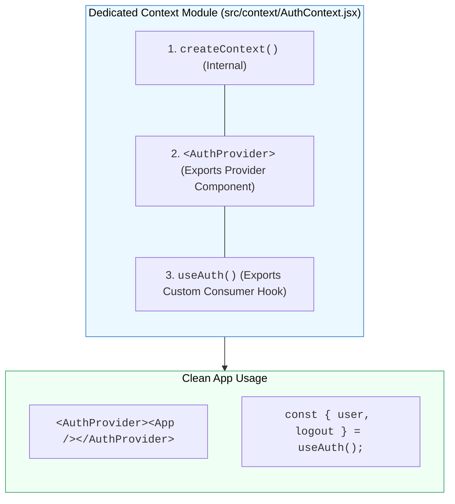

## 🏛️ 1. Scalable Provider Architecture Pattern

ជំនួសឱ្យការសរសេរកូដ Provider និង State ទាំងអស់ច្របូកច្របល់ក្នុង `App.jsx` យើងបំបែកវាជា **Dedicated Context Module** ក្នុង `src/context/`៖



---

## 🛠️ 2. កូដគំរូ: `AuthContext.jsx`

```jsx
// ឯកសារ: src/context/AuthContext.jsx
import { createContext, useContext, useState } from 'react';

const AuthContext = createContext(null);

export function AuthProvider({ children }) {
  const [user, setUser] = useState(null);

  const login = (userData) => {
    setUser(userData);
    localStorage.setItem('user', JSON.stringify(userData));
  };

  const logout = () => {
    setUser(null);
    localStorage.removeItem('user');
  };

  return (
    <AuthContext.Provider value={{ user, login, logout, isAuthenticated: !!user }}>
      {children}
    </AuthContext.Provider>
  );
}

// Custom Hook ជាមួយ Safety Check
export function useAuth() {
  const context = useContext(AuthContext);
  if (!context) {
    throw new Error('useAuth must be used within an <AuthProvider>');
  }
  return context;
}
```
