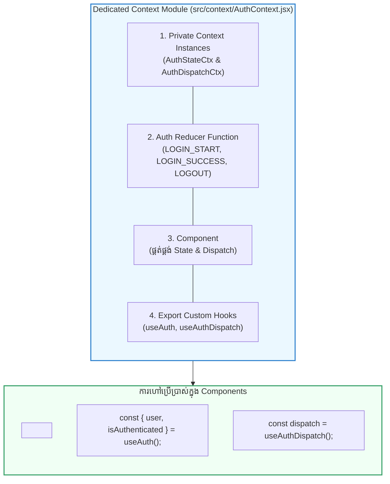

## 🏛️ ១. ស្ថាបត្យកម្ម Dedicated Context Module (Clean Architecture)

ជំនួសឱ្យការសរសេរកូដ Context ច្របូកច្របល់នៅខាងក្នុង `App.jsx` យើងរៀបចំវាជា **Dedicated Context Module** មួយក្នុង Folder `src/context/` ៖

```
src/
├── context/
│   ├── AuthContext.jsx      # 🔐 User Session & Authentication
│   ├── ThemeContext.jsx     # 🎨 Theme Mode (Light / Dark)
│   ├── CartContext.jsx      # 🛒 E-Commerce Cart + useReducer
│   └── AppProviders.jsx     # 🧩 Provider Combiner
```



---

## ⚡ ២. The Split Context Pattern (បំបែក State និង Dispatch សម្រាប់ High-Performance)

> [!TIP]
> **ហេតុអ្វីបានជាត្រូវបំបែក State និង Dispatch?**  
> នៅក្នុង React `dispatch` function ពី `useReducer` ត្រូវបានធានាថាមាន **Stable Identity** (មិនដែលផ្លាស់ប្តូរ reference ឡើយរវាង render)។  
> ប្រសិនបើយើងបំបែក Context ជាពីរ៖
> 1. `AuthStateContext` ➔ សម្រាប់ Components ដែលត្រូវការបង្ហាញទិន្នន័យ (User Profile, Avatar)
> 2. `AuthDispatchContext` ➔ សម្រាប់ Components ដែលត្រូវការតែ Action (Logout Button, Login Form)
> 
> នៅពេល User Login ឬ Logout សមាសភាគដែលមានតែប៊ូតុង **នឹងមិនត្រូវ Re-render ឡើងវិញជាដាច់ខាត!**

---

## 💻 ៣. កូដគំរូកម្រិត Enterprise ៖ `AuthContext.jsx` ពេញលេញ

```jsx
// src/context/AuthContext.jsx
import { createContext, useContext, useReducer, useEffect } from 'react';

// ── ១. បង្កើត PRIVATE CONTEXT OBJECTS ──
const AuthStateContext = createContext(null);
const AuthDispatchContext = createContext(null);

// ── ២. INITIAL STATE ──
const initialAuthState = {
  user: null,
  token: null,
  isAuthenticated: false,
  isLoading: true, // សម្រាប់ពិនិត្យមើល Token ដំបូង
  error: null,
};

// ── ៣. AUTH REDUCER ──
function authReducer(state, action) {
  switch (action.type) {
    case 'LOGIN_START':
      return { ...state, isLoading: true, error: null };

    case 'LOGIN_SUCCESS':
      return {
        ...state,
        isLoading: false,
        isAuthenticated: true,
        user: action.payload.user,
        token: action.payload.token,
        error: null,
      };

    case 'LOGIN_FAILURE':
      return {
        ...state,
        isLoading: false,
        isAuthenticated: false,
        user: null,
        token: null,
        error: action.payload,
      };

    case 'LOGOUT':
      return {
        ...state,
        isLoading: false,
        isAuthenticated: false,
        user: null,
        token: null,
        error: null,
      };

    case 'RESTORE_SESSION':
      return {
        ...state,
        isLoading: false,
        isAuthenticated: !!action.payload.user,
        user: action.payload.user,
        token: action.payload.token,
      };

    default:
      throw new Error(`Unhandled action type: ${action.type}`);
  }
}

// ── ៤. PROVIDER COMPONENT ──
export function AuthProvider({ children }) {
  const [state, dispatch] = useReducer(authReducer, initialAuthState);

  // 🔄 ពិនិត្យមើល LocalStorage ពេល App ចាប់ផ្តើមដំណើរការដំបូង
  useEffect(() => {
    try {
      const savedUser = localStorage.getItem('auth_user');
      const savedToken = localStorage.getItem('auth_token');

      if (savedUser && savedToken) {
        dispatch({
          type: 'RESTORE_SESSION',
          payload: { user: JSON.parse(savedUser), token: savedToken },
        });
      } else {
        dispatch({ type: 'RESTORE_SESSION', payload: { user: null, token: null } });
      }
    } catch {
      dispatch({ type: 'RESTORE_SESSION', payload: { user: null, token: null } });
    }
  }, []);

  return (
    <AuthStateContext.Provider value={state}>
      <AuthDispatchContext.Provider value={dispatch}>
        {children}
      </AuthDispatchContext.Provider>
    </AuthStateContext.Provider>
  );
}

// ── ៥. CUSTOM HOOKS WITH FAIL-SAFE GUARDS ──

// Hook សម្រាប់អាន State (User, Auth status, Loading)
export function useAuth() {
  const context = useContext(AuthStateContext);
  if (!context) {
    throw new Error('useAuth() ត្រូវតែប្រើប្រាស់នៅខាងក្នុង <AuthProvider> ប៉ុណ្ណោះ!');
  }
  return context;
}

// Hook សម្រាប់ទាញយក Dispatch Function (Login, Logout actions)
export function useAuthDispatch() {
  const context = useContext(AuthDispatchContext);
  if (!context) {
    throw new Error('useAuthDispatch() ត្រូវតែប្រើប្រាស់នៅខាងក្នុង <AuthProvider> ប៉ុណ្ណោះ!');
  }
  return context;
}

// Helper Functions សម្រាប់ Login / Logout ដោយស្វ័យប្រវត្តិ
export function useAuthActions() {
  const dispatch = useAuthDispatch();

  const login = async (email, password) => {
    dispatch({ type: 'LOGIN_START' });
    try {
      // ក្លែងធ្វើ API Request
      if (email === 'admin@gmail.com' && password === '123456') {
        const dummyUser = { id: 1, name: 'Sok Dara', email, role: 'Admin' };
        const dummyToken = 'jwt-token-sample-xyz';

        localStorage.setItem('auth_user', JSON.stringify(dummyUser));
        localStorage.setItem('auth_token', dummyToken);

        dispatch({
          type: 'LOGIN_SUCCESS',
          payload: { user: dummyUser, token: dummyToken },
        });
      } else {
        throw new Error('Email ឬ Password មិនត្រឹមត្រូវឡើយ!');
      }
    } catch (err) {
      dispatch({ type: 'LOGIN_FAILURE', payload: err.message });
    }
  };

  const logout = () => {
    localStorage.removeItem('auth_user');
    localStorage.removeItem('auth_token');
    dispatch({ type: 'LOGOUT' });
  };

  return { login, logout };
}
```

---

## 🚀 ៤. ការប្រើប្រាស់ក្នុង Application UI

```jsx
// src/App.jsx
import { useState } from 'react';
import { AuthProvider, useAuth, useAuthActions } from './context/AuthContext';

function Navbar() {
  const { user, isAuthenticated, isLoading } = useAuth();
  const { logout } = useAuthActions();

  if (isLoading) {
    return <header className="p-4 text-xs text-slate-400">កំពុងផ្ទុក Session...</header>;
  }

  return (
    <header className="p-4 border-b flex justify-between items-center bg-white dark:bg-slate-900">
      <div className="font-bold text-sm text-slate-800 dark:text-white">
        🛡️ Enterprise Auth Portal
      </div>

      {isAuthenticated ? (
        <div className="flex items-center gap-3">
          <span className="text-xs font-semibold text-slate-700 dark:text-slate-300">
            សួស្តី, {user.name} ({user.role})
          </span>
          <button
            onClick={logout}
            className="px-3 py-1.5 bg-rose-600 hover:bg-rose-700 text-white rounded-xl text-xs font-bold transition shadow"
          >
            ចាកចេញ (Logout)
          </button>
        </div>
      ) : (
        <span className="text-xs text-slate-400">មិនទាន់ Login ទេ</span>
      )}
    </header>
  );
}

function LoginForm() {
  const { isAuthenticated, error, isLoading } = useAuth();
  const { login } = useAuthActions();
  const [email, setEmail] = useState('admin@gmail.com');
  const [password, setPassword] = useState('123456');

  if (isAuthenticated) {
    return (
      <div className="p-6 text-center text-emerald-600 font-bold text-sm">
        🎉 អ្នកបាន Login រួចរាល់ហើយ!
      </div>
    );
  }

  const handleSubmit = (e) => {
    e.preventDefault();
    login(email, password);
  };

  return (
    <form onSubmit={handleSubmit} className="p-6 space-y-4 max-w-sm mx-auto">
      <h3 className="font-bold text-base text-slate-800 dark:text-white">ចូលប្រើប្រាស់គណនី</h3>
      
      {error && (
        <div className="p-3 bg-rose-50 border border-rose-200 text-rose-600 rounded-xl text-xs font-medium">
          ⚠️ {error}
        </div>
      )}

      <div>
        <label className="block text-xs font-bold text-slate-600 dark:text-slate-400 mb-1">
          Email (ប្រើ: admin@gmail.com)
        </label>
        <input
          type="email"
          value={email}
          onChange={(e) => setEmail(e.target.value)}
          className="w-full px-3 py-2 border rounded-xl text-xs dark:bg-slate-800 dark:text-white"
        />
      </div>

      <div>
        <label className="block text-xs font-bold text-slate-600 dark:text-slate-400 mb-1">
          Password (ប្រើ: 123456)
        </label>
        <input
          type="password"
          value={password}
          onChange={(e) => setPassword(e.target.value)}
          className="w-full px-3 py-2 border rounded-xl text-xs dark:bg-slate-800 dark:text-white"
        />
      </div>

      <button
        type="submit"
        disabled={isLoading}
        className="w-full py-2.5 bg-indigo-600 hover:bg-indigo-700 text-white rounded-xl text-xs font-bold transition shadow"
      >
        {isLoading ? 'កំពុងផ្ទៀងផ្ទាត់...' : 'Login ចូលគណនី'}
      </button>
    </form>
  );
}

export default function App() {
  return (
    <AuthProvider>
      <div className="min-h-[420px] max-w-md mx-auto my-8 bg-white dark:bg-slate-900 rounded-3xl border shadow-xl overflow-hidden">
        <Navbar />
        <LoginForm />
      </div>
    </AuthProvider>
  );
}
```

---

## 🧩 ៥. ដំណោះស្រាយ "Provider Hell" ជាមួយ AppProviders Combiner

នៅពេលកម្មវិធីរបស់អ្នកមានច្រើន Providers (Auth, Theme, Cart, Toast, QueryClient...) ការរុំជាន់គ្នាក្នុង `App.jsx` នឹងមើលទៅមិនស្អាត (Pyramid of Doom)៖

```jsx
// ❌ Provider Hell
<AuthProvider>
  <ThemeProvider>
    <CartProvider>
      <ToastProvider>
        <App />
      </ToastProvider>
    </CartProvider>
  </ThemeProvider>
</AuthProvider>
```

### ✅ ដំណោះស្រាយស្អាត ៖ `AppProviders.jsx`

```jsx
// src/context/AppProviders.jsx
import { AuthProvider } from './AuthContext';
import { ThemeProvider } from './ThemeContext';
import { CartProvider } from './CartContext';
import { ToastProvider } from './ToastContext';

export function AppProviders({ children }) {
  return (
    <AuthProvider>
      <ThemeProvider>
        <CartProvider>
          <ToastProvider>
            {children}
          </ToastProvider>
        </CartProvider>
      </ThemeProvider>
    </AuthProvider>
  );
}

// ក្នុង main.jsx ឬ App.jsx គ្រាន់តែរុំមួយជាន់ប៉ុណ្ណោះ!
// <AppProviders><App /></AppProviders>
```

---

## 🧠 ៦. សង្ខេប Mental Model ងាយចាំ

| មុខងារ | បច្ចេកទេសអនុវត្ត | អត្ថប្រយោជន៍ចម្បង |
| :--- | :--- | :--- |
| **Context Encapsulation** | រក្សាទុក Context ជា Private ក្នុង module | ការពារការ Import ច្របូកច្របល់ពីខាងក្រៅ |
| **Safety Guard** | `if (!context) throw new Error(...)` | ជួយដាស់តឿន Developer ភ្លាមៗបើភ្លេច Provider |
| **Split Pattern** | បំបែក `StateContext` និង `DispatchContext` | ទប់ស្កាត់ Unnecessary Re-render លើ Consumer Components |
| **Provider Combiner** | បង្កើត `<AppProviders>` Component | លុបបំបាត់ Provider Hell ធ្វើឱ្យ Codebase មានរបៀបរៀបរយ |
