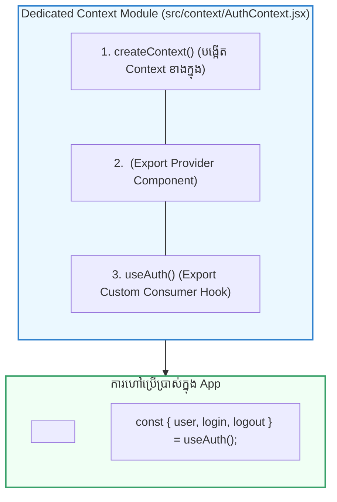

## 🏛️ ១. ស្ថាបត្យកម្ម Custom Provider Module (Clean Pattern)

ជំនួសឱ្យការសរសេរកូដ Context ច្របូកច្របល់ក្នុង `App.jsx` យើងបំបែកវាជា **Dedicated Context Module** មួយក្នុង `src/context/AuthContext.jsx`៖



---

## 🛠️ ២. ហេតុអ្វីគួរបង្កើត Custom Hook ដូចជា `useAuth()`?

សាកស្រមៃមើលកូដ ២ នេះ៖

### ❌ របៀបធម្មតា (ត្រូវ Import ២ ដងគ្រប់កន្លែង):
```jsx
// ក្នុង Navbar.jsx
import { useContext } from 'react';
import { AuthContext } from '../context/AuthContext'; // ⚠️ ត្រូវ import Context Object

function Navbar() {
  const auth = useContext(AuthContext); // បើភ្លេច wrap Provider វានឹង return undefined ដោយស្ងាត់ៗ!
}
```

### ✅ របៀប Custom Hook (ស្អាត និងមានសុវត្ថិភាព):
```jsx
// ក្នុង Navbar.jsx
import { useAuth } from '../context/AuthContext'; // ✨ Import តែមួយគត់!

function Navbar() {
  const { user, logout } = useAuth(); // មាន Safety Check ស្វ័យប្រវត្តិ!
}
```

---

## 💻 ៣. កូដគំរូពេញលេញ ៖ `AuthContext.jsx`

```jsx
// ឯកសារ: src/context/AuthContext.jsx
import { createContext, useContext, useState } from 'react';

// ១. បង្កើត Context (រក្សាទុកជា Private ក្នុង file នេះ)
const AuthContext = createContext(null);

// ២. បង្កើត Provider Component
export function AuthProvider({ children }) {
  const [user, setUser] = useState(null);

  const login = (userData) => {
    setUser(userData);
    localStorage.setItem('auth_user', JSON.stringify(userData));
  };

  const logout = () => {
    setUser(null);
    localStorage.removeItem('auth_user');
  };

  return (
    <AuthContext.Provider value={{ user, login, logout, isAuthenticated: !!user }}>
      {children}
    </AuthContext.Provider>
  );
}

// ៣. Custom Hook អមដោយ Safety Check (Developer Experience)
export function useAuth() {
  const context = useContext(AuthContext);
  if (!context) {
    throw new Error('useAuth() ត្រូវតែប្រើប្រាស់នៅខាងក្នុង <AuthProvider> ប៉ុណ្ណោះ!');
  }
  return context;
}
```

---

## 🚀 ៤. របៀបហៅប្រើប្រាស់ក្នុង App

```jsx
import { AuthProvider, useAuth } from './context/AuthContext';

function UserProfile() {
  const { user, logout } = useAuth();

  if (!user) return <p className="text-xs text-slate-400">សូម Login ដើម្បីបន្ត</p>;

  return (
    <div className="flex items-center gap-3">
      <span className="font-bold text-sm">សួស្តី, {user.name}</span>
      <button onClick={logout} className="px-3 py-1 bg-rose-600 text-white rounded-lg text-xs font-bold">
        Logout
      </button>
    </div>
  );
}

export default function App() {
  return (
    <AuthProvider>
      <div className="p-6 max-w-sm mx-auto bg-white dark:bg-slate-800 rounded-2xl shadow border">
        <UserProfile />
      </div>
    </AuthProvider>
  );
}
```

---

## 🧠 ៥. សង្ខេប Mental Model ងាយចាំ

| លក្ខណៈពិសេស | អត្ថប្រយោជន៍ចម្បង |
| :--- | :--- |
| **Encapsulation** | `createContext` នៅខាងក្នុង `AuthContext.jsx` មិនបាច់ export ផ្តេសផ្តាស |
| **Safety Guard** | `if (!context) throw new Error(...)` ប្រាប់ developer ភ្លាមបើភ្លេច wrap Provider |
| **Clean Imports** | Component ផ្សេងៗគ្រាន់តែ import `useAuth` មួយបន្ទាត់ជាការស្រេច |
