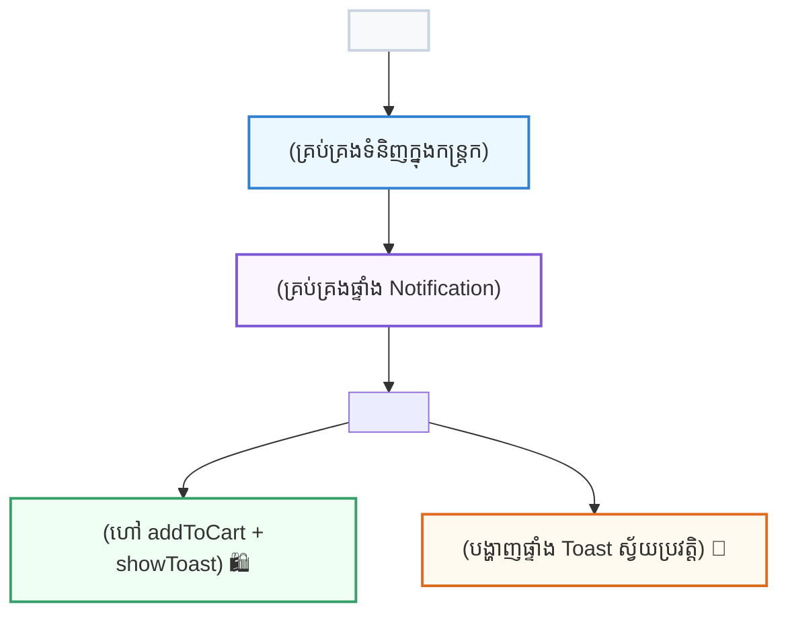

## 🏗️ ១. ស្ថាបត្យកម្ម Multi-Context (CartContext + ToastContext)

នៅក្នុង App ខ្នាតធំ យើងមិនគួរញាត់ State ទាំងអស់ចូលក្នុង Context តែមួយឡើយ។ យើងបែងចែកវាជា **២ Contexts ដាច់ដោយឡែកពីគ្នា** ៖



---

## 💻 ២. កូដពេញលេញនៃគម្រោង E-Commerce Demo

```jsx
import { createContext, useContext, useState } from 'react';

// ==========================================
// ១. CART CONTEXT
// ==========================================
const CartContext = createContext(null);

export function CartProvider({ children }) {
  const [items, setItems] = useState([]);

  const addToCart = (product) => {
    setItems((prev) => [...prev, product]);
  };

  const totalAmount = items.reduce((sum, item) => sum + item.price, 0);

  return (
    <CartContext.Provider value={{ items, addToCart, totalAmount, count: items.length }}>
      {children}
    </CartContext.Provider>
  );
}

export function useCart() {
  const context = useContext(CartContext);
  if (!context) throw new Error('useCart must be used within CartProvider');
  return context;
}

// ==========================================
// ២. TOAST CONTEXT
// ==========================================
const ToastContext = createContext(null);

export function ToastProvider({ children }) {
  const [toast, setToast] = useState(null);

  const showToast = (message) => {
    setToast(message);
    // បិទ Toast ស្វ័យប្រវត្តិក្នងរយៈពេល ២.៥ វិនាទី
    setTimeout(() => {
      setToast(null);
    }, 2500);
  };

  return (
    <ToastContext.Provider value={{ showToast }}>
      {children}
      {toast && (
        <div className="fixed bottom-5 right-5 bg-slate-900 text-white px-4 py-2.5 rounded-2xl text-xs font-bold shadow-2xl border border-slate-700 animate-bounce flex items-center gap-2 z-50">
          <span>🔔</span>
          <span>{toast}</span>
        </div>
      )}
    </ToastContext.Provider>
  );
}

export function useToast() {
  const context = useContext(ToastContext);
  if (!context) throw new Error('useToast must be used within ToastProvider');
  return context;
}

// ==========================================
// ៣. PRODUCT CARD COMPONENT
// ==========================================
function ProductCard({ product }) {
  const { addToCart } = useCart();
  const { showToast } = useToast();

  const handleBuy = () => {
    addToCart(product);
    showToast(`បានបន្ថែម "${product.title}" ចូលកន្ត្រកជោគជ័យ!`);
  };

  return (
    <div className="p-4 bg-white dark:bg-slate-800 rounded-2xl shadow border border-slate-100 dark:border-slate-700 flex justify-between items-center">
      <div>
        <h4 className="font-bold text-sm text-slate-800 dark:text-white">{product.title}</h4>
        <p className="text-xs text-blue-600 dark:text-blue-400 font-black mt-0.5">${product.price}</p>
      </div>
      <button
        onClick={handleBuy}
        className="px-4 py-2 bg-blue-600 hover:bg-blue-700 text-white rounded-xl text-xs font-bold transition shadow"
      >
        + Add to Cart
      </button>
    </div>
  );
}

// ==========================================
// ៤. ROOT APP COMPONENT
// ==========================================
export default function ContextMiniProject() {
  return (
    <CartProvider>
      <ToastProvider>
        <ShopContent />
      </ToastProvider>
    </CartProvider>
  );
}

function ShopContent() {
  const { count, totalAmount } = useCart();

  return (
    <div className="max-w-md mx-auto p-6 space-y-4">
      {/* Header Cart Badge */}
      <div className="flex justify-between items-center bg-white dark:bg-slate-800 p-4 rounded-2xl shadow border">
        <h2 className="text-base font-bold text-slate-800 dark:text-white">🛍️ Web Dev Shop</h2>
        <div className="text-xs font-bold bg-blue-50 dark:bg-blue-900/30 text-blue-600 dark:text-blue-300 px-3 py-1.5 rounded-full">
          🛒 {count} items (${totalAmount})
        </div>
      </div>

      {/* Product List */}
      <ProductCard product={{ id: 1, title: 'React Mastery Masterclass', price: 49 }} />
      <ProductCard product={{ id: 2, title: 'Next.js 15 Full-Stack Course', price: 69 }} />
      <ProductCard product={{ id: 3, title: 'TypeScript Pro Architecture', price: 39 }} />
    </div>
  );
}
```

---

## 🔍 ៣. ការវិភាគចំណុចគន្លឹះនៃកូដ

1. **ហេតុអ្វីបានជាបំបែក CartContext និង ToastContext?**  
   ប្រសិនបើដាក់បញ្ចូលគ្នាក្នុង Context តែមួយ រាល់ពេលអ្នកចុច "Add to Cart" នោះ Notification Component ក៏ត្រូវ Re-render ដែរ។ ការបំបែកជាពីរធ្វើឱ្យកូដ Re-render តែ Component ណាដែលចាំបាច់ប៉ុណ្ណោះ (Performance Optimization)។
2. **Auto-dismiss Toast ដំណើរការយ៉ាងណា?**  
   ក្នុង `ToastProvider` យើងប្រើ `setTimeout(() => setToast(null), 2500)` ដើម្បីបិទ Notification ដោយស្វ័យប្រវត្តិ។

---

## 🏆 ៤. បញ្ជីត្រួតពិនិត្យការអនុវត្ត (Checklist)

- [x] Cart State ត្រូវបានចែករំលែកឆ្លងកាត់ Components ដោយគ្មាន Prop Drilling
- [x] ចុច Add to Cart បង្ហាញ Toast Alert បណ្តែតនៅជ្រុងខាងស្តាំស្វ័យប្រវត្តិ
- [x] Toast បាត់ទៅវិញដោយស្វ័យប្រវត្តិក្នងរយៈពេល ២.៥ វិនាទី
- [x] តម្លៃសរុប និងចំនួនទំនិញ Update ភ្លាមៗនៅលើ Header
