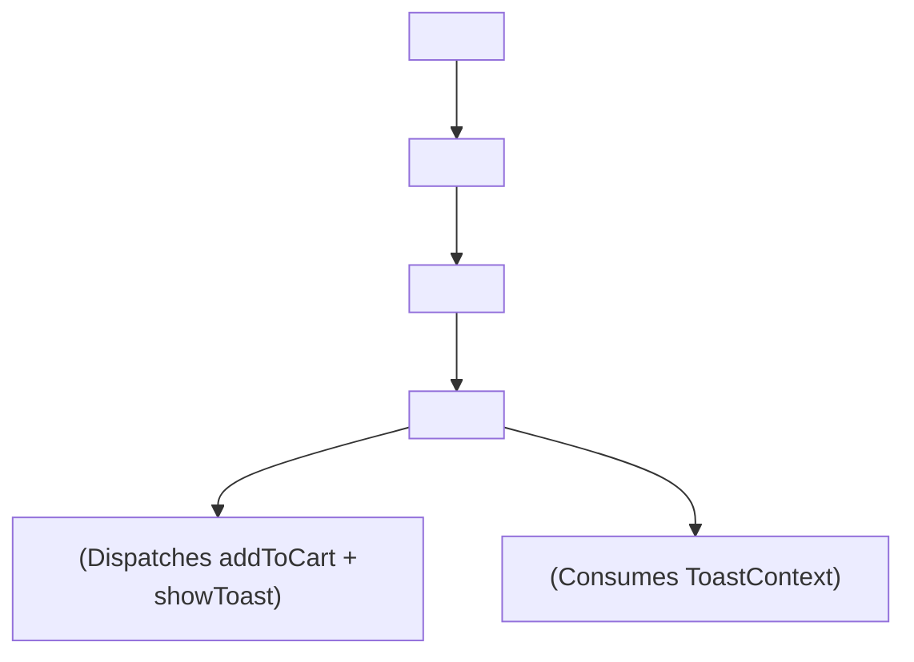

## 🏗️ 1. Multi-Context Architecture



---

## 🎨 2. Normal HTML Shop & Toast Layout

```html
<!-- HTML Shop Structure with Floating Toast -->
<div class="shop-app">
  <header>
    <span>🛒 Cart (0)</span>
  </header>
  <main>
    <div class="product">
      <h4>Course Name</h4>
      <button>Add to Cart</button>
    </div>
  </main>
  <!-- Toast Alert -->
  <div class="toast-alert">✅ Added to Cart!</div>
</div>
```

---

## 🚀 3. Complete Multi-Context E-Commerce Demo

```jsx
import { createContext, useContext, useState } from 'react';

// ── 1. CART CONTEXT ──
const CartContext = createContext(null);

export function CartProvider({ children }) {
  const [items, setItems] = useState([]);
  const addToCart = (product) => setItems((p) => [...p, product]);

  return (
    <CartContext.Provider value={{ items, addToCart }}>
      {children}
    </CartContext.Provider>
  );
}

// ── 2. TOAST CONTEXT ──
const ToastContext = createContext(null);

export function ToastProvider({ children }) {
  const [toast, setToast] = useState(null);

  const showToast = (message) => {
    setToast(message);
    setTimeout(() => setToast(null), 2500);
  };

  return (
    <ToastContext.Provider value={{ showToast }}>
      {children}
      {toast && (
        <div className="fixed bottom-4 right-4 bg-slate-900 text-white px-4 py-2 rounded-xl text-xs font-bold shadow-xl animate-bounce">
          {toast}
        </div>
      )}
    </ToastContext.Provider>
  );
}

// ── 3. PRODUCT ITEM COMPONENT ──
function ProductCard({ product }) {
  const { addToCart } = useContext(CartContext);
  const { showToast } = useContext(ToastContext);

  const handleBuy = () => {
    addToCart(product);
    showToast(`✅ Added ${product.title} to cart!`);
  };

  return (
    <div className="p-4 bg-white dark:bg-slate-800 rounded-2xl shadow border flex justify-between items-center">
      <div>
        <h4 className="font-bold text-sm text-slate-800 dark:text-white">{product.title}</h4>
        <p className="text-xs text-blue-600 font-black">${product.price}</p>
      </div>
      <button
        onClick={handleBuy}
        className="px-3 py-1.5 bg-blue-600 text-white rounded-xl text-xs font-bold"
      >
        + Add
      </button>
    </div>
  );
}

// ── 4. ROOT APP ──
export default function ContextMiniProject() {
  return (
    <CartProvider>
      <ToastProvider>
        <div className="max-w-md mx-auto p-6 space-y-4">
          <h2 className="text-xl font-bold text-slate-800 dark:text-white">
            🛍️ Multi-Context Shop Demo
          </h2>
          <ProductCard product={{ id: 1, title: 'React Mastery', price: 49 }} />
          <ProductCard product={{ id: 2, title: 'Next.js 15 Fullstack', price: 69 }} />
        </div>
      </ToastProvider>
    </CartProvider>
  );
}
```
