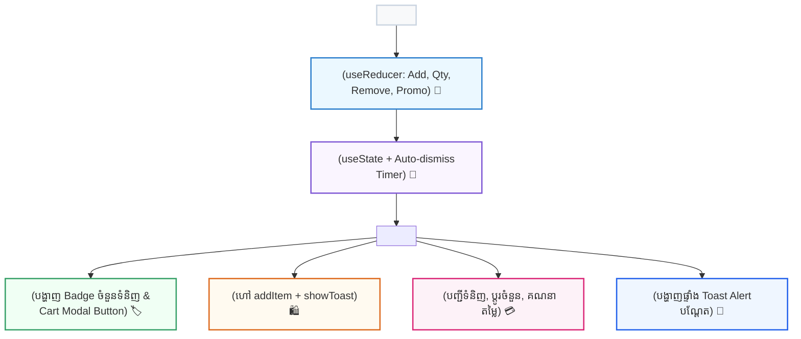

## 🛍️ ១. ស្ថាបត្យកម្មប្រព័ន្ធ Multi-Context (Architecture Blueprint)

នៅក្នុងគម្រោងខ្នាតធំ យើងមិនត្រូវច្របល់ State ទាំងអស់ចូលក្នុង Global Container តែមួយឡើយ។ យើងបែងចែកវាជា **២ Dedicated Contexts** ៖
1. **`CartContext` (គ្រប់គ្រងដោយ `useReducer`):** ផ្ទុកទិន្នន័យទំនិញ, ចំនួន (Quantity), ការបញ្ចុះតម្លៃ (Promo Code), និងការគណនាតម្លៃសរុប។
2. **`ToastContext` (គ្រប់គ្រងដោយ `useState` + Timer):** បង្ហាញ Floating Notification Message នៅជ្រុងខាងក្រោម និងបិទទៅវិញដោយស្វ័យប្រវត្តិក្នងរយៈពេល ២.៥ វិនាទី។



---

## 💻 ២. កូដពេញលេញនៃគម្រោង (Complete E-Commerce Project)

### 📂 ឯកសារទី ១ ៖ `ToastContext.jsx` (Notification System)

```jsx
// src/context/ToastContext.jsx
import { createContext, useContext, useState, useCallback } from 'react';

const ToastContext = createContext(null);

export function ToastProvider({ children }) {
  const [toasts, setToasts] = useState([]);

  // Function សម្រាប់ Trigger Toast ថ្មី
  const showToast = useCallback((message, type = 'success') => {
    const id = Date.now() + Math.random();
    const newToast = { id, message, type };

    setToasts((prev) => [...prev, newToast]);

    // ⏱️ Auto-dismiss ក្នុងរយៈពេល ២.៥ វិនាទី
    setTimeout(() => {
      setToasts((prev) => prev.filter((t) => t.id !== id));
    }, 2500);
  }, []);

  const removeToast = useCallback((id) => {
    setToasts((prev) => prev.filter((t) => t.id !== id));
  }, []);

  return (
    <ToastContext.Provider value={{ showToast }}>
      {children}

      {/* Floating Toast Notification Container */}
      <div className="fixed bottom-5 right-5 z-50 flex flex-col gap-2 pointer-events-none max-w-sm">
        {toasts.map((toast) => (
          <div
            key={toast.id}
            className={`pointer-events-auto px-4 py-3 rounded-2xl shadow-2xl text-xs font-bold flex items-center justify-between gap-3 text-white transition-all transform animate-in slide-in-from-bottom-3 ${
              toast.type === 'danger'
                ? 'bg-rose-600'
                : toast.type === 'info'
                ? 'bg-blue-600'
                : 'bg-emerald-600'
            }`}
          >
            <div className="flex items-center gap-2">
              <span>{toast.type === 'danger' ? '🗑️' : '✨'}</span>
              <span>{toast.message}</span>
            </div>
            <button
              onClick={() => removeToast(toast.id)}
              className="opacity-75 hover:opacity-100 font-bold ml-2"
            >
              ✕
            </button>
          </div>
        ))}
      </div>
    </ToastContext.Provider>
  );
}

export function useToast() {
  const context = useContext(ToastContext);
  if (!context) throw new Error('useToast() ត្រូវតែប្រើក្នុង <ToastProvider>!');
  return context;
}
```

---

### 📂 ឯកសារទី ២ ៖ `CartContext.jsx` (Cart State + useReducer)

```jsx
// src/context/CartContext.jsx
import { createContext, useContext, useReducer, useMemo } from 'react';

const CartContext = createContext(null);

const initialCartState = {
  items: [],
  promoCode: '',
  discountPercent: 0,
};

function cartReducer(state, action) {
  switch (action.type) {
    case 'ADD_TO_CART': {
      const existing = state.items.find((item) => item.id === action.payload.id);
      if (existing) {
        return {
          ...state,
          items: state.items.map((item) =>
            item.id === action.payload.id
              ? { ...item, quantity: item.quantity + 1 }
              : item
          ),
        };
      }
      return {
        ...state,
        items: [...state.items, { ...action.payload, quantity: 1 }],
      };
    }

    case 'UPDATE_QUANTITY': {
      const { id, quantity } = action.payload;
      if (quantity <= 0) {
        return {
          ...state,
          items: state.items.filter((item) => item.id !== id),
        };
      }
      return {
        ...state,
        items: state.items.map((item) =>
          item.id === id ? { ...item, quantity } : item
        ),
      };
    }

    case 'REMOVE_FROM_CART':
      return {
        ...state,
        items: state.items.filter((item) => item.id !== action.payload.id),
      };

    case 'APPLY_PROMO': {
      const code = action.payload.trim().toUpperCase();
      if (code === 'REACT20') {
        return { ...state, promoCode: code, discountPercent: 20 };
      }
      return { ...state, promoCode: code, discountPercent: 0 };
    }

    case 'CLEAR_CART':
      return { ...state, items: [], promoCode: '', discountPercent: 0 };

    default:
      return state;
  }
}

export function CartProvider({ children }) {
  const [state, dispatch] = useReducer(cartReducer, initialCartState);

  // 🧮 Derived States
  const totalCount = state.items.reduce((sum, item) => sum + item.quantity, 0);
  const subtotal = state.items.reduce(
    (sum, item) => sum + item.price * item.quantity,
    0
  );
  const discountAmount = (subtotal * state.discountPercent) / 100;
  const grandTotal = Math.max(0, subtotal - discountAmount);

  const value = useMemo(
    () => ({
      items: state.items,
      promoCode: state.promoCode,
      discountPercent: state.discountPercent,
      totalCount,
      subtotal,
      discountAmount,
      grandTotal,
      dispatch,
    }),
    [state, totalCount, subtotal, discountAmount, grandTotal]
  );

  return <CartContext.Provider value={value}>{children}</CartContext.Provider>;
}

export function useCart() {
  const context = useContext(CartContext);
  if (!context) throw new Error('useCart() ត្រូវតែប្រើក្នុង <CartProvider>!');
  return context;
}
```

---

### 📂 ឯកសារទី ៣ ៖ `App.jsx` (Components Integration)

```jsx
// src/App.jsx
import { useState } from 'react';
import { ToastProvider, useToast } from './context/ToastContext';
import { CartProvider, useCart } from './context/CartContext';

const PRODUCTS = [
  { id: 1, title: 'React Mastery Pro Course', price: 49, category: 'Frontend' },
  { id: 2, title: 'Next.js 15 Full-Stack Suite', price: 79, category: 'Fullstack' },
  { id: 3, title: 'TypeScript Enterprise Architecture', price: 39, category: 'Languages' },
  { id: 4, title: 'Tailwind CSS Modern UI Kit', price: 29, category: 'Design' },
];

function Header({ onOpenCart }) {
  const { totalCount, grandTotal } = useCart();

  return (
    <header className="p-4 border-b border-slate-200 dark:border-slate-800 bg-white dark:bg-slate-900 flex justify-between items-center sticky top-0 z-30">
      <div className="flex items-center gap-2">
        <span className="text-xl">🛍️</span>
        <h1 className="font-bold text-slate-800 dark:text-white text-sm">
          DevTech Academy Store
        </h1>
      </div>

      <button
        onClick={onOpenCart}
        className="px-4 py-2 bg-indigo-600 hover:bg-indigo-700 text-white rounded-xl text-xs font-bold transition shadow flex items-center gap-2"
      >
        <span>🛒</span>
        <span>{totalCount} មុខ</span>
        <span className="bg-indigo-500/50 px-2 py-0.5 rounded-md">
          ${grandTotal.toFixed(2)}
        </span>
      </button>
    </header>
  );
}

function ProductCard({ product }) {
  const { dispatch } = useCart();
  const { showToast } = useToast();

  const handleAddToCart = () => {
    dispatch({ type: 'ADD_TO_CART', payload: product });
    showToast(`បានបញ្ចូល "${product.title}" ទៅក្នុងកន្ត្រកជោគជ័យ!`);
  };

  return (
    <div className="p-4 bg-white dark:bg-slate-900 rounded-2xl border border-slate-200 dark:border-slate-800 shadow-sm flex flex-col justify-between space-y-3">
      <div>
        <span className="text-[10px] font-bold tracking-wider uppercase px-2 py-0.5 bg-indigo-50 dark:bg-indigo-950/50 text-indigo-600 dark:text-indigo-400 rounded-md">
          {product.category}
        </span>
        <h3 className="font-bold text-xs text-slate-800 dark:text-white mt-2">
          {product.title}
        </h3>
      </div>

      <div className="flex justify-between items-center pt-2">
        <span className="font-black text-sm text-indigo-600 dark:text-indigo-400">
          ${product.price}
        </span>
        <button
          onClick={handleAddToCart}
          className="px-3 py-1.5 bg-slate-900 dark:bg-indigo-600 hover:bg-indigo-700 text-white rounded-xl text-xs font-bold transition shadow"
        >
          + Add to Cart
        </button>
      </div>
    </div>
  );
}

function CartDrawer({ isOpen, onClose }) {
  const {
    items,
    promoCode,
    discountPercent,
    subtotal,
    discountAmount,
    grandTotal,
    dispatch,
  } = useCart();
  const { showToast } = useToast();
  const [inputPromo, setInputPromo] = useState('');

  if (!isOpen) return null;

  const handleApplyPromo = (e) => {
    e.preventDefault();
    dispatch({ type: 'APPLY_PROMO', payload: inputPromo });
    if (inputPromo.trim().toUpperCase() === 'REACT20') {
      showToast('🎉 បានអនុវត្តបញ្ចុះតម្លៃ ២០% ជោគជ័យ!');
    } else {
      showToast('⚠️ កូដបញ្ចុះតម្លៃមិនត្រឹមត្រូវឡើយ', 'danger');
    }
  };

  const handleClear = () => {
    dispatch({ type: 'CLEAR_CART' });
    showToast('កន្ត្រកទំនិញត្រូវបានសំអាតរួចរាល់', 'info');
  };

  return (
    <div className="fixed inset-0 z-50 bg-black/50 backdrop-blur-sm flex justify-end animate-in fade-in duration-200">
      <div className="w-full max-w-sm bg-white dark:bg-slate-900 h-full p-6 shadow-2xl flex flex-col justify-between border-l border-slate-200 dark:border-slate-800">
        <div>
          <div className="flex justify-between items-center pb-4 border-b border-slate-200 dark:border-slate-800">
            <h2 className="font-bold text-base text-slate-800 dark:text-white">
              🛒 កន្ត្រករបស់អ្នក ({items.length})
            </h2>
            <button
              onClick={onClose}
              className="text-slate-400 hover:text-slate-600 font-bold text-sm"
            >
              ✕ បិទ
            </button>
          </div>

          {/* ITEM LIST */}
          <ul className="divide-y divide-slate-100 dark:divide-slate-800 max-h-72 overflow-y-auto mt-4 pr-1">
            {items.length === 0 ? (
              <li className="py-12 text-center text-xs text-slate-400">
                មិនទាន់មានទំនិញក្នុងកន្ត្រកនៅឡើយទេ!
              </li>
            ) : (
              items.map((item) => (
                <li
                  key={item.id}
                  className="py-3 flex justify-between items-center text-xs"
                >
                  <div>
                    <p className="font-bold text-slate-800 dark:text-white">
                      {item.title}
                    </p>
                    <p className="text-indigo-600 dark:text-indigo-400 font-semibold mt-0.5">
                      ${item.price} × {item.quantity}
                    </p>
                  </div>

                  <div className="flex items-center gap-1.5">
                    <button
                      onClick={() =>
                        dispatch({
                          type: 'UPDATE_QUANTITY',
                          payload: { id: item.id, quantity: item.quantity - 1 },
                        })
                      }
                      className="w-5 h-5 rounded bg-slate-100 dark:bg-slate-800 flex items-center justify-center font-bold"
                    >
                      -
                    </button>
                    <span className="w-4 text-center font-bold text-xs">
                      {item.quantity}
                    </span>
                    <button
                      onClick={() =>
                        dispatch({
                          type: 'UPDATE_QUANTITY',
                          payload: { id: item.id, quantity: item.quantity + 1 },
                        })
                      }
                      className="w-5 h-5 rounded bg-slate-100 dark:bg-slate-800 flex items-center justify-center font-bold"
                    >
                      +
                    </button>
                    <button
                      onClick={() => {
                        dispatch({
                          type: 'REMOVE_FROM_CART',
                          payload: { id: item.id },
                        });
                        showToast(`បានលុប "${item.title}"`, 'danger');
                      }}
                      className="text-rose-500 ml-2 font-bold"
                    >
                      ✕
                    </button>
                  </div>
                </li>
              ))
            )}
          </ul>
        </div>

        {/* BOTTOM CHECKOUT SECTION */}
        <div className="border-t border-slate-200 dark:border-slate-800 pt-4 space-y-3 text-xs">
          {/* PROMO INPUT */}
          <form onSubmit={handleApplyPromo} className="flex gap-2">
            <input
              type="text"
              placeholder="កូដ: REACT20"
              value={inputPromo}
              onChange={(e) => setInputPromo(e.target.value)}
              className="flex-1 px-3 py-1.5 border rounded-xl dark:bg-slate-800 dark:text-white"
            />
            <button
              type="submit"
              className="px-3 py-1.5 bg-slate-800 text-white rounded-xl font-bold hover:bg-slate-700"
            >
              ប្រើកូដ
            </button>
          </form>

          {/* SUMMARY BREAKDOWN */}
          <div className="space-y-1 text-slate-600 dark:text-slate-400">
            <div className="flex justify-between">
              <span>តម្លៃដើម (Subtotal):</span>
              <span>${subtotal.toFixed(2)}</span>
            </div>
            {discountPercent > 0 && (
              <div className="flex justify-between text-emerald-600 font-bold">
                <span>បញ្ចុះតម្លៃ ({discountPercent}%):</span>
                <span>-${discountAmount.toFixed(2)}</span>
              </div>
            )}
            <div className="flex justify-between font-black text-sm text-slate-800 dark:text-white pt-2 border-t border-slate-200 dark:border-slate-800">
              <span>សរុបចុងក្រោយ:</span>
              <span>${grandTotal.toFixed(2)}</span>
            </div>
          </div>

          <div className="flex gap-2 pt-2">
            <button
              onClick={handleClear}
              className="px-3 py-2 bg-slate-100 dark:bg-slate-800 hover:bg-slate-200 rounded-xl font-bold text-slate-600 dark:text-slate-300 transition"
            >
              សំអាត
            </button>
            <button
              onClick={() =>
                showToast('🚀 ការបញ្ជាទិញទទួលបានជោគជ័យ! សូមអរគុណ។')
              }
              className="flex-1 py-2 bg-indigo-600 hover:bg-indigo-700 text-white rounded-xl font-bold transition shadow"
            >
              ទូទាត់ប្រាក់ (${grandTotal.toFixed(2)})
            </button>
          </div>
        </div>
      </div>
    </div>
  );
}

export default function StoreApp() {
  const [isCartOpen, setIsCartOpen] = useState(false);

  return (
    <CartProvider>
      <ToastProvider>
        <div className="min-h-[520px] max-w-lg mx-auto my-8 bg-slate-50 dark:bg-slate-950 rounded-3xl border border-slate-200 dark:border-slate-800 shadow-2xl overflow-hidden flex flex-col">
          <Header onOpenCart={() => setIsCartOpen(true)} />

          <main className="p-4 flex-1">
            <h2 className="text-xs font-bold text-slate-500 uppercase tracking-wider mb-3">
              វគ្គសិក្សាដែលមានប្រជាប្រិយភាព
            </h2>
            <div className="grid grid-cols-1 sm:grid-cols-2 gap-3">
              {PRODUCTS.map((product) => (
                <ProductCard key={product.id} product={product} />
              ))}
            </div>
          </main>

          <CartDrawer
            isOpen={isCartOpen}
            onClose={() => setIsCartOpen(false)}
          />
        </div>
      </ToastProvider>
    </CartProvider>
  );
}
```

---

## 🔍 ៣. ការវិភាគចំណុចគន្លឹះនៃស្ថាបត្យកម្ម

1. **Separation of Concerns:**  
   `CartProvider` គ្រប់គ្រង Business State ឯ `ToastProvider` គ្រប់គ្រង Transient UI State។ នៅពេល Toast បិទទៅវិញ មានតែ Toast Container ប៉ុណ្ណោះដែល update ដោយ Cart Items មិនត្រូវគណនាឡើងវិញឡើយ។
2. **Auto-dismiss Timer ជាមួយ Unique ID:**  
   ក្នុង `ToastProvider` យើងប្រើ `Date.now() + Math.random()` ដើម្បីបង្កើត Toast ID តែមួយគត់ និងច្រោះចេញតាម `id` ដោយមិនបារម្ភពីបញ្ហាច្រឡំ Message ឡើយ។
3. **Derived State Optimization:**  
   `totalCount`, `subtotal`, និង `grandTotal` ត្រូវបានគណនាក្នុង Provider ហើយរុំដោយ `useMemo` ដើម្បីផ្តល់ជូន Consumer ភ្លាមៗដោយគ្មានគណនាស្ទួន។

---

## 🏆 ៤. បញ្ជីត្រួតពិនិត្យការអនុវត្ត (Checklist)

- [x] Cart State ដំណើរការដោយ `useReducer` ជាមួយ Actions: Add, Quantity (+/-), Remove, Clear, និង Promo Code
- [x] Toast Notification System ដំណើរការជាមួយ Floating UI Alert និង Auto-dismiss Timer (២.៥ វិនាទី)
- [x] គ្មាន Prop Drilling ឆ្លងកាត់ Components ឡើយ
- [x] ប៊ូតុង Add to Cart បញ្ជូន State ទៅ Cart ផង និងបញ្ជូន Alert ទៅ Toast ផងក្នុងពេលតែមួយ
- [x] Cart Modal បង្ហាញការគណនាតម្លៃដើម បញ្ចុះតម្លៃ និងតម្លៃសរុបយ៉ាងត្រឹមត្រូវ
