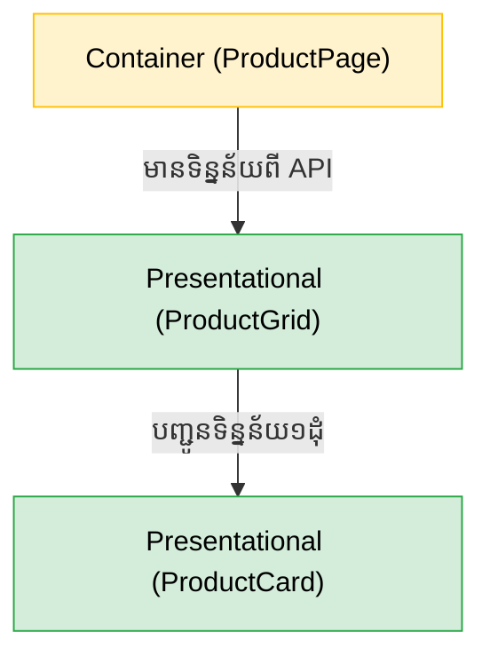
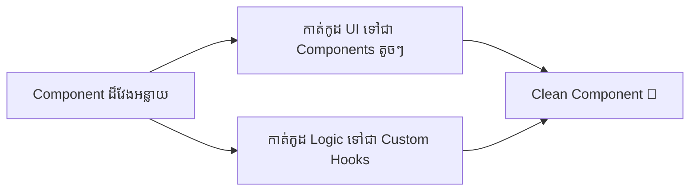

## 🏛️ Feature-Based Architecture (ស្តង់ដារក្រុមហ៊ុនធំៗ)

កាលពីមេរៀនទី ១១ យើងបានស្គាល់ពីការរៀបចំ Folder តាមប្រភេទឯកសារ (components, hooks, utils)។ ប៉ុន្តែនៅពេលគម្រោងកាន់តែធំ រចនាសម្ព័ន្ធនោះនឹងធ្វើអោយអ្នកវិលមុខ! 
សហគមន៍បច្ចុប្បន្ន ណែនាំអោយប្រើប្រាស់ **Feature-Based Architecture** (ការរៀបចំតាមមុខងារ)៖

```text
src/
├── features/
│   ├── auth/            # មុខងារ Login/Register ទាំងអស់នៅទីនេះ
│   │   ├── components/  # - LoginForm, SignupButton
│   │   ├── hooks/       # - useAuth
│   │   ├── api/         # - ការហៅ Network ពាក់ព័ន្ធនឹង Auth
│   │   └── utils/       # - validationRules
│   │
│   ├── products/        # មុខងារបង្ហាញទំនិញ
│   │   ├── components/  # - ProductCard, ProductGallery
│   │   ├── hooks/       # - useProducts
│   │   └── api/         # - fetchProducts
│
├── components/          # សម្រាប់តែ Shared Components ដូចជា Button, Input
├── layouts/             # Navbar, Footer
├── pages/               # ផ្គុំ Features បញ្ចូលគ្នាដើម្បីចេញជាទំព័រ
└── App.jsx
```
អត្ថប្រយោជន៍គឺ៖ ប្រសិនបើអ្នកចង់កែមុខងារ `Auth` អ្នកគ្រាន់តែបើក Folder `auth/` តែមួយគត់ គឺមានអ្វីៗគ្រប់យ៉ាងនៅទីនោះ!

---


## 🏗️ រចនាសម្ព័ន្ធ Folder ស្តង់ដារ

ភាពខុសគ្នារវាងអ្នកចេះ React ធម្មតា និងអ្នកអភិវឌ្ឍន៍ React អាជីព គឺស្ថិតនៅលើរបៀបដែលពួកគេរៀបចំ Folder គម្រោង។ បើអ្នកដាក់កូដរាប់សិបឯកសារលាយឡំគ្នាក្នុង `src/components/` នោះគម្រោងអ្នកនឹងមានភាពរញ៉េរញ៉ៃ (Spaghetti Code) ជាក់ជាមិនខាន។

នេះជារចនាសម្ព័ន្ធដែលសហគមន៍ណែនាំសម្រាប់គម្រោងខ្នាតមធ្យម ទៅធំ៖

```text
src/
├── assets/          # រូបភាព, Icons, ពុម្ពអក្សរ
├── components/      # កន្លែងផ្ទុក Components ទាំងអស់
│   ├── ui/          # ប៊ូតុង, ប្រអប់វាយអក្សរ ដែលអាចប្រើបានគ្រប់ទីកន្លែង (Dumb)
│   ├── layout/      # របារម៉ឺនុយ (Navbar), Footer, Sidebar
│   └── common/      # Components ទូទៅ
├── features/        # បែងចែកតាមមុខងារ (ឧ. authentication, products, cart)
├── pages/           # Components ធំៗតំណាងអោយទំព័រនីមួយៗ
├── hooks/           # Custom Hooks ផ្ទាល់ខ្លួន
└── utils/           # អនុគមន៍ជំនួយ (ឧ. formatCurrency)
```

---

## 🎭 Presentational vs Container Components

ទស្សនវិជ្ជាដ៏សំខាន់មួយក្នុងការសរសេរ React គឺការបំបែកតួនាទី (Separation of Concerns)៖

### 1. Presentational Components (អ្នកបង្ហាញម៉ូដ / UI)
តួនាទីរបស់វាគឺ **"ធ្វើម៉េចអោយតែស្អាត"**។ វាគ្មាន State ស្មុគស្មាញ និងមិនចេះហៅ API ទេ! វារង់ចាំទទួលទិន្នន័យពី Props ហើយបង្ហាញចេញមកក្រៅ។
*ឧទាហរណ៍: `Button`, `ProductCard`, `Avatar`*

### 2. Container Components (អ្នកគ្រប់គ្រង / Logic)
តួនាទីរបស់វាគឺ **"ធ្វើការងារធ្ងន់"**។ វាមានតួនាទីហៅ API, ផ្ទុក State ធំៗ, និងគិតគូរពី Business Logic មុននឹងបញ្ជូនទិន្នន័យទៅអោយកូនៗ។
*ឧទាហរណ៍: `ProductListContainer`, `LoginForm`*



---


## ✨ គោលការណ៍កូដស្អាតក្នុង React (Clean Code)

1. **Keep Components Small:** កុំបណ្តោយអោយ Component មួយមានកូដលើសពី ២០០ ជួរ។ បើវាវែង ត្រូវបំបែកវាជា Presentational Components។
2. **Extract Logic to Custom Hooks:** បើ Component មាន `useState` ឫ `useEffect` ច្រើនញឹកញាប់ពេក ចូរបំបែកវាទៅជា Custom Hook (`use...`) ដើម្បីអោយកូដ UI ស្រឡះល្អ។
3. **Avoid Magic Numbers:** កុំសរសេរលេខឫអក្សរផ្ទាល់ (ឧ. `role === "2"`), គួរប្រើ អថេរថេរ (Constants) ដូចជា `role === ROLES.ADMIN`។



---

## 🤝 ជំហានបន្ទាប់: React + TypeScript (ភាពល្អឥតខ្ចោះ)

សូមអបអរសាទរដែលអ្នកបានបញ្ចប់វគ្គ React Fundamentals និង Architecture នេះ!
ដើម្បីក្លាយជាអ្នកអភិវឌ្ឍន៍អាជីពពិតប្រាកដ អ្នកមិនអាចខ្វះ **TypeScript** បានទេ។

នៅពេលអ្នកបូកបញ្ចូល React ជាមួយ TypeScript វានឹងជួយដោះស្រាយបញ្ហាឈឺក្បាលជាច្រើន៖

```tsx
// ឧទាហរណ៍នៃការប្រើប្រាស់ TypeScript ក្នុង React
type ButtonProps = {
  text: string;
  variant: 'primary' | 'secondary'; // អ្នកមិនអាចវាយពាក្យផ្សេងក្រៅពី២នេះបានទេ!
  onClick: () => void;
};

// បើមានគេហៅ <Button text={123} /> វានឹងលោតបន្ទាត់ក្រហមភ្លាមៗ!
export function Button({ text, variant, onClick }: ButtonProps) {
  return (
    <button className={`btn-${variant}`} onClick={onClick}>
      {text}
    </button>
  );
}
```

ការសិក្សាអំពី TypeScript (ដូចជា Interface, Type, Generics) ហើយយកវាមកបំពាក់លើ React (Props, State, Context, Events) គឺជាស្ពានចម្លងដ៏សំខាន់បំផុត ដើម្បីឆ្ពោះទៅកាន់ការក្លាយជា Full-Stack Developer!
