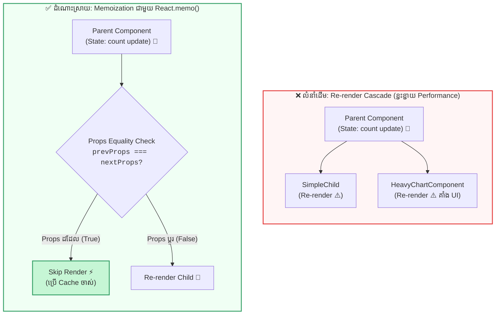

## 🏎️ ១. The React Re-render Waterfall (បញ្ហាដែលត្រូវដោះស្រាយ)

នៅក្នុង React លំនាំដើម (Default Behavior) គឺ៖  
**«នៅពេល Parent Component ធ្វើបច្ចុប្បន្នភាព State នោះគ្រប់ Child Components ទាំងអស់ដែលនៅខាងក្រោមវានឹងត្រូវ Re-render ឡើងវិញដោយស្វ័យប្រវត្តិ!»**

ទោះបីជា Child Component នោះមិនបានទទួល State នោះ ឬ Props របស់វាមិនបានផ្លាស់ប្តូរសោះក៏ដោយ ក៏ React នៅតែដំណើរការ Render Function របស់វាដដែល។ នេះហៅថា **Re-render Waterfall**។



---

## 🧩 ២. សសរស្តម្ភទាំង ៣ នៃ Performance Optimization

```
┌─────────────────┐       ┌─────────────────┐       ┌─────────────────┐
│   React.memo    │       │     useMemo     │       │   useCallback   │
├─────────────────┤       ├─────────────────┤       ├─────────────────┤
│ Cache Component │       │ Cache 計算លទ្ធផល │       │ Cache Function  │
│ (Skip Re-render)│       │ (Expensive Value│       │ (Stable Identity│
└─────────────────┘       └─────────────────┘       └─────────────────┘
```

### ១. `React.memo(Component)`
ជា Higher-Order Component (HOC) ដែលរុំព័ទ្ធ Functional Component។ វានឹងធ្វើការប្រៀបធៀប Props ចាស់ និង Props ថ្មី (`Shallow Comparison`)។ ប្រសិនបើ Props ទាំងអស់នៅដដែល វានឹង **Skip ការ Render ទាំងស្រុង**។

### ២. `useMemo(() => computeHeavyData(data), [data])`
ជា React Hook សម្រាប់ Cache **លទ្ធផលនៃការគណនា (Computed Value)**។ វានឹងដំណើរការគណនាឡើងវិញលុះត្រាតែ items ក្នុង Dependency Array (`[data]`) មានការផ្លាស់ប្តូរ។

### ៣. `useCallback((args) => handleAction(args), [deps])`
ជា React Hook សម្រាប់ Cache **តួ Function Reference**។ វាធានាថា Function នោះនឹងរក្សា Memory Address ដដែលរវាង render ដើម្បីការពារកុំឱ្យ `React.memo` លើ Child Component ច្រឡំថា Props បានផ្លាស់ប្តូរ។

---

## 💻 ៣. ការអនុវត្តជាក់ស្តែង ៖ Dashboard Performance Optimization (បំបែកមួយជំហានម្តងៗ)

ដើម្បីងាយស្រួលយល់ និងរៀបចំកូដឱ្យមានរបៀប យើងបំបែកការអនុវត្ត `React.memo`, `useMemo`, និង `useCallback` ជាជំហានៗ ដោយភ្ជាប់ Logic ជាមួយ HTML/JSX ជាក់ស្តែង ៖

### ជំហានទី ១ ៖ ការពារ Child Component ដោយ `React.memo`
រុំព័ទ្ធ Child Component ជាមួយ `memo()` ដើម្បីកុំឱ្យវា Re-render នៅពេល State របស់ Parent ផ្លាស់ប្តូរ (ដរាបណា Props `items` និង `onExport` នៅដដែល) ៖

```jsx
// 1. Memoized Child Component
import { memo } from 'react';

export const HeavyChart = memo(function HeavyChart({ items, onExport }) {
  console.log('🎨 HeavyChart Rendered! (ប្រតិបត្តិការគូរ Chart ធ្ងន់)');

  return (
    <div className="chart-card">
      <div className="chart-header">
        <h3>📊 ក្រាហ្វិកស្ថិតិ (រក្សាទុកក្នុង Cache)</h3>
        <span>{items.length} ទិន្នន័យ</span>
      </div>

      <p>Component នេះនឹងមិន Re-render ឡើយនៅពេលអ្នកចុច Counter ក្នុង Parent!</p>

      {/* ប៊ូតុងទទួល Callback Handler */}
      <button onClick={onExport}>
        📥 Export Data
      </button>
    </div>
  );
});
```

---

### ជំហានទី ២ ៖ Cache ការគណនាធ្ងន់ៗដោយ `useMemo`
ប្រើ `useMemo` ដើម្បីការពារការច្រោះ (Filter) ទិន្នន័យ ៥,០០០ ជួរឡើងវិញ នៅពេល Parent Re-render ដោយសារ State ផ្សេង ៖

```javascript
// 2. Heavy Data Filtering Logic
const filteredRecords = useMemo(() => {
  console.log('⏳ កំពុង Filter ទិន្នន័យ 5,000 items ក្នុង Memory...');
  const dummyData = Array.from({ length: 5000 }, (_, index) => ({
    id: index + 1,
    title: `គម្រោងអភិវឌ្ឍន៍ #${index + 1} - System Architecture`,
    category: index % 2 === 0 ? 'Frontend' : 'Backend',
  }));

  if (!searchQuery.trim()) return dummyData;

  return dummyData.filter((item) =>
    item.title.toLowerCase().includes(searchQuery.toLowerCase())
  );
}, [searchQuery]); // 👈 ដំណើរការគណនាតែពេល searchQuery ផ្លាស់ប្តូរ
```

```jsx
{/* HTML / JSX Input សម្រាប់បញ្ជូន searchQuery ទៅកាន់ useMemo */}
<input
  type="text"
  placeholder="ស្វែងរកក្នុងទិន្នន័យ 5,000 ជួរ..."
  value={searchQuery}
  onChange={(e) => setSearchQuery(e.target.value)}
/>
```

---

### ជំហានទី ៣ ៖ រក្សា Function Reference ឱ្យនៅដដែលដោយ `useCallback`
ប្រើ `useCallback` ដើម្បីកុំឱ្យ Parent បង្កើត Function Reference ថ្មីរាល់ Render (ការពារកុំឱ្យ `React.memo` លើ `HeavyChart` ច្រឡំថា Prop ផ្លាស់ប្តូរ) ៖

```javascript
// 3. Stable Function Reference
const handleExportData = useCallback(() => {
  alert(`បាន Export ទិន្នន័យចំនួន ${filteredRecords.length} ជោគជ័យ!`);
}, [filteredRecords.length]);
```

```jsx
{/* HTML / JSX: បញ្ជូន Stable Reference ទៅកាន់ Memoized Component */}
<HeavyChart items={filteredRecords} onExport={handleExportData} />
```

---

### ជំហានទី ៤ ៖ Component ពេញលេញ (Clean & Semantic JSX)
ការផ្គុំបញ្ចូលគ្នារវាង `useState`, `useMemo`, `useCallback`, និង `HeavyChart` ៖

```jsx
// src/components/OptimizedDashboard.jsx
import { useState, useMemo, useCallback } from 'react';
import { HeavyChart } from './HeavyChart';

export default function OptimizedDashboard() {
  const [count, setCount] = useState(0);
  const [searchQuery, setSearchQuery] = useState('');

  // 1. Cache Filtered Results
  const filteredRecords = useMemo(() => {
    const dummyData = Array.from({ length: 5000 }, (_, i) => ({
      id: i + 1,
      title: `គម្រោង #${i + 1}`,
    }));

    if (!searchQuery.trim()) return dummyData;
    return dummyData.filter((item) =>
      item.title.toLowerCase().includes(searchQuery.toLowerCase())
    );
  }, [searchQuery]);

  // 2. Cache Function Reference
  const handleExportData = useCallback(() => {
    alert(`Exported ${filteredRecords.length} items!`);
  }, [filteredRecords.length]);

  return (
    <div className="dashboard">
      <header>
        <h2>⚡ Performance Dashboard</h2>
        {/* ⚡ ការចុចប៊ូតុង Counter នេះ នឹងមិនបង្កឱ្យ HeavyChart Re-render ឡើយ! */}
        <button onClick={() => setCount((c) => c + 1)}>
          Counter: {count}
        </button>
      </header>

      <input
        type="text"
        placeholder="ស្វែងរក..."
        value={searchQuery}
        onChange={(e) => setSearchQuery(e.target.value)}
      />

      {/* Memoized Component */}
      <HeavyChart items={filteredRecords} onExport={handleExportData} />
    </div>
  );
}
```

---

## 🔍 ៤. ការវិភាគស៊ីជម្រៅ (Under the Hood Analysis)

### សេណារីយ៉ូទី ១ ៖ អ្នកប្រើប្រាស់ចុចប៊ូតុង "Counter"
1. `setCount` ធ្វើឱ្យ `OptimizedDashboard` Re-render។
2. `useMemo` ពិនិត្យឃើញ `searchQuery` មិនបានផ្លាស់ប្តូរ ➔ **Skip ការ Filter 5,000 items** (សន្សំ CPU Time)។
3. `useCallback` ពិនិត្យឃើញ `filteredRecords.length` មិនបានផ្លាស់ប្តូរ ➔ **ផ្តល់ Function Reference ដដែល**។
4. `React.memo` លើ `HeavyChart` ពិនិត្យឃើញ `items` និង `onExport` props ដូចមុន ១០០% ➔ **Skip ការ Render លើ HeavyChart ទាំងស្រុង!** 🚀

### សេណារីយ៉ូទី ២ ៖ បើគ្មាន `useCallback` តើមានអ្វីកើតឡើង?
ប្រសិនបើ `onExport` ត្រូវបានសរសេរជា `const handleExport = () => { ... }` ធម្មតា៖
- រាល់ពេលចុច Counter នោះ Parent នឹងបង្កើត Function ថ្មីក្នុង Memory (`newOnExport !== oldOnExport`)។
- `React.memo` លើ `HeavyChart` នឹងគិតថា Props ផ្លាស់ប្តូរ ហើយបង្ខំឱ្យ HeavyChart ត្រូវ Re-render ឡើងវិញដោយឥតប្រយោជន៍!

---

## ⚠️ ៥. ការប្រុងប្រយ័ត្ន ៖ ពេលណាដែលមិនគួរប្រើប្រាស់ (Premature Optimization)

> [!WARNING]
> **ច្បាប់របស់ React ៖ "Don't Optimize Until You Have a Slow App!"**  
> ការ Memoization ត្រូវការចំណាយ Memory បន្ថែមដើម្បីរក្សាទុក Cache និងចំណាយ CPU cycles ដើម្បីប្រៀបធៀប Dependencies រាល់ render។

### ❌ ករណីមិនគួរប្រើ:
1. **ការគណនាតិចតួច:** ដូចជា `useMemo(() => a + b, [a, b])` ឬ String concatenation សាមញ្ញ។
2. **Component តូចៗ:** ប៊ូតុងធម្មតា ឬ Text Card ធម្មតា ដែលចំណាយពេល Render តិចជាង 0.1ms។
3. **ការបញ្ជូន Props ផ្លាស់ប្តូរគ្រប់ Render:** ប្រសិនបើ Prop នោះប្រែប្រួលរាល់ Render នោះ `React.memo` នឹងដំណើរការ Shallow Compare ដោយឥតប្រយោជន៍ ព្រោះវានឹងត្រូវ Render ដដែល។

---

## 🧠 ៦. តារាងសង្ខេប Mental Model ងាយចាំ

| ឧបករណ៍ | អ្វីដែលត្រូវបាន Cache | គោលបំណងចម្បង | ឧទាហរណ៍ប្រើប្រាស់ |
| :--- | :--- | :--- | :--- |
| **`React.memo`** | Component VDOM | ទប់ស្កាត់ Child Re-render ពេល Props មិនប្តូរ | `<HeavyTable items={data} />` |
| **`useMemo`** | Computed Value | ទប់ស្កាត់ការគណនាធ្ងន់ៗស្ទួន | `filter()`, `sort()`, Big Math |
| **`useCallback`** | Function Reference | រក្សា Function Identity សម្រាប់ Memoized Child | `onClick={memoizedHandler}` |
