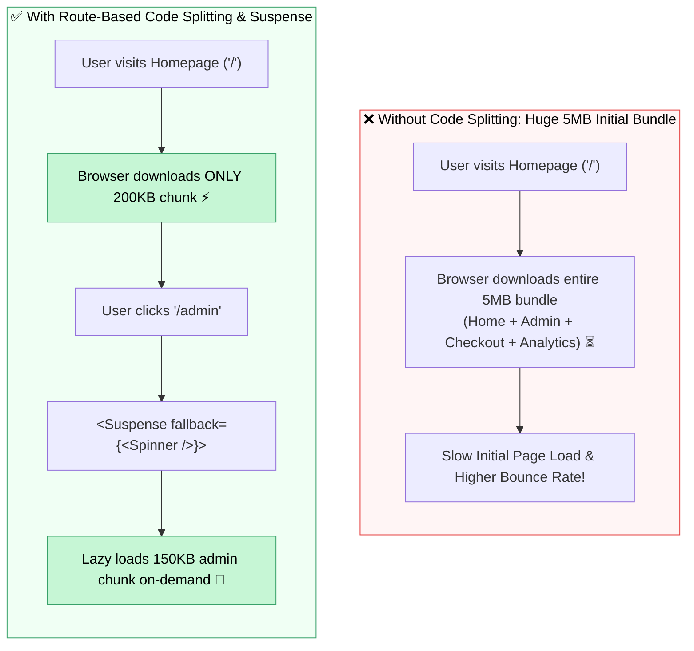

## ✂️ 1. Monolithic Bundle vs Code Splitting



---

## 🛠️ 2. កូដអនុវត្តជាក់ស្តែង

```jsx
import { lazy, Suspense } from 'react';
import { BrowserRouter, Routes, Route, Link } from 'react-router-dom';

// 1. Dynamic Imports ជាមួយ React.lazy
const HomePage = lazy(() => import('./pages/HomePage'));
const AnalyticsDashboard = lazy(() => import('./pages/AnalyticsDashboard'));

function LoadingFallback() {
  return (
    <div className="flex items-center justify-center p-12 text-blue-600 font-bold">
      <div className="animate-spin rounded-full h-8 w-8 border-b-2 border-blue-600 mr-3"></div>
      កំពុងទាញយកទិន្នន័យទំព័រ...
    </div>
  );
}

export default function App() {
  return (
    <BrowserRouter>
      <nav className="p-4 bg-slate-900 text-white flex gap-4">
        <Link to="/">ទំព័រដើម</Link>
        <Link to="/analytics">Analytics (Lazy)</Link>
      </nav>

      {/* 2. រុំ Routes ដោយ Suspense */}
      <Suspense fallback={<LoadingFallback />}>
        <Routes>
          <Route path="/" element={<HomePage />} />
          <Route path="/analytics" element={<AnalyticsDashboard />} />
        </Routes>
      </Suspense>
    </BrowserRouter>
  );
}
```
