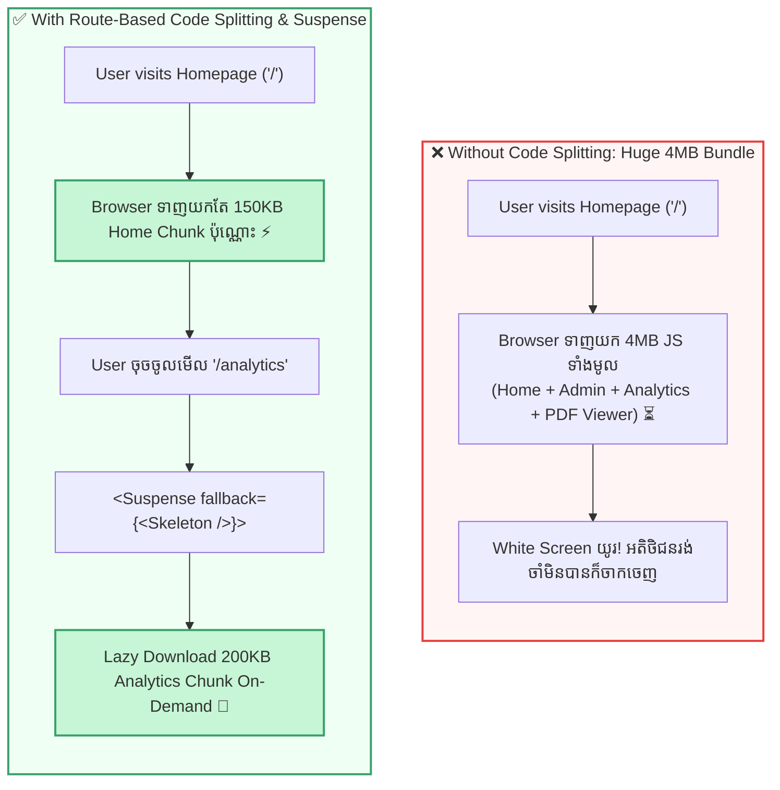
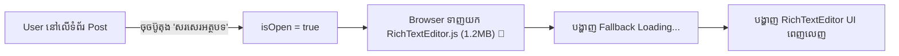

## 🍕 ១. ស្វែងយល់ពីបញ្ហា Monolithic Bundle (ការប្រៀបធៀបជាក់ស្តែង)

សាកស្រមៃថាអ្នកចូលហាងអាហារដើម្បី **ផឹកទឹកតែមួយកែវ** ប៉ុន្តែអ្នករត់តុបង្ខំឱ្យអ្នករង់ចាំចុងភៅចម្អិនម្ហូប ១០០ មុខឱ្យឆ្អិនរួចរាល់ទាំងអស់សិន ទើបលើកទឹកមកឱ្យអ្នកផឹក! នេះហើយគឺជាអ្វីដែលកើតឡើងប្រសិនបើ **គ្មាន Code Splitting** ៖

* **❌ គ្មាន Code Splitting (Monolithic Bundle) ៖** នៅពេល User គ្រាន់តែបើកមើល Homepage ដំបូង Browser ត្រូវបង្ខំចិត្តទាញយក JavaScript ទាំងមូលរបស់ Website (Home + Admin Dashboard + Analytics Charts + PDF Viewer + Settings) ដែលមានទំហំ 3MB–5MB+។ លទ្ធផលគឺ User ឃើញអេក្រង់សស្អាត (White Screen) រង់ចាំយូររហូតធុញទ្រាន់ហើយចាកចេញ (High Bounce Rate)។
* **✅ មាន Code Splitting ៖** Browser ទាញយកតែកូដដែលចាំបាច់សម្រាប់ទំព័រដំបូងប៉ុណ្ណោះ (ត្រឹម 100KB–200KB) ធ្វើឱ្យ Web បើកឡើងភ្លាមៗ (Fast FCP & LCP)។ នៅពេលណាដែល User ចុចចូលទំព័រ Admin ឬចុចបើក Chart ទើប Browser ចាប់ផ្តើមទាញយកកូដផ្នែកនោះតាមក្រោយ (On-Demand)។



---

## ⚙️ ២. ភាពខុសគ្នារវាង Static Import និង Dynamic Import

ដើម្បីយល់ពី `React.lazy` យើងត្រូវយល់ពីវិធី Import ទាំង ២ បែបនេះសិន ៖

### ២.១ — Static Import (ទាញយកកូដភ្លាមៗពេល App ចាប់ផ្តើម)
```javascript
// 📦 ទាំងអស់នេះត្រូវបញ្ចូលក្នុង Bundle ចម្បងតែមួយ (Main Bundle)
import HomePage from './pages/HomePage';
import AdminDashboard from './pages/AdminDashboard';
```
> **ចំណាំ ៖** ទោះបី User មិនដែលចុចចូលទំព័រ Admin ក៏ដោយ ក៏កូដ Admin ត្រូវ Download មកទុកក្នុង Browser តាំងពីដំបូងដែរ។

### ២.២ — Dynamic Import (ទាញយកកូដតាមតម្រូវការពេលហៅប្រើ)
```javascript
// ⚡ Bundler (Vite / Webpack) នឹងកាត់កូដនេះជា File .js Chunk ដាច់ដោយឡែក
import('./pages/AdminDashboard').then((module) => {
  console.log('ទាញយក AdminDashboard រួចរាល់!');
});
```

---

## 🛠️ ៣. គូស្នេហ៍ដ៏មានឥទ្ធិពល ៖ `React.lazy()` + `<Suspense>`

`React.lazy()` គឺជាមុខងាររបស់ React ដែលជួយបំប្លែង Dynamic `import()` ឱ្យទៅជា React Component ធម្មតា។ ហើយដោយសារការទាញយកកូដតាម Network ត្រូវចំណាយពេល `<Suspense>` ដើរតួជាអ្នករង់ចាំ និងបង្ហាញផ្ទាំង **Fallback UI** (ដូចជា Loading Spinner ឬ Skeleton) អំឡុងពេលទាញយក ៖

```jsx
import { lazy, Suspense } from 'react';

// ១. ប្រកាស Lazy Component
const HeavyChart = lazy(() => import('./components/HeavyChart'));

// ២. ប្រើប្រាស់ជាមួយ Suspense
function Dashboard() {
  return (
    <Suspense fallback={<p>កំពុងទាញយក Chart Engine...</p>}>
      <HeavyChart />
    </Suspense>
  );
}
```

### ដំណើរការ ៤ ដំណាក់កាល ៖
1. **Initial Load ៖** Bundle ដំបូងមិនផ្ទុកកូដរបស់ `HeavyChart` ឡើយ។
2. **Trigger ៖** នៅពេលដែល React ចាប់ផ្តើម Render `<HeavyChart />` នោះ `React.lazy` នឹងហៅ Dynamic `import()` ដើម្បីទាញយក `.js` chunk ពី Server។
3. **Suspense State ៖** ក្នុងអំឡុងពេល Network កំពុងទាញយក React នឹង Render ផ្ទាំង `fallback` UI។
4. **Resolved State ៖** ពេល Download ចប់ React នឹងប្តូរពី fallback មកបង្ហាញ UI ពិតប្រាកដរបស់ `HeavyChart` ភ្លាមៗ។

---

## 💻 ៤. ការអនុវត្ត Route-Based Code Splitting (មួយជំហានម្តងៗ)

វិធីសាស្ត្រដែលពេញនិយមនិងមានប្រសិទ្ធភាពបំផុតក្នុងការបំបែកកូដ គឺបំបែកតាម Route (ទំព័រនីមួយៗ) ៖

### ជំហានទី ១ ៖ ប្តូរពី Static Import ទៅជា `React.lazy()`
ទាញយកកូដនៃទំព័រនីមួយៗតាមតម្រូវការ (On-Demand) ៖

```javascript
// src/App.jsx
import { lazy } from 'react';

// ⏳ កូដនៃទំព័រនីមួយៗនឹងត្រូវបំបែកជា File .js chunks ដាច់ដោយឡែកពីគ្នា
const HomePage = lazy(() => import('./pages/HomePage'));
const ProductsPage = lazy(() => import('./pages/ProductsPage'));
const AdminDashboard = lazy(() => import('./pages/AdminDashboard'));
const AnalyticsPage = lazy(() => import('./pages/AnalyticsPage'));
```

---

### ជំហានទី ២ ៖ បង្កើត Fallback Loading Component
ផ្ទាំង UI បណ្តោះអាសន្នសម្រាប់បង្ហាញជូន User អំឡុងពេល Browser កំពុងទាញយក Chunk តាម Network ៖

```jsx
// src/components/PageLoader.jsx
export function PageLoader() {
  return (
    <div className="page-loader">
      <div className="spinner"></div>
      <p>កំពុងទាញយកទំព័រពី Server...</p>
    </div>
  );
}
```

---

### ជំហានទី ៣ ៖ រុំព័ទ្ធ `<Suspense>` ជុំវិញ `<Routes>`
ផ្គុំ Navigation និង Routes ដោយរុំព័ទ្ធដោយ `<Suspense fallback={<PageLoader />}>` ៖

```jsx
// src/App.jsx
import { Suspense, lazy } from 'react';
import { BrowserRouter, Routes, Route, Link } from 'react-router-dom';
import { PageLoader } from './components/PageLoader';

// Lazy loaded page components
const HomePage = lazy(() => import('./pages/HomePage'));
const ProductsPage = lazy(() => import('./pages/ProductsPage'));
const AdminDashboard = lazy(() => import('./pages/AdminDashboard'));
const AnalyticsPage = lazy(() => import('./pages/AnalyticsPage'));

export default function App() {
  return (
    <BrowserRouter>
      {/* 🧭 Navigation Menu (ផ្ទុកក្នុង Main Bundle ស្រាប់ មិនបាច់ Lazy ទេ) */}
      <nav className="navbar">
        <Link to="/">ទំព័រដើម</Link>
        <Link to="/products">ទំនិញ</Link>
        <Link to="/admin">Admin Panel (Lazy)</Link>
        <Link to="/analytics">Analytics (Lazy)</Link>
      </nav>

      {/* ⚡ Suspense Boundary សម្រាប់គ្រប់គ្រង Lazy Routes */}
      <main className="content-area">
        <Suspense fallback={<PageLoader />}>
          <Routes>
            <Route path="/" element={<HomePage />} />
            <Route path="/products" element={<ProductsPage />} />
            <Route path="/admin" element={<AdminDashboard />} />
            <Route path="/analytics" element={<AnalyticsPage />} />
          </Routes>
        </Suspense>
      </main>
    </BrowserRouter>
  );
}
```

---

## 🎯 ៥. Component-Level Lazy Loading (On-Demand Modals & Tools)

ក្រៅពីកម្រិតទំព័រ (Routes) យើងអាចប្រើ `React.lazy` សម្រាប់ Component ណាដែលមានទំហំធ្ងន់ ហើយ User មិនប្រាកដថាបើកមើលគ្រប់គ្នា ដូចជា **Rich Text Editor**, **PDF Viewer**, ឬ **Payment Modal** ៖



### ៥.១ — Lazy Import Heavy Component
```javascript
import { lazy } from 'react';

// ⏳ ទាញយកកូដ Editor តែនៅពេល User ចុចបើក Modal ប៉ុណ្ណោះ
const RichTextEditor = lazy(() => import('./components/RichTextEditor'));
```

### ៥.២ — បង្ហាញតាមលក្ខខណ្ឌក្នុង Modal JSX
```jsx
// src/components/PostEditorModal.jsx
import { useState, Suspense, lazy } from 'react';

const RichTextEditor = lazy(() => import('./RichTextEditor'));

export function PostEditorModal() {
  const [isOpen, setIsOpen] = useState(false);

  return (
    <div>
      {/* ប៊ូតុងចុចបើក Modal */}
      <button onClick={() => setIsOpen(true)}>
        ✍️ បង្កើតអត្ថបទថ្មី (Open Heavy Editor)
      </button>

      {/* បង្ហាញ Modal លុះត្រាតែ isOpen === true */}
      {isOpen && (
        <div className="modal-overlay">
          <div className="modal-box">
            <button onClick={() => setIsOpen(false)}>✕ បិទ</button>

            {/* Suspense សម្រាប់តែ Editor ខាងក្នុង Modal */}
            <Suspense fallback={<p>កំពុងផ្ទុក Editor Engine...</p>}>
              <RichTextEditor onSave={() => setIsOpen(false)} />
            </Suspense>
          </div>
        </div>
      )}
    </div>
  );
}
```

---

## 🛡️ ៦. Error Handling ពេល Network ដាច់ (Error Boundaries)

> [!WARNING]
> **បញ្ហា Network Failure ៖**  
> ប្រសិនបើ User ដាច់ Internet ខណៈពេលកំពុងចុចប្តូរ Route នោះ `import()` នឹង Fail។ យើងត្រូវប្រើ **Error Boundary** ដើម្បីចាប់យក Error នេះ មិនឱ្យ App Crash ឡើយ។

```jsx
// src/components/LazyErrorBoundary.jsx
import React from 'react';

export class LazyErrorBoundary extends React.Component {
  state = { hasError: false };

  static getDerivedStateFromError() {
    return { hasError: true };
  }

  componentDidCatch(error, errorInfo) {
    console.error('Lazy Chunk Loading Failed:', error, errorInfo);
  }

  render() {
    if (this.state.hasError) {
      return (
        <div className="error-fallback">
          <h3>⚠️ មិនអាចទាញយកទំព័រនេះបានទេ</h3>
          <p>សូមពិនិត្យមើលសេវា Internet របស់អ្នក ឬមាន Version ថ្មីរបស់កម្មវិធី។</p>
          <button onClick={() => window.location.reload()}>
            🔄 ព្យាយាមម្តងទៀត (Reload Page)
          </button>
        </div>
      );
    }

    return this.props.children;
  }
}
```

### ផ្គុំ Error Boundary ជាមួយ Suspense ៖
```jsx
<LazyErrorBoundary>
  <Suspense fallback={<PageLoader />}>
    <Routes>
      <Route path="/admin" element={<AdminDashboard />} />
    </Routes>
  </Suspense>
</LazyErrorBoundary>
```

---

## ⚠️ ៧. ច្បាប់សំខាន់ៗដែលត្រូវចងចាំ (Gotchas & Best Practices)

1. **ត្រូវតែប្រើ `export default` ៖**  
   `React.lazy()` ស្គាល់តែ Default Export ប៉ុណ្ណោះ (`export default function MyPage() {}`)។ ប្រសិនបើ Component ប្រើ Named Export (`export function MyPage() {}`) អ្នកត្រូវបំប្លែង Promise ៖
   ```javascript
   const MyPage = lazy(() =>
     import('./MyPage').then((module) => ({ default: module.MyPage }))
   );
   ```
2. **កុំ Lazy Load របស់ដែលត្រូវបង្ហាញភ្លាមៗលើ Screen (Above the Fold) ៖**  
   កុំ Lazy Component ដូចជា `Navbar`, `Footer`, ឬ `HeroSection` នៃ Homepage ព្រោះវានឹងធ្វើឱ្យ User ឃើញ Loading មិនចាំបាច់ និងធ្វើឱ្យ LCP (Largest Contentful Paint) ធ្លាក់ចុះ។
3. **កន្លែងដែលស័ក្តិសមបំផុតសម្រាប់ Lazy Loading ៖**  
   - គ្រប់ Routes ទាំងអស់ ក្រៅពី Main Landing Page
   - Modal ផ្ទាំងធំៗ (Editor, File Uploader, Checkout Dialog)
   - ផ្ទាំង Chart និង Graph ធ្ងន់ៗ (Chart.js, Recharts, D3.js)
   - PDF Previewers ឬ 3D Canvas

---

## 🧠 ៨. សង្ខេប Mental Model ងាយចាំ

| លក្ខណៈពិសេស | កូដអនុវត្ត | អត្ថប្រយោជន៍ចម្បង |
| :--- | :--- | :--- |
| **Dynamic Import** | `import('./Module')` | បង្កើត Chunk ដាច់ដោយឡែកក្នុង Bundler |
| **Lazy Wrapper** | `lazy(() => import(...))` | បំប្លែង Promise ទៅជា Lazy React Component |
| **Suspense Boundary** | `<Suspense fallback={...}>` | បង្ហាញ Loading Skeleton អំឡុងពេលទាញយកតាម Network |
| **Error Boundary** | `<LazyErrorBoundary>` | ការពារ App កុំឱ្យ Crash ពេល Download បរាជ័យ |
