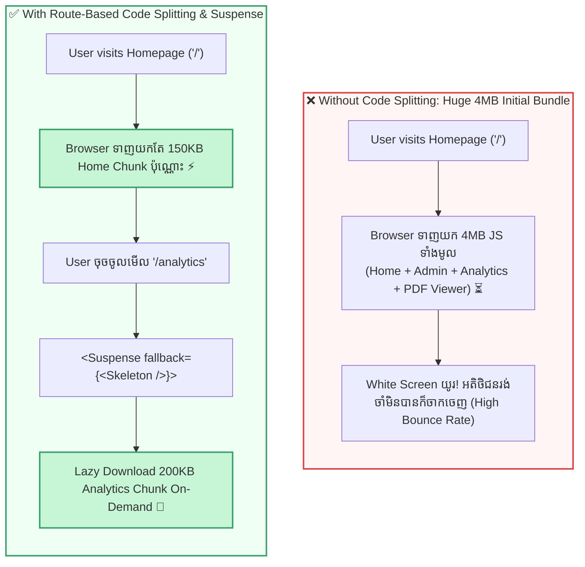

## ✂️ ១. Monolithic Bundle vs Code Splitting Architecture

នៅក្នុងកម្មវិធី React បែបប្រពៃណី ឧបករណ៍ Bundler (ដូចជា Vite ឬ Webpack) នឹងប្រមូលផ្តុំកូដទាំងអស់ចូលក្នុងឯកសារ JavaScript តែមួយ (Monolithic `bundle.js`) ដែលអាចមានទំហំរហូតដល់ 3MB ទៅ 5MB+!



---

## 🛠️ ២. គូស្នេហ៍ដ៏មានឥទ្ធិពល ៖ `React.lazy` + `Suspense`

```jsx
// Dynamic Import ជាមួយ React.lazy
const HeavyComponent = lazy(() => import('./HeavyComponent'));

// ប្រើប្រាស់ជាមួយ Suspense
<Suspense fallback={<LoadingSkeleton />}>
  <HeavyComponent />
</Suspense>
```

### ដំណើរការ ៤ ដំណាក់កាល ៖
1. **Initial Load:** Bundle ដំបូងមិនផ្ទុកកូដរបស់ `HeavyComponent` ឡើយ។
2. **User Trigger:** នៅពេលដែល Component ត្រូវបង្ហាញលើ Screen នោះ `React.lazy` នឹងហៅ Dynamic `import()` ដើម្បីទាញយក `.js` chunk ពី Server។
3. **Suspense State:** ក្នុងអំឡុងពេល Network កំពុងទាញយក React នឹង Render ផ្ទាំង `fallback` UI។
4. **Resolved State:** ពេល Download ចប់ React នឹងប្តូរពី fallback មកបង្ហាញ UI របស់ `HeavyComponent` ភ្លាមៗ។

---

## 💻 ៣. ការអនុវត្តជាក់ស្តែង ៖ Route-Based Code Splitting

ខាងក្រោមនេះជារចនាសម្ព័ន្ធស្តង់ដារនៃការរៀបចំ Router ជាមួយ Code Splitting៖

```jsx
// src/App.jsx
import { lazy, Suspense } from 'react';
import { BrowserRouter, Routes, Route, Link } from 'react-router-dom';

// ── ១. LAZY LOADED ROUTE COMPONENTS (ត្រូវតែជា Default Export) ──
const HomePage = lazy(() => import('./pages/HomePage'));
const ProductsPage = lazy(() => import('./pages/ProductsPage'));
const AdminDashboard = lazy(() => import('./pages/AdminDashboard'));
const AnalyticsPage = lazy(() => import('./pages/AnalyticsPage'));

// ── ២. BEAUTIFUL LOADING FALLBACK UI ──
function PageLoader() {
  return (
    <div className="flex flex-col items-center justify-center p-16 space-y-3">
      <div className="w-10 h-10 border-4 border-indigo-200 border-t-indigo-600 rounded-full animate-spin"></div>
      <p className="text-xs font-bold text-slate-500 animate-pulse">
        កំពុងទាញយកទំព័រពី Server...
      </p>
    </div>
  );
}

export default function App() {
  return (
    <BrowserRouter>
      <div className="min-h-screen bg-slate-50 dark:bg-slate-950 text-slate-800 dark:text-slate-100">
        {/* TOP NAVIGATION BAR */}
        <nav className="p-4 bg-white dark:bg-slate-900 border-b border-slate-200 dark:border-slate-800 flex justify-between items-center sticky top-0 z-40">
          <div className="font-bold text-sm text-indigo-600 dark:text-indigo-400 flex items-center gap-2">
            <span>⚡</span>
            <span>FastApp Pro</span>
          </div>

          <div className="flex gap-4 text-xs font-semibold">
            <Link to="/" className="hover:text-indigo-600 transition">ទំព័រដើម</Link>
            <Link to="/products" className="hover:text-indigo-600 transition">ទំនិញ</Link>
            <Link to="/admin" className="hover:text-indigo-600 transition">Admin Panel (Lazy)</Link>
            <Link to="/analytics" className="hover:text-indigo-600 transition">Analytics (Lazy)</Link>
          </div>
        </nav>

        {/* ── ៣. SUSPENSE BOUNDARY AROUND ROUTES ── */}
        <main className="max-w-4xl mx-auto p-6">
          <Suspense fallback={<PageLoader />}>
            <Routes>
              <Route path="/" element={<HomePage />} />
              <Route path="/products" element={<ProductsPage />} />
              <Route path="/admin" element={<AdminDashboard />} />
              <Route path="/analytics" element={<AnalyticsPage />} />
            </Routes>
          </Suspense>
        </main>
      </div>
    </BrowserRouter>
  );
}
```

---

## 🎯 ៤. Component-Level Lazy Loading (On-Demand Modals & Editors)

ក្រៅពី Route យើងក៏អាចប្រើ `React.lazy` សម្រាប់ Component ធ្ងន់ៗដែលមិនចាំបាច់បង្ហាញតាំងពីដំបូង ដូចជា **Rich Text Editor**, **PDF Viewer**, ឬ **Payment Modal** ៖

```jsx
import { useState, lazy, Suspense } from 'react';

// ⏳ ទាញយកកូដ RichTextEditor តែនៅពេល User ចុចបើក Modal ប៉ុណ្ណោះ!
const RichTextEditor = lazy(() => import('./components/RichTextEditor'));

export function PostEditorModal() {
  const [isOpen, setIsOpen] = useState(false);

  return (
    <div>
      <button
        onClick={() => setIsOpen(true)}
        className="px-4 py-2 bg-indigo-600 text-white rounded-xl text-xs font-bold"
      >
        ✍️ បង្កើតអត្ថបទថ្មី (Open Heavy Editor)
      </button>

      {isOpen && (
        <div className="fixed inset-0 bg-black/50 backdrop-blur-sm flex items-center justify-center p-4 z-50">
          <div className="bg-white dark:bg-slate-900 p-6 rounded-3xl max-w-lg w-full shadow-2xl border">
            <div className="flex justify-between items-center mb-4">
              <h3 className="font-bold text-sm">Rich Text Editor</h3>
              <button onClick={() => setIsOpen(false)} className="text-slate-400 font-bold">✕</button>
            </div>

            {/* Suspense សម្រាប់តែ Editor ខាងក្នុង Modal */}
            <Suspense fallback={<div className="p-8 text-center text-xs text-slate-400">កំពុងផ្ទុក Editor Engine...</div>}>
              <RichTextEditor onSave={() => setIsOpen(false)} />
            </Suspense>
          </div>
        </div>
      )}
    </div>
  );
}
```

---

## 🛡️ ៥. Error Handling ពេល Network ដាច់ (Error Boundaries)

> [!WARNING]
> **បញ្ហា Network Failure ៖**  
> ប្រសិនបើ User កំពុងប្រើប្រាស់ App ហើយស្រាប់តែដាច់ Internet ពេលកំពុងចុចប្តូរ Route នោះ `import()` នឹង Fail ហើយបង្កជា Uncaught Promise Rejection!

### ✅ ដំណោះស្រាយជាមួយ Error Boundary:

```jsx
import React from 'react';

export class LazyErrorBoundary extends React.Component {
  state = { hasError: false };

  static getDerivedStateFromError() {
    return { hasError: true };
  }

  render() {
    if (this.state.hasError) {
      return (
        <div className="p-6 text-center bg-rose-50 dark:bg-rose-950/40 border border-rose-200 dark:border-rose-900 rounded-2xl">
          <p className="text-xs font-bold text-rose-600">
            ⚠️ មិនអាចទាញយកទំព័រនេះបានទេ (សូមពិនិត្យមើលសេវា Internet របស់អ្នក)
          </p>
          <button
            onClick={() => window.location.reload()}
            className="mt-3 px-3.5 py-1.5 bg-rose-600 text-white rounded-xl text-xs font-bold"
          >
            🔄 ព្យាយាមម្តងទៀត
          </button>
        </div>
      );
    }

    return this.props.children;
  }
}
```

---

## 🧠 ៦. សង្ខេប Mental Model ងាយចាំ

| លក្ខណៈពិសេស | កូដអនុវត្ត | អត្ថប្រយោជន៍ចម្បង |
| :--- | :--- | :--- |
| **Dynamic Import** | `import('./Module')` | បង្កើត Chunk ដាច់ដោយឡែកក្នុង Bundler |
| **Lazy Wrapper** | `lazy(() => import(...))` | បំប្លែង Promise ទៅជា Lazy React Component |
| **Suspense Boundary** | `<Suspense fallback={...}>` | បង្ហាញ Loading Skeleton អំឡុងពេលទាញយកតាម Network |
| **Error Boundary** | `<LazyErrorBoundary>` | ការពារ App កុំឱ្យ Crash ពេល Download បរាជ័យ |
