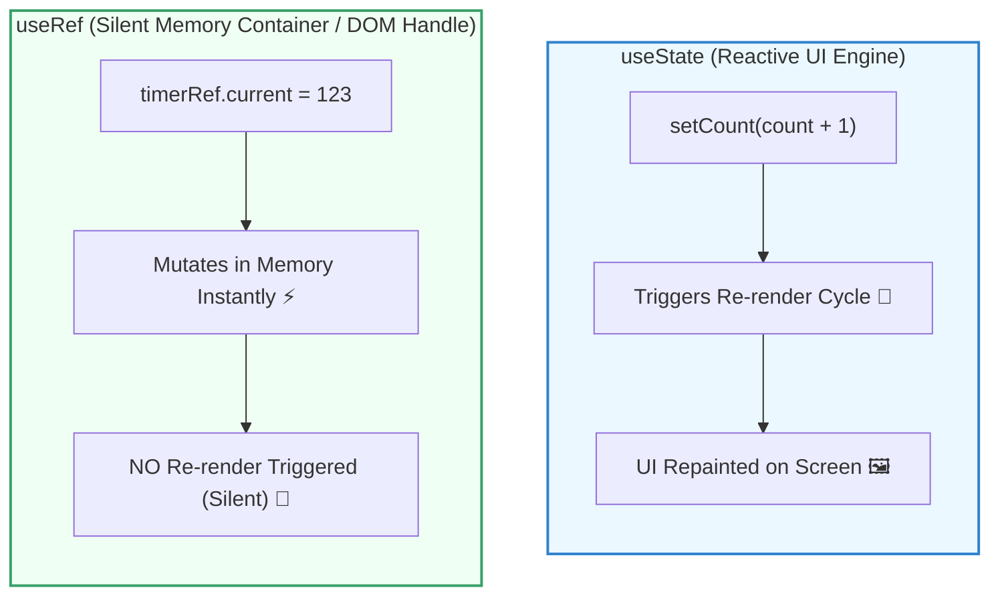

## 🔍 ១. Mental Model: `useState` vs `useRef`

នៅក្នុង React យើងមានឧបករណ៍ពីរសម្រាប់រក្សាទុកទិន្នន័យក្នុង Component៖

1. **`useState` (UI State — សម្រាប់ទិន្នន័យដែលប៉ះពាល់ការបង្ហាញលើ Screen):**  
   រាល់ពេល State ផ្លាស់ប្តូរ ➔ React នឹង Re-render UI ភ្លាមៗ។
2. **`useRef` (Silent Container — សម្រាប់ទិន្នន័យដែលមិនប៉ះពាល់ UI Render):**  
   ជាប្រអប់សម្ងាត់ `{ current: initialValue }` ដែលរក្សាទុកតម្លៃក្នុង Memory ដោយមិនបង្កឱ្យមាន Re-render ឡើយ។



---

## 🛠️ ២. មហិទ្ធិឫទ្ធិទាំង ២ នៃ `useRef`

```
┌──────────────────────────────────────┐     ┌──────────────────────────────────────┐
│       1. Direct DOM Access           │     │    2. Persistent Mutable Container   │
├──────────────────────────────────────┤     ├──────────────────────────────────────┤
│ • Auto-focus input fields            │     │ • ផ្ទុក Timer / Interval IDs          │
│ • Scroll to specific element         │     │ • ផ្ទុក Previous Prop/State value     │
│ • HTML5 Video / Audio Playback       │     │ • រាប់ចំនួន Render Counts            │
│ • Canvas 2D / WebGL Contexts         │     │ • ផ្ទុក WebSocket / Instance Object   │
└──────────────────────────────────────┘     └──────────────────────────────────────┘
```

---

## 🎯 ៣. ការអនុវត្តជាក់ស្តែង ៖ ករណីសិក្សាទាំង ៤ (Use Cases)

### ករណីទី ១ ៖ Search Auto-Focus ជាមួយ Keyboard Shortcut (`Cmd+K`)

```jsx
import { useRef, useEffect } from 'react';

export function SearchBox() {
  const searchInputRef = useRef(null);

  // ចុច Cmd+K (Mac) ឬ Ctrl+K (Windows) ដើម្បី Auto-focus
  useEffect(() => {
    const handleKeyDown = (e) => {
      if ((e.metaKey || e.ctrlKey) && e.key === 'k') {
        e.preventDefault(); // ការពារ shortcut default របស់ Browser
        searchInputRef.current?.focus();
      }
    };

    window.addEventListener('keydown', handleKeyDown);
    return () => window.removeEventListener('keydown', handleKeyDown);
  }, []);

  return (
    <div className="relative max-w-sm">
      <input
        ref={searchInputRef}
        type="text"
        placeholder="ស្វែងរកឯកសារ... (ចុច Cmd+K)"
        className="w-full px-4 py-2 border rounded-xl text-xs dark:bg-slate-800"
      />
    </div>
  );
}
```

---

### ករណីទី ២ ៖ Custom HTML5 Media Player Controls

```jsx
import { useRef, useState } from 'react';

export function CustomVideoPlayer() {
  const videoRef = useRef(null);
  const [isPlaying, setIsPlaying] = useState(false);

  const togglePlay = () => {
    if (!videoRef.current) return;

    if (isPlaying) {
      videoRef.current.pause(); // ហៅ Native DOM Method
      setIsPlaying(false);
    } else {
      videoRef.current.play(); // ហៅ Native DOM Method
      setIsPlaying(true);
    }
  };

  const handleRestart = () => {
    if (!videoRef.current) return;
    videoRef.current.currentTime = 0; // កំណត់វិនាទីវីដេអូទៅដើមវិញ
    videoRef.current.play();
    setIsPlaying(true);
  };

  return (
    <div className="p-4 bg-slate-900 rounded-3xl max-w-sm text-white space-y-3">
      <video
        ref={videoRef}
        src="https://www.w3schools.com/html/mov_bbb.mp4"
        className="w-full rounded-2xl"
        onEnded={() => setIsPlaying(false)}
      />

      <div className="flex gap-2">
        <button
          onClick={togglePlay}
          className="flex-1 py-2 bg-indigo-600 rounded-xl text-xs font-bold"
        >
          {isPlaying ? '⏸️ Pause' : '▶️ Play'}
        </button>
        <button
          onClick={handleRestart}
          className="px-3 py-2 bg-slate-800 rounded-xl text-xs font-bold"
        >
          🔄 Restart
        </button>
      </div>
    </div>
  );
}
```

---

### ករណីទី ៣ ៖ Stopwatch Timer (ផ្ទុក Timer ID ដោយមិនបាច់ Re-render)

```jsx
import { useState, useRef, useEffect } from 'react';

export function Stopwatch() {
  const [seconds, setSeconds] = useState(0);
  const [isRunning, setIsRunning] = useState(false);

  // 🛡️ ផ្ទុក Timer ID ក្នុង Ref ព្រោះការកែ Timer ID មិនគួរធ្វើឱ្យ UI Re-render ឡើយ
  const timerRef = useRef(null);

  const start = () => {
    if (timerRef.current !== null) return;
    setIsRunning(true);
    timerRef.current = setInterval(() => {
      setSeconds((prev) => prev + 1);
    }, 1000);
  };

  const stop = () => {
    clearInterval(timerRef.current);
    timerRef.current = null;
    setIsRunning(false);
  };

  const reset = () => {
    stop();
    setSeconds(0);
  };

  // Cleanup ពេល Component Unmount ដើម្បីការពារ Memory Leak
  useEffect(() => {
    return () => clearInterval(timerRef.current);
  }, []);

  return (
    <div className="p-6 bg-white dark:bg-slate-900 border rounded-3xl text-center max-w-xs space-y-4">
      <h2 className="text-3xl font-black font-mono">{seconds}s</h2>
      <div className="flex justify-center gap-2">
        {!isRunning ? (
          <button onClick={start} className="px-4 py-1.5 bg-emerald-600 text-white rounded-xl text-xs font-bold">
            Start
          </button>
        ) : (
          <button onClick={stop} className="px-4 py-1.5 bg-amber-600 text-white rounded-xl text-xs font-bold">
            Pause
          </button>
        )}
        <button onClick={reset} className="px-4 py-1.5 bg-slate-200 dark:bg-slate-800 rounded-xl text-xs font-bold">
          Reset
        </button>
      </div>
    </div>
  );
}
```

---

### ករណីទី ៤ ៖ តាមដានតម្លៃ State ចាស់ (The `usePrevious` Pattern)

```jsx
import { useState, useEffect, useRef } from 'react';

// Custom Hook សម្រាប់ចងចាំតម្លៃ Render មុន
function usePrevious(value) {
  const ref = useRef();
  useEffect(() => {
    ref.current = value; // Update ref ក្រោយពេល Render ចប់
  }, [value]);
  return ref.current; // Return តម្លៃពី Render មុន
}

export function PriceTracker() {
  const [price, setPrice] = useState(100);
  const prevPrice = usePrevious(price);

  return (
    <div className="p-4 border rounded-2xl max-w-xs space-y-2">
      <p className="text-xs text-slate-500">តម្លៃមុន: ${prevPrice ?? 'N/A'}</p>
      <p className="text-base font-bold">តម្លៃបច្ចុប្បន្ន: ${price}</p>
      <div className="flex gap-2">
        <button onClick={() => setPrice((p) => p + 10)} className="px-2 py-1 bg-green-500 text-white rounded text-xs">+$10</button>
        <button onClick={() => setPrice((p) => p - 10)} className="px-2 py-1 bg-red-500 text-white rounded text-xs">-$10</button>
      </div>
    </div>
  );
}
```

---

## 🚀 ៤. Forwarding Refs ជាមួយ `React.forwardRef`

នៅពេលអ្នកបង្កើត Reusable UI Input Component អ្នកមិនអាចបញ្ជូន `ref` ធម្មតាបានឡើយ។ អ្នកត្រូវប្រើ `forwardRef` ៖

```jsx
import { forwardRef } from 'react';

// ✅ Child Component ទទួលយក ref ពី Parent
export const CustomInput = forwardRef(function CustomInput(props, ref) {
  return (
    <div className="space-y-1">
      <label className="text-xs font-bold">{props.label}</label>
      <input
        ref={ref}
        {...props}
        className="w-full px-3 py-2 border rounded-xl text-xs"
      />
    </div>
  );
});
```

---

## 🧠 ៥. សង្ខេប Mental Model ងាយចាំ

| លក្ខណៈពិសេស | `useState` | `useRef` |
| :--- | :--- | :--- |
| **ការ Re-render** | បង្ក Re-render រាល់ពេលផ្លាស់ប្តូរ | **មិនបង្ក Re-render ឡើយ** (Zero Overhead) |
| **ការផ្ទុកតម្លៃ** | អានបានក្នុង JSX ដោយផ្ទាល់ | ផ្ទុកក្នុង `.current` property |
| **ពេលវេលាប្រើប្រាស់** | UI Data, Toggle, Form inputs, Lists | DOM references, Timer IDs, Previous state |
| **ការកែប្រែតម្លៃ** | ហាម mutate ត្រូវប្រើ `setState(newVal)` | អាច mutate ផ្ទាល់បាន `ref.current = newVal` |
