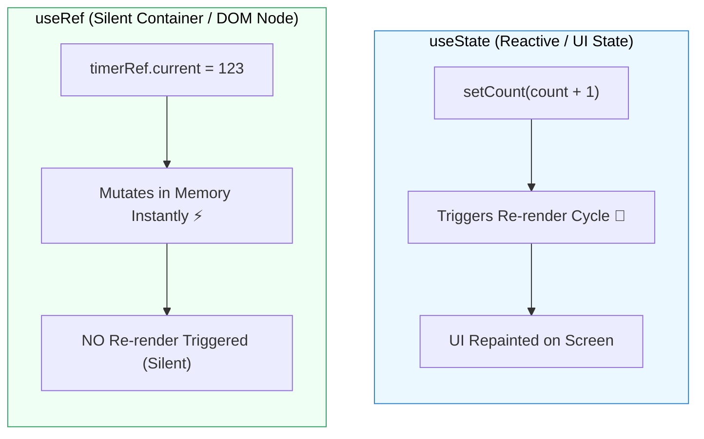

## 🔍 1. `useState` vs `useRef` Architecture



---

## 🛠️ 2. កូដអនុវត្តជាក់ស្តែង: Focus Input & Video Control

```jsx
import { useRef } from 'react';

export default function RefDemo() {
  const inputRef = useRef(null);
  const videoRef = useRef(null);

  const handleFocus = () => {
    // បញ្ជា DOM ផ្ទាល់ឱ្យ Focus នៅលើ Input
    inputRef.current.focus();
  };

  const handlePlayVideo = () => {
    videoRef.current.play();
  };

  const handlePauseVideo = () => {
    videoRef.current.pause();
  };

  return (
    <div className="p-8 max-w-md mx-auto space-y-6">
      {/* 1. DOM Focus */}
      <div className="p-5 border rounded-2xl bg-white shadow-sm space-y-3">
        <h3 className="font-bold">Input Focus Control</h3>
        <input 
          ref={inputRef}
          type="text" 
          placeholder="ចុចប៊ូតុងដើម្បី Focus ខ្ញុំ..." 
          className="w-full border px-3 py-2 rounded-lg"
        />
        <button onClick={handleFocus} className="px-4 py-2 bg-blue-600 text-white rounded-lg font-bold text-sm">
          Focus Input 🎯
        </button>
      </div>

      {/* 2. Video Player Imperative Play/Pause */}
      <div className="p-5 border rounded-2xl bg-white shadow-sm space-y-3">
        <h3 className="font-bold">Video Player Control</h3>
        <video 
          ref={videoRef}
          width="100%" 
          className="rounded-lg"
          src="https://www.w3schools.com/html/mov_bbb.mp4" 
        />
        <div className="flex gap-2">
          <button onClick={handlePlayVideo} className="px-4 py-2 bg-emerald-600 text-white rounded-lg font-bold text-sm">Play</button>
          <button onClick={handlePauseVideo} className="px-4 py-2 bg-rose-600 text-white rounded-lg font-bold text-sm">Pause</button>
        </div>
      </div>
    </div>
  );
}
```
