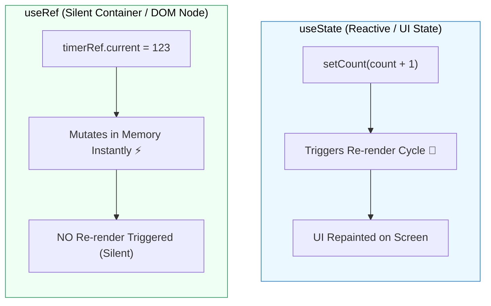

## 🔍 1. `useState` vs `useRef` Comparison



---

## 🎯 2. Use Case 1: Input Auto-Focus

### 🌐 Normal HTML Structure:

```html
<!-- HTML Input & Button ធម្មតា -->
<div class="search-box">
  <input type="text" id="search-input" placeholder="វាយស្វែងរក..." />
  <button type="button" onclick="document.getElementById('search-input').focus()">
    🔍 Focus Input
  </button>
</div>
```

### 💻 React Code (ជាមួយ `useRef`):

```jsx
import { useRef } from 'react';

export function InputFocusDemo() {
  // 1. បង្កើត Ref object ចាប់ផ្តើមដោយ null
  const inputRef = useRef(null);

  // 2. Handler បញ្ជាឱ្យ Focus
  const handleFocus = () => {
    inputRef.current.focus(); // ហៅ DOM method ដោយផ្ទាល់
  };

  return (
    <div>
      {/* 3. ភ្ជាប់ Ref ទៅកាន់ Input DOM Node */}
      <input ref={inputRef} type="text" placeholder="វាយស្វែងរក..." />
      <button onClick={handleFocus}>🔍 Focus Input</button>
    </div>
  );
}
```

### 🔍 ការពន្យល់មួយជួរៗ (Line-by-Line Explanation):

1. `const inputRef = useRef(null);`
   - បង្កើត Object `{ current: null }` ដែល React នឹងរក្សាទុកក្នុង Memory រវាង Render ទាំងអស់។
2. `<input ref={inputRef} ... />`
   - ភ្ជាប់ `ref` prop ទៅកាន់ Element — ពេល React Render ចប់ `inputRef.current` នឹងចង្អុលទៅកាន់ Real DOM Element `<input>`។
3. `inputRef.current.focus();`
   - ហៅ native DOM method `.focus()` ដោយផ្ទាល់ (Imperative Action) ដោយមិនបង្កឱ្យ Component Re-render ឡើយ។

---

## 🎬 3. Use Case 2: Custom Video Player Controls

### 🌐 Normal HTML Structure:

```html
<!-- HTML5 Video Player ធម្មតា -->
<video id="my-video" src="/promo.mp4" width="400"></video>
<div class="controls">
  <button onclick="document.getElementById('my-video').play()">Play</button>
  <button onclick="document.getElementById('my-video').pause()">Pause</button>
</div>
```

### 💻 React Code (ជាមួយ `useRef`):

```jsx
import { useRef } from 'react';

export function VideoPlayer() {
  const videoRef = useRef(null);

  const handlePlay = () => videoRef.current.play();
  const handlePause = () => videoRef.current.pause();

  return (
    <div className="video-card">
      <video ref={videoRef} src="https://www.w3schools.com/html/mov_bbb.mp4" width="320" />
      <div className="flex gap-2 mt-2">
        <button onClick={handlePlay} className="px-3 py-1 bg-green-600 text-white rounded">Play</button>
        <button onClick={handlePause} className="px-3 py-1 bg-red-600 text-white rounded">Pause</button>
      </div>
    </div>
  );
}
```

### 🔍 ការពន្យល់មួយជួរៗ (Line-by-Line Explanation):

1. `const videoRef = useRef(null);`
   - ចាប់យក DOM reference នៃ `<video>` tag។
2. `videoRef.current.play()` និង `videoRef.current.pause()`
   - បញ្ជា HTML5 Media API ដោយផ្ទាល់ — សាមញ្ញ លឿន និងគ្មាន Re-render overhead ឡើយ។

---

## ⏱️ 4. Use Case 3: Storing Timers & Mutable Values (No Re-render)

### 💻 Code សម្រាប់ Timer Ref:

```jsx
import { useState, useRef } from 'react';

export function Stopwatch() {
  const [seconds, setSeconds] = useState(0);
  // ផ្ទុក Timer ID ក្នុង Ref (ដើម្បីកុំឱ្យ Timer ID update បង្ក Re-render)
  const timerRef = useRef(null);

  const startTimer = () => {
    if (timerRef.current !== null) return;
    timerRef.current = setInterval(() => {
      setSeconds((prev) => prev + 1);
    }, 1000);
  };

  const stopTimer = () => {
    clearInterval(timerRef.current);
    timerRef.current = null; // Reset ref
  };

  return (
    <div>
      <h3 className="text-2xl font-bold">{seconds}s</h3>
      <button onClick={startTimer}>Start</button>
      <button onClick={stopTimer}>Stop</button>
    </div>
  );
}
```

### 🔍 ការពន្យល់មួយជួរៗ (Line-by-Line Explanation):

1. `const timerRef = useRef(null);`
   - រក្សាទុក `setInterval` ID។ ប្រសិនបើយើងប្រើ `useState` សម្រាប់ Timer ID វានឹង Re-render ឥតប្រយោជន៍។
2. `timerRef.current = setInterval(...)`
   - កែប្រែតម្លៃ `.current` ដោយផ្ទាល់ (Silent Mutation)។
3. `clearInterval(timerRef.current)`
   - លុប Timer ចេញដើម្បីបញ្ឈប់ Stopwatch។
