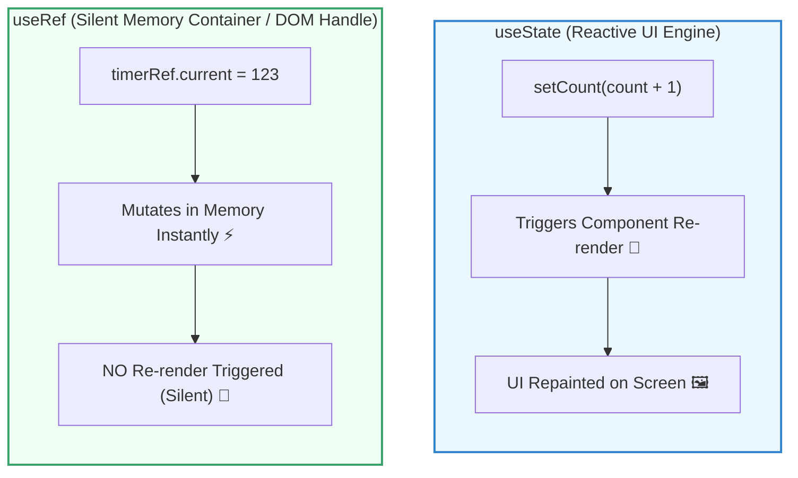

## 💡 ១. Mental Model: `useState` vs `useRef` (ការប្រៀបធៀបងាយយល់)

ដើម្បីយល់ពី `useRef` សូមស្រមៃមើលភាពខុសគ្នារវាង **ក្តារខៀនសាធារណៈ** និង **សៀវភៅកត់ត្រាក្នុងហោប៉ៅ** ៖

* **📢 `useState` (ក្តារខៀនសាធារណៈ ៖ UI State) ៖**  
  រាល់ពេលអ្នកលុបសរសេរលេខថ្មីលើក្តារខៀន មនុស្សគ្រប់គ្នាក្នុងបន្ទប់នឹងងាកមកមើល ហើយបន្ទប់ទាំងមូលត្រូវរៀបចំឡើងវិញ (**Re-render UI** ភ្លាមៗ)។ ស័ក្តិសមសម្រាប់ទិន្នន័យដែលត្រូវបង្ហាញលើអេក្រង់។
* **🤫 `useRef` (សៀវភៅកត់ត្រាក្នុងហោប៉ៅ ៖ Silent Memory Container) ៖**  
  អ្នកដកសៀវភៅចេញពីហោប៉ៅមកកត់ត្រាលេខកូដសម្ងាត់ ឬកាន់ពិលឡាស៊ែរបាញ់ចង្អុលវត្ថុអ្វីមួយ ដោយគ្មាននរណាម្នាក់ដឹង ឬរំខានដល់អ្នកដទៃឡើយ (**Zero Re-render** ស្ងាត់ស្ងៀម)។



---

## 🛠️ ២. មហិទ្ធិឫទ្ធិទាំង ២ នៃ `useRef`

`useRef(initialValue)` នឹង Return មកវិញនូវ JavaScript Object ធម្មតាមួយគឺ `{ current: initialValue }` ដែលមានតួនាទីធំៗ ២ ៖

```
┌─────────────────────────────────────────┐     ┌─────────────────────────────────────────┐
│        ១. Direct DOM Access (ពិលឡាស៊ែរ)   │     │    ២. Persistent Mutable Value (សៀវភៅកត់)│
├─────────────────────────────────────────┤     ├─────────────────────────────────────────┤
│ • Auto-focus លើ Input fields            │     │ • ផ្ទុក Timer / setInterval IDs         │
│ • Scroll ទៅកាន់ទីតាំងណាមួយលើទំព័រ       │     │ • ផ្ទុក Previous Prop ឬ State ចាស់      │
│ • បញ្ជា Video / Audio (Play, Pause)     │     │ • រាប់ចំនួនដងនៃការ Render (Render Count) │
│ • ភ្ជាប់ទៅកាន់ Canvas ឬ 3D Libraries    │     │ • ផ្ទុក WebSocket ឬ Socket.io Instance  │
└─────────────────────────────────────────┘     └─────────────────────────────────────────┘
```

---

## 🎯 ៣. ការអនុវត្តជាក់ស្តែង ៖ ករណីសិក្សាទាំង ៤ (Step-by-Step)

---

### ករណីទី ១ ៖ Auto-Focus លើ Input ជាមួយ Shortcut (`Cmd + K` / `Ctrl + K`)

នៅពេលចង់ឱ្យ Cursor លោតចូលប្រអប់ Search ដោយស្វ័យប្រវត្តិ ៖

```jsx
// src/components/SearchBox.jsx
import { useRef, useEffect } from 'react';

export function SearchBox() {
  // ១. បង្កើត Ref សម្រាប់ភ្ជាប់ទៅកាន់ DOM Node
  const searchInputRef = useRef(null);

  // ២. ចាប់យក Keyboard Shortcut (Cmd+K ឬ Ctrl+K)
  useEffect(() => {
    const handleKeyDown = (e) => {
      if ((e.metaKey || e.ctrlKey) && e.key === 'k') {
        e.preventDefault();
        // ⚡ ហៅ Native DOM .focus() Method ផ្ទាល់
        searchInputRef.current?.focus();
      }
    };

    window.addEventListener('keydown', handleKeyDown);
    return () => window.removeEventListener('keydown', handleKeyDown);
  }, []);

  return (
    <div className="search-container">
      {/* ៣. ភ្ជាប់ ref ទៅកាន់ HTML <input> */}
      <input
        ref={searchInputRef}
        type="text"
        placeholder="ស្វែងរកឯកសារ... (ចុច Cmd+K / Ctrl+K)"
      />
      <button onClick={() => searchInputRef.current?.focus()}>
        🔍 Focus
      </button>
    </div>
  );
}
```

---

### ករណីទី ២ ៖ Custom HTML5 Media Controls (Play / Pause / Seek)

HTML5 `<video>` មាន Native Methods ដូចជា `.play()`, `.pause()`, និង Property `.currentTime` ដែល React State មិនអាចបញ្ជាផ្ទាល់បានឡើយ ៖

```jsx
// src/components/VideoPlayer.jsx
import { useRef, useState } from 'react';

export function VideoPlayer() {
  const videoRef = useRef(null);
  const [isPlaying, setIsPlaying] = useState(false);

  // បញ្ជា Play / Pause តាមរយៈ Real DOM Node
  const togglePlay = () => {
    if (!videoRef.current) return;

    if (isPlaying) {
      videoRef.current.pause();
      setIsPlaying(false);
    } else {
      videoRef.current.play();
      setIsPlaying(true);
    }
  };

  // កំណត់វិនាទីវីដេអូទៅចំណុចដើមវិញ (currentTime = 0)
  const handleRestart = () => {
    if (!videoRef.current) return;
    videoRef.current.currentTime = 0;
    videoRef.current.play();
    setIsPlaying(true);
  };

  return (
    <div className="player-card">
      {/* ភ្ជាប់ videoRef ទៅ <video> element */}
      <video
        ref={videoRef}
        src="https://www.w3schools.com/html/mov_bbb.mp4"
        onEnded={() => setIsPlaying(false)}
      />

      <div className="controls">
        <button onClick={togglePlay}>
          {isPlaying ? '⏸️ Pause' : '▶️ Play'}
        </button>
        <button onClick={handleRestart}>
          🔄 Restart
        </button>
      </div>
    </div>
  );
}
```

---

### ករណីទី ៣ ៖ Stopwatch Timer (ផ្ទុក Interval ID ដោយមិនបាច់ Re-render)

> [!TIP]
> **ហេតុអ្វីមិនប្រើ `useState` សម្រាប់ Timer ID?**  
> ប្រសិនបើអ្នកប្រើ `const [timerId, setTimerId] = useState()` រាល់ពេលអ្នកចុច Start កម្មវិធីនឹង Re-render មួយដងឥតប្រយោជន៍ ព្រោះ Timer ID គ្រាន់តែជាលេខសម្គាល់ក្នុង Memory ប៉ុណ្ណោះ មិនមែនជាអ្វីដែលត្រូវគូរលើ Screen ឡើយ។ `useRef` គឺជាជម្រើសដ៏ល្អឥតខ្ចោះ!

```jsx
// src/components/Stopwatch.jsx
import { useState, useRef, useEffect } from 'react';

export function Stopwatch() {
  const [seconds, setSeconds] = useState(0);
  const [isRunning, setIsRunning] = useState(false);

  // 🛡️ ផ្ទុក Timer ID ក្នុង Ref ព្រោះការផ្លាស់ប្តូរ Timer ID មិនត្រូវបង្ក Re-render ឡើយ
  const timerRef = useRef(null);

  const handleStart = () => {
    if (timerRef.current !== null) return; // ការពារកុំឱ្យចុច Start ជាន់ច្រើនដង

    setIsRunning(true);
    timerRef.current = setInterval(() => {
      setSeconds((prev) => prev + 1);
    }, 1000);
  };

  const handleStop = () => {
    clearInterval(timerRef.current);
    timerRef.current = null;
    setIsRunning(false);
  };

  const handleReset = () => {
    handleStop();
    setSeconds(0);
  };

  // Cleanup Timer ពេល Component Unmount ដើម្បីការពារ Memory Leak
  useEffect(() => {
    return () => clearInterval(timerRef.current);
  }, []);

  return (
    <div className="stopwatch-box">
      <h2>⏱️ {seconds}s</h2>
      <div className="btn-group">
        {!isRunning ? (
          <button onClick={handleStart}>Start</button>
        ) : (
          <button onClick={handleStop}>Pause</button>
        )}
        <button onClick={handleReset}>Reset</button>
      </div>
    </div>
  );
}
```

---

### ករណីទី ៤ ៖ តាមដានតម្លៃ State ចាស់ (The `usePrevious` Pattern)

នៅពេលអ្នកចង់ប្រៀបធៀបថាតើតម្លៃ State លើកមុន និងលើកនេះខុសគ្នាយ៉ាងណា ៖

```jsx
// src/hooks/usePrevious.js
import { useRef, useEffect } from 'react';

// Custom Hook សម្រាប់ចងចាំតម្លៃ Render លើកមុន
export function usePrevious(value) {
  const ref = useRef();

  useEffect(() => {
    // ធ្វើបច្ចុប្បន្នភាពតម្លៃ ref ក្រោយពេល Render ចប់សព្វគ្រប់
    ref.current = value;
  }, [value]);

  // Return តម្លៃចាស់ (តម្លៃមុនពេល useEffect ដំណើរការ)
  return ref.current;
}
```

#### ការយកទៅប្រើប្រាស់ក្នុង Component ៖
```jsx
// src/components/PriceTracker.jsx
import { useState } from 'react';
import { usePrevious } from './usePrevious';

export function PriceTracker() {
  const [price, setPrice] = useState(100);
  const prevPrice = usePrevious(price);

  return (
    <div className="price-card">
      <p>តម្លៃមុន ៖ ${prevPrice ?? 'N/A'}</p>
      <p>តម្លៃបច្ចុប្បន្ន ៖ ${price}</p>
      <button onClick={() => setPrice((p) => p + 10)}>+$10</button>
      <button onClick={() => setPrice((p) => p - 10)}>-$10</button>
    </div>
  );
}
```

---

## 🚀 ៤. Forwarding Refs ជាមួយ `React.forwardRef`

តាមលំនាំដើមក្នុង React (មុន React 19) Functional Component មិនអាចទទួលយក `ref` prop ពី Parent Component ដោយផ្ទាល់បានឡើយ។ យើងត្រូវប្រើ `React.forwardRef` ៖

```jsx
// src/components/CustomInput.jsx
import { forwardRef } from 'react';

// ✅ Child Component ទទួលយក ref ពី Parent ហើយបញ្ជូនបន្តទៅ <input>
export const CustomInput = forwardRef(function CustomInput(props, ref) {
  return (
    <div className="input-group">
      <label>{props.label}</label>
      <input ref={ref} {...props} />
    </div>
  );
});
```

#### Parent Component ប្រើប្រាស់ CustomInput ៖
```jsx
// src/components/LoginForm.jsx
import { useRef } from 'react';
import { CustomInput } from './CustomInput';

export function LoginForm() {
  const emailInputRef = useRef(null);

  const focusEmail = () => {
    emailInputRef.current?.focus();
  };

  return (
    <div>
      <CustomInput ref={emailInputRef} label="Email Address" type="email" />
      <button onClick={focusEmail}>Focus Email Input</button>
    </div>
  );
}
```

> [!NOTE]
> **React 19 Update ៖**  
> នៅក្នុង **React 19** អ្នកមិនបាច់ប្រើ `forwardRef()` ទៀតឡើយ! `ref` អាចត្រូវបានបញ្ជូនជា `props.ref` ដូច Props ធម្មតាបានតែម្តង។

---

## ⚠️ ៥. ច្បាប់មាស ៣ នៃ `useRef` (Golden Rules)

1. **🚫 ហាមកែប្រែ `ref.current` ក្នុង Render Phase ៖**  
   ```jsx
   // ❌ ខុសធ្ងន់ធ្ងរ (Side Effect ក្នុង Render)
   function BadComponent() {
     const countRef = useRef(0);
     countRef.current++; // ហាមធ្វើបែបនេះដាច់ខាត!
     return <div>{countRef.current}</div>;
   }

   // ✅ ត្រឹមត្រូវ (កែប្រែក្នុង Event Handler ឬ useEffect)
   function GoodComponent() {
     const countRef = useRef(0);
     const handleClick = () => {
       countRef.current++; // ត្រឹមត្រូវ!
     };
     return <button onClick={handleClick}>Click</button>;
   }
   ```
2. **🚫 កុំប្រើ `useRef` ជំនួស `useState` សម្រាប់ទិន្នន័យដែលត្រូវបង្ហាញលើ UI ៖**  
   ប្រសិនបើតម្លៃមួយផ្លាស់ប្តូរហើយអ្នកចង់ឱ្យអេក្រង់ផ្លាស់ប្តូរតាម ត្រូវតែប្រើ `useState`។
3. **✅ ប្រើ `useRef` សម្រាប់ Imperative Actions & Silent State ៖**  
   Focus, Media controls, Timers, Animation frames, និង Third-party DOM libraries (D3, Leaflet Maps, Chart.js)។

---

## 🧠 ៦. សង្ខេប Mental Model ងាយចាំ

| លក្ខណៈពិសេស | `useState` | `useRef` |
| :--- | :--- | :--- |
| **ការ Re-render** | បង្ក Re-render រាល់ពេលតម្លៃផ្លាស់ប្តូរ | **មិនបង្ក Re-render ឡើយ** (Zero Overhead) |
| **ការផ្ទុកតម្លៃ** | អានបានក្នុង JSX ដោយផ្ទាល់ | ផ្ទុកក្នុង `.current` property |
| **គោលបំណងចម្បង** | UI State, Forms, Toggles, Lists | DOM references, Timer IDs, Previous state |
| **វិធីកែប្រែតម្លៃ** | ហាម mutate ផ្ទាល់ (ប្រើ `setState`) | អាច mutate ផ្ទាល់បាន (`ref.current = newVal`) |
