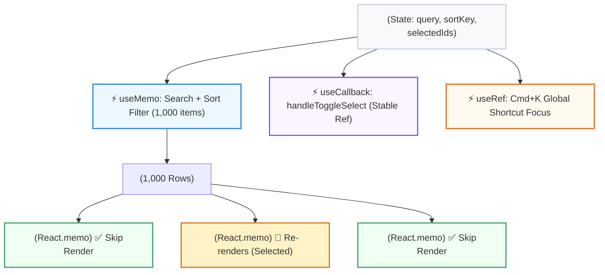

## 🏗️ ១. ស្ថាបត្យកម្មប្រព័ន្ធ (Performance Architecture)

ក្នុងគម្រោងនេះ យើងនឹងបង្កើត Data Grid ខ្នាតធំមួយដែលមាន **1,000 ទិន្នន័យ**។ ដើម្បីកុំឱ្យមានការទាក់ (Lag) យើងផ្គុំបច្ចេកទេស Optimization ទាំងអស់ចូលគ្នា ៖



---

## 💻 ២. កូដពេញលេញនៃគម្រោង (`src/OptimizedDataGrid.jsx`)

```jsx
// src/OptimizedDataGrid.jsx
import { useState, useMemo, useCallback, useRef, useEffect, memo } from 'react';

// ── ១. បង្កើតទិន្នន័យគំរូ ១,០០០ RECORDS ──
const GENERATED_DATA = Array.from({ length: 1000 }, (_, index) => {
  const id = index + 1;
  const roles = ['Frontend Lead', 'Backend Engineer', 'DevOps Architect', 'UI/UX Designer', 'Product Owner'];
  return {
    id: `DEV-${String(id).padStart(4, '0')}`,
    name: `វិស្វករកម្មវិធី #${id}`,
    email: `engineer.${id}@enterprise-tech.com`,
    role: roles[index % roles.length],
    score: Math.floor(Math.random() * 40) + 60, // 60 - 100
    status: index % 4 === 0 ? 'Inactive' : 'Active',
  };
});

// ── ២. MEMOIZED ROW COMPONENT ──
// ✅ រុំដោយ React.memo: Re-render លុះត្រាតែ isSelected ឬ item ផ្លាស់ប្តូរ!
const GridRow = memo(function GridRow({ item, isSelected, onToggle }) {
  // Console log ដើម្បីមើល Render ជាក់ស្តែងក្នុង DevTools
  // console.log(`Rendering Row: ${item.id}`);

  return (
    <tr
      className={`border-b border-slate-100 dark:border-slate-800 transition-colors text-xs ${
        isSelected
          ? 'bg-indigo-50/80 dark:bg-indigo-950/40'
          : 'hover:bg-slate-50/80 dark:hover:bg-slate-800/40'
      }`}
    >
      <td className="p-3.5 text-center">
        <input
          type="checkbox"
          checked={isSelected}
          onChange={() => onToggle(item.id)}
          className="w-4 h-4 rounded text-indigo-600 focus:ring-indigo-500 cursor-pointer"
        />
      </td>
      <td className="p-3.5 font-mono text-slate-500">{item.id}</td>
      <td className="p-3.5 font-bold text-slate-800 dark:text-slate-200">
        {item.name}
      </td>
      <td className="p-3.5 text-slate-600 dark:text-slate-400 font-mono">
        {item.email}
      </td>
      <td className="p-3.5">
        <span
          className={`px-2.5 py-1 rounded-full text-[10px] font-bold ${
            item.role.includes('Lead')
              ? 'bg-purple-100 text-purple-700 dark:bg-purple-950/60 dark:text-purple-300'
              : 'bg-slate-100 text-slate-700 dark:bg-slate-800 dark:text-slate-300'
          }`}
        >
          {item.role}
        </span>
      </td>
      <td className="p-3.5 font-black text-indigo-600 dark:text-indigo-400">
        {item.score} pts
      </td>
      <td className="p-3.5">
        <span
          className={`inline-flex items-center gap-1 text-[10px] font-bold px-2 py-0.5 rounded-md ${
            item.status === 'Active'
              ? 'text-emerald-700 bg-emerald-50 dark:bg-emerald-950/50 dark:text-emerald-300'
              : 'text-slate-500 bg-slate-100 dark:bg-slate-800'
          }`}
        >
          <span className={`w-1.5 h-1.5 rounded-full ${item.status === 'Active' ? 'bg-emerald-500' : 'bg-slate-400'}`}></span>
          {item.status}
        </span>
      </td>
    </tr>
  );
});

// ── ៣. MAIN DATA GRID COMPONENT ──
export default function OptimizedDataGrid() {
  const [searchQuery, setSearchQuery] = useState('');
  const [sortField, setSortField] = useState('id'); // 'id' | 'name' | 'score'
  const [sortOrder, setSortOrder] = useState('asc'); // 'asc' | 'desc'
  const [selectedIds, setSelectedIds] = useState(new Set());
  
  const searchInputRef = useRef(null);

  // ── ៤. KEYBOARD SHORTCUT (Cmd+K / Ctrl+K) ──
  useEffect(() => {
    const handleKeyDown = (e) => {
      if ((e.metaKey || e.ctrlKey) && e.key === 'k') {
        e.preventDefault();
        searchInputRef.current?.focus();
      }
    };
    window.addEventListener('keydown', handleKeyDown);
    return () => window.removeEventListener('keydown', handleKeyDown);
  }, []);

  // ── ៥. useMemo: FILTER & SORT HEAVY OPERATION ──
  const processedRows = useMemo(() => {
    console.log('⚡ ដំណើរការ Filter & Sort លើ 1,000 items...');

    let result = GENERATED_DATA;

    // Filter តាម Search Query
    if (searchQuery.trim()) {
      const q = searchQuery.toLowerCase();
      result = result.filter(
        (row) =>
          row.name.toLowerCase().includes(q) ||
          row.email.toLowerCase().includes(q) ||
          row.role.toLowerCase().includes(q) ||
          row.id.toLowerCase().includes(q)
      );
    }

    // Sort តាម Column
    return [...result].sort((a, b) => {
      let valA = a[sortField];
      let valB = b[sortField];

      if (typeof valA === 'string') {
        return sortOrder === 'asc'
          ? valA.localeCompare(valB)
          : valB.localeCompare(valA);
      }

      return sortOrder === 'asc' ? valA - valB : valB - valA;
    });
  }, [searchQuery, sortField, sortOrder]);

  // ── ៦. useCallback: STABLE SELECTION HANDLER ──
  const handleToggleSelect = useCallback((id) => {
    setSelectedIds((prev) => {
      const updated = new Set(prev);
      if (updated.has(id)) {
        updated.delete(id);
      } else {
        updated.add(id);
      }
      return updated;
    });
  }, []);

  // Toggle Select All
  const handleSelectAll = () => {
    if (selectedIds.size === processedRows.length) {
      setSelectedIds(new Set());
    } else {
      setSelectedIds(new Set(processedRows.map((r) => r.id)));
    }
  };

  const handleSort = (field) => {
    if (sortField === field) {
      setSortOrder((prev) => (prev === 'asc' ? 'desc' : 'asc'));
    } else {
      setSortField(field);
      setSortOrder('asc');
    }
  };

  return (
    <div className="min-h-screen bg-slate-100 dark:bg-slate-950 p-4 sm:p-8">
      <div className="max-w-5xl mx-auto bg-white dark:bg-slate-900 rounded-3xl shadow-xl border border-slate-200 dark:border-slate-800 p-6 space-y-6">
        
        {/* HEADER SECTION */}
        <div className="flex flex-col sm:flex-row justify-between items-start sm:items-center gap-4">
          <div>
            <h1 className="text-xl font-black text-slate-800 dark:text-white flex items-center gap-2">
              <span>⚡</span> High-Performance Data Grid (1,000 Records)
            </h1>
            <p className="text-xs text-slate-500 dark:text-slate-400 mt-1">
              បង្កើនល្បឿន Render ដោយប្រើ React.memo, useMemo, useCallback & useRef
            </p>
          </div>

          {/* SEARCH BOX WITH CMD+K */}
          <div className="relative w-full sm:w-80">
            <input
              ref={searchInputRef}
              type="text"
              value={searchQuery}
              onChange={(e) => setSearchQuery(e.target.value)}
              placeholder="ស្វែងរក ID, ឈ្មោះ, ឬ Role... (Cmd+K)"
              className="w-full pl-3.5 pr-14 py-2 bg-slate-50 dark:bg-slate-800 border border-slate-200 dark:border-slate-700 rounded-xl text-xs focus:outline-none focus:ring-2 focus:ring-indigo-500"
            />
            <kbd className="absolute right-2.5 top-2 bg-slate-200 dark:bg-slate-700 text-slate-600 dark:text-slate-300 text-[10px] px-2 py-0.5 rounded font-mono font-bold">
              ⌘K
            </kbd>
          </div>
        </div>

        {/* METRICS & ACTION BAR */}
        <div className="flex flex-wrap justify-between items-center bg-slate-50 dark:bg-slate-800/60 p-3.5 rounded-2xl text-xs gap-3">
          <div className="flex items-center gap-4 font-semibold text-slate-600 dark:text-slate-300">
            <span>📊 បង្ហាញ៖ <b className="text-slate-900 dark:text-white">{processedRows.length}</b> ជួរ</span>
            <span>✅ ជ្រើសរើស៖ <b className="text-indigo-600 dark:text-indigo-400">{selectedIds.size}</b> នាក់</span>
          </div>

          <div className="flex gap-2">
            <button
              onClick={handleSelectAll}
              className="px-3 py-1.5 bg-slate-200 dark:bg-slate-700 hover:bg-slate-300 text-slate-700 dark:text-slate-200 font-bold rounded-lg text-xs transition"
            >
              {selectedIds.size === processedRows.length ? 'ដកការជ្រើសរើស' : 'ជ្រើសទាំងអស់'}
            </button>
          </div>
        </div>

        {/* TABLE CONTAINER */}
        <div className="overflow-x-auto max-h-[460px] border border-slate-200 dark:border-slate-800 rounded-2xl">
          <table className="w-full text-left border-collapse">
            <thead className="bg-slate-50 dark:bg-slate-800/80 sticky top-0 backdrop-blur text-[11px] uppercase font-bold text-slate-500 tracking-wider z-10 border-b border-slate-200 dark:border-slate-700">
              <tr>
                <th className="p-3.5 w-12 text-center">
                  <input
                    type="checkbox"
                    checked={processedRows.length > 0 && selectedIds.size === processedRows.length}
                    onChange={handleSelectAll}
                    className="w-4 h-4 rounded text-indigo-600"
                  />
                </th>
                <th onClick={() => handleSort('id')} className="p-3.5 cursor-pointer hover:text-indigo-600">
                  ID {sortField === 'id' ? (sortOrder === 'asc' ? '↑' : '↓') : ''}
                </th>
                <th onClick={() => handleSort('name')} className="p-3.5 cursor-pointer hover:text-indigo-600">
                  ឈ្មោះ {sortField === 'name' ? (sortOrder === 'asc' ? '↑' : '↓') : ''}
                </th>
                <th className="p-3.5">Email</th>
                <th className="p-3.5">តួនាទី</th>
                <th onClick={() => handleSort('score')} className="p-3.5 cursor-pointer hover:text-indigo-600">
                  ពិន្ទុ {sortField === 'score' ? (sortOrder === 'asc' ? '↑' : '↓') : ''}
                </th>
                <th className="p-3.5">ស្ថានភាព</th>
              </tr>
            </thead>

            <tbody>
              {processedRows.length === 0 ? (
                <tr>
                  <td colSpan="7" className="py-12 text-center text-xs text-slate-400">
                    រកមិនឃើញទិន្នន័យដែលត្រូវនឹងពាក្យស្វែងរកឡើយ!
                  </td>
                </tr>
              ) : (
                processedRows.map((row) => (
                  <GridRow
                    key={row.id}
                    item={row}
                    isSelected={selectedIds.has(row.id)}
                    onToggle={handleToggleSelect}
                  />
                ))
              )}
            </tbody>
          </table>
        </div>

      </div>
    </div>
  );
}
```

---

## 🔍 ៣. ការវិភាគចំណុចគន្លឹះនៃ Performance

1. **ហេតុអ្វីបានជាប្រើ `new Set()` សម្រាប់ Selected IDs?**  
   `selectedIds.has(id)` មានល្បឿន **O(1) Constant Time** ខណៈពេលដែល Array `.includes()` មានល្បឿន O(N)។ ក្នុងទិន្នន័យ ១,០០០ ជួរ ការប្រើ `Set` ធ្វើឱ្យការឆែក Checkbox លឿនដូចផ្លេកបន្ទោរ!
2. **ហេតុអ្វី `handleToggleSelect` ប្រើ Functional State Update?**  
   យើងប្រើ `setSelectedIds((prev) => ...)` ជំនួសឱ្យការដាក់ `[selectedIds]` ក្នុង `useCallback` dependencies។ វិធីនេះធ្វើឱ្យ `handleToggleSelect` **មិនដែលផ្លាស់ប្តូរ Reference ឡើយ (`[]` empty deps)** ដែលជួយឱ្យ `React.memo` លើ `GridRow` ដំណើរការបានល្អឥតខ្ចោះ!
3. **ការគ្រប់គ្រង Memory:**  
   ទិន្នន័យ 1,000 Records ត្រូវបាន Cache ក្នុង Memory ហើយ Sort ដោយមិនចាំបាច់ Fetch ឡើងវិញរាល់ពេលប្តូរលំដាប់តម្រៀប។

---

## 🏆 ៤. បញ្ជីត្រួតពិនិត្យការអនុវត្ត (Checklist)

- [x] ស្វែងរក (Search) និងតម្រៀប (Sort) លើ 1,000 Rows ដំណើរការលឿនដោយគ្មាន Lag ជាមួយ `useMemo`
- [x] ចុច Checkbox លើ Row មួយ គឺ Re-render តែ Row នោះមួយគត់ដោយប្រើ `React.memo` + `useCallback`
- [x] ចុចផ្លូវកាត់ `Cmd+K` / `Ctrl+K` ធ្វើការ Focus ទៅលើ Search Box ភ្លាមៗតាមរយៈ `useRef`
- [x] គាំទ្រការ Select All និងដកការជ្រើសរើសទាំងអស់ដោយប្រើ `Set` Data Structure
