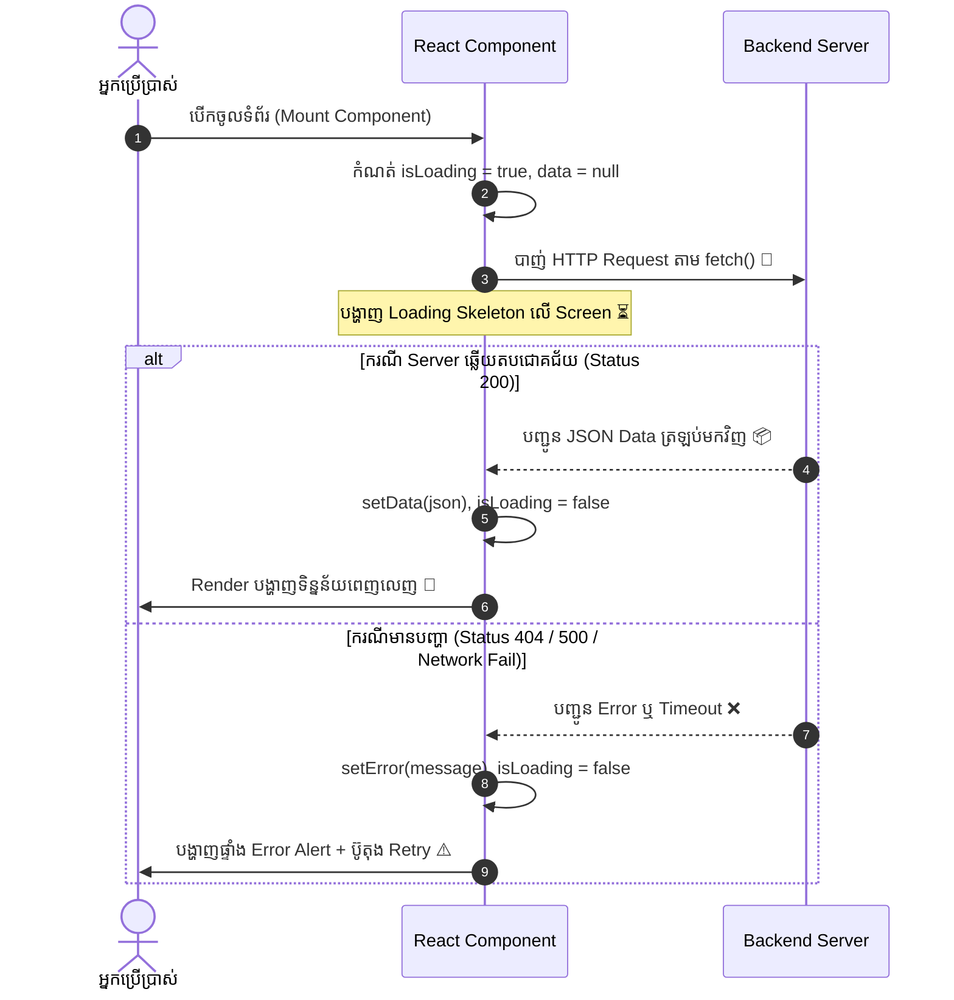

## 🌐 ១. ដំណើរការ Asynchronous Data Flow ក្នុង React

នៅក្នុង Web Application ការទាញយកទិន្នន័យពី Backend API គឺជាដំណើរការ **Asynchronous (មិនទាន់ពេលភ្លាមៗ)**។ React Component នឹងត្រូវឆ្លងកាត់ **៣ ដំណាក់កាលស្នូល (Tri-State Architecture)** ៖



---

## 📦 ២. The Tri-State Pattern (State Architecture)

រាល់ Component ណាដែលធ្វើការទាញយកទិន្នន័យ គួរតែប្រកាស State ទាំង ៣ នេះជាស្តង់ដារ៖

```javascript
const [data, setData] = useState(null);          // 📦 ផ្ទុក Response Data ពិតប្រាកដ
const [isLoading, setIsLoading] = useState(true); // ⏳ ស្ថានភាពកំពុងរង់ចាំ Network (true/false)
const [error, setError] = useState(null);        // ⚠️ ផ្ទុកសារ Error ប្រសិនបើមានបញ្ហា
```

---

## ⚡ ៣. ការសរសេរ `fetch()` ជាមួយ Async/Await & `res.ok` Check

> [!IMPORTANT]
> **ច្បាប់សំខាន់បំផុតនៃ Native `fetch()` ៖**  
> `fetch()` នឹងមិន Reject Promise ដោយស្វ័យប្រវត្តិលើ HTTP status 404 ឬ 500 ឡើយ! អ្នក **ត្រូវតែឆែក `if (!res.ok)` ដោយដៃ** មុននឹងបម្លែងជា JSON។

```javascript
const loadUsers = async (signal) => {
  setIsLoading(true);
  setError(null);

  try {
    const res = await fetch('https://jsonplaceholder.typicode.com/users', { signal });

    // 🛡️ ឆែក Status Code (200 - 299 គឺជោគជ័យ)
    if (!res.ok) {
      throw new Error(`Server ឆ្លើយតប Error កូដ: ${res.status} (${res.statusText})`);
    }

    const json = await res.json();
    setData(json);
  } catch (err) {
    // បើ Error បណ្តាលមកពី AbortController យើងមិនបាច់បង្ហាញ Error លើ UI ឡើយ
    if (err.name === 'AbortError') return;
    setError(err.message || 'មានបញ្ហាមិនអាចទាញយកទិន្នន័យបានទេ');
  } finally {
    setIsLoading(false);
  }
};
```

---

## 🛑 ៤. ការប្រើប្រាស់ `AbortController` ក្នុង `useEffect` Cleanup

នៅពេលដែល User ចុច Navigate ចេញពីទំព័រលឿន ខណៈពេលដែល Network Request កំពុងដំណើរការ ប្រសិនបើយើងមិន Cancel ទេ Browser នឹងព្យាយាម Update State លើ Component ដែលបានងាប់ទៅហើយ។

```javascript
useEffect(() => {
  // ១. បង្កើត Controller Instance
  const controller = new AbortController();

  // ២. ហៅ Function Fetch ដោយបញ្ជូន Signal ទៅជាមួយ
  loadUsers(controller.signal);

  // ៣. Cleanup: បោះបង់ Request ភ្លាមៗពេល Component Unmount
  return () => {
    controller.abort();
  };
}, []); // 👈 Empty dependency array ធានាថារត់តែម្ដងគត់ពេល Mount
```

---

## 💻 ៥. កូដគំរូពេញលេញ ៖ User Directory with Retry & Skeleton

```jsx
// src/components/UserDirectory.jsx
import { useState, useEffect, useCallback } from 'react';

export default function UserDirectory() {
  const [users, setUsers] = useState([]);
  const [isLoading, setIsLoading] = useState(true);
  const [error, setError] = useState(null);
  const [reloadKey, setReloadKey] = useState(0);

  const handleRetry = () => {
    setReloadKey((prev) => prev + 1); // Trigger useEffect ឱ្យរត់ម្តងទៀត
  };

  useEffect(() => {
    const controller = new AbortController();

    const fetchUsers = async () => {
      setIsLoading(true);
      setError(null);

      try {
        const response = await fetch('https://jsonplaceholder.typicode.com/users', {
          signal: controller.signal,
        });

        if (!response.ok) {
          throw new Error(`HTTP Error Status: ${response.status}`);
        }

        const data = await response.json();
        setUsers(data);
      } catch (err) {
        if (err.name === 'AbortError') return;
        setError(err.message || 'បរាជ័យក្នុងការតភ្ជាប់ទៅកាន់ Server');
      } finally {
        setIsLoading(false);
      }
    };

    fetchUsers();

    return () => controller.abort();
  }, [reloadKey]);

  return (
    <div className="max-w-xl mx-auto p-6 bg-white dark:bg-slate-900 rounded-3xl border border-slate-200 dark:border-slate-800 shadow-xl space-y-6">
      {/* HEADER */}
      <div className="flex justify-between items-center pb-4 border-b border-slate-200 dark:border-slate-800">
        <div>
          <h2 className="text-lg font-black text-slate-800 dark:text-white flex items-center gap-2">
            <span>👥</span> បញ្ជីអ្នកប្រើប្រាស់ (User Directory)
          </h2>
          <p className="text-xs text-slate-500">ទាញយកទិន្នន័យផ្ទាល់ពី JSONPlaceholder REST API</p>
        </div>

        <button
          onClick={handleRetry}
          disabled={isLoading}
          className="px-3.5 py-1.5 bg-indigo-50 dark:bg-indigo-950/50 hover:bg-indigo-100 text-indigo-600 dark:text-indigo-400 rounded-xl text-xs font-bold transition disabled:opacity-50"
        >
          {isLoading ? 'កំពុងផ្ទុក...' : '🔄 Refresh'}
        </button>
      </div>

      {/* ── ១. LOADING STATE (SKELETON UI) ── */}
      {isLoading && (
        <div className="space-y-3">
          {[1, 2, 3, 4].map((n) => (
            <div
              key={n}
              className="p-4 rounded-2xl border border-slate-100 dark:border-slate-800 bg-slate-50 dark:bg-slate-800/40 animate-pulse flex items-center gap-4"
            >
              <div className="w-10 h-10 rounded-full bg-slate-200 dark:bg-slate-700" />
              <div className="flex-1 space-y-2">
                <div className="h-3.5 bg-slate-200 dark:bg-slate-700 rounded w-1/3" />
                <div className="h-2.5 bg-slate-200 dark:bg-slate-700 rounded w-1/2" />
              </div>
            </div>
          ))}
        </div>
      )}

      {/* ── ២. ERROR STATE (WITH RETRY BUTTON) ── */}
      {error && !isLoading && (
        <div className="p-6 bg-rose-50 dark:bg-rose-950/40 border border-rose-200 dark:border-rose-900 rounded-2xl text-center space-y-3">
          <div className="text-2xl">⚠️</div>
          <h3 className="font-bold text-sm text-rose-800 dark:text-rose-200">
            បរាជ័យក្នុងការទាញយកទិន្នន័យ
          </h3>
          <p className="text-xs text-rose-600 dark:text-rose-300 font-mono">{error}</p>
          <button
            onClick={handleRetry}
            className="px-4 py-2 bg-rose-600 hover:bg-rose-700 text-white rounded-xl text-xs font-bold transition shadow"
          >
            ព្យាយាមម្តងទៀត (Retry)
          </button>
        </div>
      )}

      {/* ── ៣. SUCCESS STATE (RENDER DATA) ── */}
      {!isLoading && !error && (
        <ul className="space-y-2.5 max-h-96 overflow-y-auto pr-1">
          {users.length === 0 ? (
            <li className="py-8 text-center text-xs text-slate-400">
              📭 មិនមានទិន្នន័យអ្នកប្រើប្រាស់ឡើយ!
            </li>
          ) : (
            users.map((user) => (
              <li
                key={user.id}
                className="p-3.5 bg-slate-50 dark:bg-slate-800/50 hover:bg-slate-100 dark:hover:bg-slate-800 rounded-2xl border border-slate-100 dark:border-slate-800 flex items-center justify-between transition text-xs"
              >
                <div className="flex items-center gap-3">
                  <div className="w-8 h-8 rounded-full bg-indigo-500 text-white flex items-center justify-center font-bold text-xs">
                    {user.name.charAt(0)}
                  </div>
                  <div>
                    <h4 className="font-bold text-slate-800 dark:text-white">
                      {user.name}
                    </h4>
                    <p className="text-[11px] text-slate-500 font-mono">{user.email}</p>
                  </div>
                </div>

                <span className="px-2.5 py-1 rounded-full bg-white dark:bg-slate-900 border text-[10px] font-bold text-slate-600 dark:text-slate-300">
                  {user.company.name}
                </span>
              </li>
            ))
          )}
        </ul>
      )}
    </div>
  );
}
```

---

## 🔍 ៦. ការវិភាគចំណុចគន្លឹះនៃកូដ

1. **ការគ្រប់គ្រង `reloadKey` សម្រាប់ Retry:**  
   យើងប្រើ `[reloadKey]` ជា Dependency ក្នុង `useEffect`។ នៅពេល User ចុចប៊ូតុង Refresh/Retry យើងគ្រាន់តែ `setReloadKey(k => k + 1)` នោះ React នឹងដឹងថាត្រូវដំណើរការ Fetch សារជាថ្មីដោយស្វ័យប្រវត្តិ។
2. **ការការពារ Memory Leak ជាមួយ `AbortController`:**  
   ប្រសិនបើ Server ឆ្លើយតបយឺត (ឧ. 5 វិនាទី) ហើយ User ចុចបិទទំព័រនោះមុន 5 វិនាទី Cleanup function នឹងរត់កាត់ផ្តាច់ Connection ភ្លាមៗ មិនបន្សល់ទុក Pending Process ក្នុង Memory ឡើយ។
3. **Conditional Rendering ៣ ជាន់:**  
   `isLoading` ➔ `error` ➔ `success` ត្រូវបានបែងចែកដាច់ដោយឡែកពីគ្នា ធ្វើឱ្យ UI មានភាពច្បាស់លាស់ មិនរញ៉េរញ៉ៃ។

---

## 🧠 ៧. សង្ខេប Mental Model ងាយចាំ

| ដំណាក់កាល State | តម្លៃ State គំរូ | UI ដែលត្រូវបង្ហាញ |
| :--- | :--- | :--- |
| **Loading** | `isLoading: true, data: null, error: null` | Skeleton Loader / Spinner |
| **Error** | `isLoading: false, data: null, error: "404"` | Error Banner + Retry Button |
| **Success (Empty)** | `isLoading: false, data: [], error: null` | Empty State ("គ្មានទិន្នន័យ") |
| **Success (Filled)** | `isLoading: false, data: [...], error: null` | Table / Grid / Card List |
