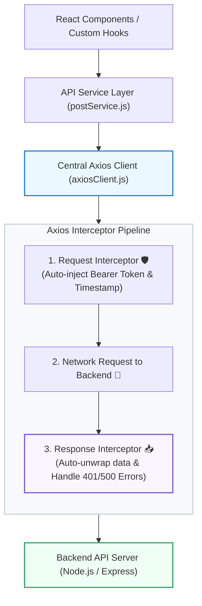

## 🆚 ១. តារាងប្រៀបធៀបលម្អិត ៖ Native `fetch()` vs `axios`

| លក្ខណៈពិសេស (Feature) | Native `fetch()` | `axios` |
| :--- | :--- | :--- |
| **JSON Data Parsing** | ត្រូវហៅ `await res.json()` ដោយដៃ | **Auto-parse JSON** (ស្ថិតក្នុង `response.data`) |
| **HTTP Error Handling** | មិន Reject លើ status 4xx/5xx (ត្រូវឆែក `res.ok`) | **Auto-reject Promise** លើ status 4xx និង 5xx |
| **Base URL Setup** | គ្មាន (ត្រូវសរសេរ Full URL គ្រប់កន្លែង) | **មាន `axios.create({ baseURL })`** |
| **Interceptors** | គ្មាន (ត្រូវសរសេរ Wrapper Function ផ្ទាល់ខ្លួន) | **មាន Request & Response Interceptors ស្រាប់** |
| **Request Timeout** | ត្រូវបង្កើត `AbortController` + `setTimeout` | **មាន Built-in `timeout: 8000`** |
| **Upload Progress** | ពិបាក (ត្រូវប្រើ XMLHttpRequest ជំនួស) | **មាន `onUploadProgress` callback ស្រាប់** |

---

## 🏗️ ២. ស្ថាបត្យកម្ម Enterprise Central API Client

នៅក្នុង Project ស្តង់ដារ យើងមិនត្រូវហៅ `axios.get('https://api...')` រាយប៉ាយតាម Components ឡើយ។ យើងបែងចែកជា **Central HTTP Client** ក្នុង `src/api/axiosClient.js` ៖



---

## 💻 ៣. ការអនុវត្តជាក់ស្តែង ៖ `src/api/axiosClient.js`

```javascript
// src/api/axiosClient.js
import axios from 'axios';

// ── ១. បង្កើត AXIOS INSTANCE ──
const axiosClient = axios.create({
  baseURL: 'https://jsonplaceholder.typicode.com',
  timeout: 10000, // បោះបង់បើ Server មិនឆ្លើយតបក្នុង ១០ វិនាទី
  headers: {
    'Content-Type': 'application/json',
    Accept: 'application/json',
  },
});

// ── ២. REQUEST INTERCEPTOR (AUTO-ATTACH AUTH TOKEN) ──
axiosClient.interceptors.request.use(
  (config) => {
    // ទាញយក JWT Access Token ពី LocalStorage
    const token = localStorage.getItem('auth_token');

    if (token) {
      config.headers.Authorization = `Bearer ${token}`;
    }

    // បន្ថែម Custom Request Header (ឧ. Client Version)
    config.headers['X-Client-App'] = 'React-Enterprise-v1';

    return config;
  },
  (error) => {
    return Promise.reject(error);
  }
);

// ── ៣. RESPONSE INTERCEPTOR (GLOBAL ERROR HANDLING) ──
axiosClient.interceptors.response.use(
  (response) => {
    // Server ឆ្លើយតប status 2xx ជោគជ័យ
    return response;
  },
  (error) => {
    if (error.response) {
      const { status, data } = error.response;

      // 🔐 ករណី Status 401: Unauthorized / Token Expired
      if (status === 401) {
        console.warn('🔒 Session Expired! កំពុងនាំ User ទៅ Login Page...');
        localStorage.removeItem('auth_token');
        localStorage.removeItem('auth_user');
        window.location.href = '/login';
      }

      // 🛑 ករណី Status 403: Forbidden (គ្មានសិទ្ធិ)
      if (status === 403) {
        console.error('⛔ អ្នកមិនមានសិទ្ធិចូលមើលទិន្នន័យនេះឡើយ!');
      }

      // 💥 ករណី Status 500: Server គាំង
      if (status >= 500) {
        console.error('💥 Server កំពុងមានបញ្ហាបច្ចេកទេស!');
      }

      // Format Error Message ឱ្យស្អាតសម្រាប់ Component
      const customMessage = data?.message || `HTTP Error ${status}`;
      return Promise.reject(new Error(customMessage));
    }

    // ករណី Network Error ឬ Server Timeout
    if (error.code === 'ECONNABORTED') {
      return Promise.reject(new Error('⏳ ការតភ្ជាប់ផុតកំណត់ (Network Timeout)!'));
    }

    return Promise.reject(new Error(error.message || 'Network Failure!'));
  }
);

export default axiosClient;
```

---

## 📂 ៤. ការបង្កើត Service Layer (`src/services/postService.js`)

ការបំបែក Endpoint Calls ទៅក្នុង Service Layer ជួយឱ្យកូដស្អាត មិនបាច់សរសេរ URL ក្នុង React Component ឡើយ៖

```javascript
// src/services/postService.js
import axiosClient from '../api/axiosClient';

export const postService = {
  // GET: ទាញយកបញ្ជី Posts
  getAll: async (limit = 10) => {
    const response = await axiosClient.get(`/posts?_limit=${limit}`);
    return response.data;
  },

  // GET BY ID: ទាញយក Post តែមួយ
  getById: async (id) => {
    const response = await axiosClient.get(`/posts/${id}`);
    return response.data;
  },

  // POST: បង្កើត Post ថ្មី
  create: async (postData) => {
    const response = await axiosClient.post('/posts', postData);
    return response.data;
  },

  // DELETE: លុប Post
  delete: async (id) => {
    const response = await axiosClient.delete(`/posts/${id}`);
    return response.data;
  },
};
```

---

## 🚀 ៥. ការហៅប្រើប្រាស់ក្នុង React Component

```jsx
// src/components/ArticleManager.jsx
import { useState, useEffect } from 'react';
import { postService } from '../services/postService';

export default function ArticleManager() {
  const [articles, setArticles] = useState([]);
  const [isLoading, setIsLoading] = useState(true);
  const [error, setError] = useState(null);
  const [titleInput, setTitleInput] = useState('');

  // ១. FETCH ARTICLES
  const loadArticles = async () => {
    setIsLoading(true);
    setError(null);
    try {
      const data = await postService.getAll(5);
      setArticles(data);
    } catch (err) {
      setError(err.message);
    } finally {
      setIsLoading(false);
    }
  };

  useEffect(() => {
    loadArticles();
  }, []);

  // ២. CREATE ARTICLE
  const handleCreate = async (e) => {
    e.preventDefault();
    if (!titleInput.trim()) return;

    try {
      const newPost = await postService.create({
        title: titleInput,
        body: 'មាតិកាអត្ថបទថ្មីបង្កើតតាម Axios Service Layer',
        userId: 1,
      });

      setArticles((prev) => [newPost, ...prev]);
      setTitleInput('');
    } catch (err) {
      alert(`បរាជ័យក្នុងការបង្កើត: ${err.message}`);
    }
  };

  // ៣. DELETE ARTICLE
  const handleDelete = async (id) => {
    try {
      await postService.delete(id);
      setArticles((prev) => prev.filter((item) => item.id !== id));
    } catch (err) {
      alert(`បរាជ័យក្នុងការលុប: ${err.message}`);
    }
  };

  return (
    <div className="max-w-lg mx-auto p-6 bg-white dark:bg-slate-900 border border-slate-200 dark:border-slate-800 rounded-3xl shadow-xl space-y-6">
      <div className="flex justify-between items-center pb-3 border-b border-slate-200 dark:border-slate-800">
        <h2 className="text-base font-black text-slate-800 dark:text-white flex items-center gap-2">
          <span>📰</span> Axios Article Manager
        </h2>
        <span className="text-xs text-slate-500">{articles.length} អត្ថបទ</span>
      </div>

      {/* CREATE FORM */}
      <form onSubmit={handleCreate} className="flex gap-2">
        <input
          type="text"
          value={titleInput}
          onChange={(e) => setTitleInput(e.target.value)}
          placeholder="បញ្ចូលចំណងជើងអត្ថបទថ្មី..."
          className="flex-1 px-3.5 py-2 border rounded-xl text-xs dark:bg-slate-800 dark:text-white focus:outline-none focus:ring-2 focus:ring-indigo-500"
        />
        <button
          type="submit"
          className="px-4 py-2 bg-indigo-600 hover:bg-indigo-700 text-white rounded-xl text-xs font-bold transition shadow"
        >
          + Add
        </button>
      </form>

      {/* ERROR BANNER */}
      {error && (
        <div className="p-3 bg-rose-50 border border-rose-200 text-rose-600 rounded-xl text-xs font-medium">
          ⚠️ {error}
        </div>
      )}

      {/* ARTICLE LIST */}
      {isLoading ? (
        <p className="text-center py-8 text-xs text-slate-400">⏳ កំពុងទាញយកទិន្នន័យពី Axios...</p>
      ) : (
        <ul className="space-y-2.5 max-h-80 overflow-y-auto pr-1">
          {articles.map((item) => (
            <li
              key={item.id}
              className="p-3.5 bg-slate-50 dark:bg-slate-800/50 rounded-2xl border border-slate-100 dark:border-slate-800 flex justify-between items-start gap-3"
            >
              <div>
                <h4 className="font-bold text-xs text-slate-800 dark:text-white capitalize">
                  {item.title}
                </h4>
                <p className="text-[11px] text-slate-500 mt-1 line-clamp-1">{item.body}</p>
              </div>
              <button
                onClick={() => handleDelete(item.id)}
                className="text-rose-500 hover:text-rose-700 font-bold text-xs shrink-0"
              >
                ✕
              </button>
            </li>
          ))}
        </ul>
      )}
    </div>
  );
}
```

---

## 🧠 ៦. សង្ខេបចំណុចសំខាន់ៗ (Key Takeaways)

- តែងតែបង្កើត **Axios Central Instance** (`axiosClient.js`) ជានិច្ច ដើម្បីគ្រប់គ្រង baseURL, timeouts, និង headers នៅកន្លែងតែមួយ។
- ប្រើ **Request Interceptors** សម្រាប់ Auto Bearer Token Injection។
- ប្រើ **Response Interceptors** សម្រាប់ Global Error Handling (401 Session Expired, 403 Forbidden, 500 Internal Server Errors)។
- រៀបចំ **Service Layer Pattern** សម្រាប់បំបែក API Endpoints ចេញពី React UI Components។
