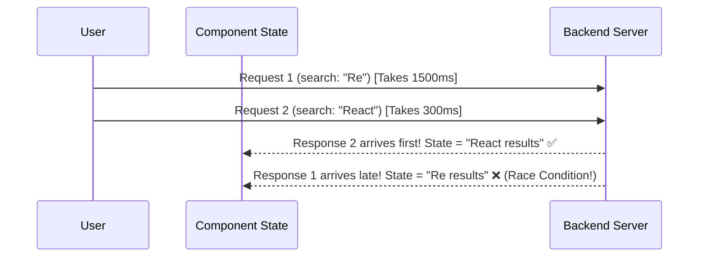

## 🏃‍♂️ 1. Race Condition Visualized



---

## 🛡️ 2. Solution A: Boolean Ignore Flag Pattern

### 💻 Code សម្រាប់តែ Ignore Flag Pattern:

```javascript
useEffect(() => {
  let isCurrent = true; // 1. Flag បញ្ជាក់ថា Effect នេះនៅជាចុងក្រោយ

  const fetchData = async () => {
    const result = await fetchUserData(userId);
    
    // 2. ពិនិត្យមើលថាតើ Component បាន Re-render រួចហើយឬនៅ?
    if (isCurrent) {
      setUserData(result); // Update តែពេលណា request នេះនៅតែជា current
    }
  };

  fetchData();

  // 3. Cleanup: ពេល userId ប្តូរ Effect មុននឹងត្រូវ mark ថា expired
  return () => {
    isCurrent = false;
  };
}, [userId]);
```

### 🔍 ការពន្យល់មួយជួរៗ (Line-by-Line Explanation):

1. `let isCurrent = true;`
   - បង្កើត Local Variable មួយនៅក្នុង Scope នៃ Effect បច្ចុប្បន្ន។
2. `if (isCurrent)`
   - មុនពេលហៅ `setUserData(result)` យើងពិនិត្យមើលថា `isCurrent` នៅតែ `true` ឬអត់។
3. `return () => { isCurrent = false; };`
   - នៅពេល `userId` ផ្លាស់ប្តូរ React នឹងដំណើរការ Cleanup function នៃ Effect ចាស់ភ្លាម ដោយកំណត់ `isCurrent = false`។ ដូច្នេះបើ Response ចាស់ត្រឡប់មកដល់យឺត ក៏វាមិនអាច Update State បានដែរ។

---

## 🛑 3. Solution B: AbortController Pattern

### 💻 Code សម្រាប់តែ AbortController Pattern:

```javascript
useEffect(() => {
  const controller = new AbortController();

  const loadData = async () => {
    try {
      const res = await fetch(`/api/search?q=${query}`, {
        signal: controller.signal, // ភ្ជាប់ signal ទៅ request
      });
      const data = await res.json();
      setResults(data);
    } catch (err) {
      if (err.name !== 'AbortError') {
        setError(err.message);
      }
    }
  };

  loadData();

  // Cleanup: Cancel request មុនភ្លាម ពេល query ផ្លាស់ប្តូរ
  return () => controller.abort();
}, [query]);
```

### 🔍 ការពន្យល់មួយជួរៗ (Line-by-Line Explanation):

1. `const controller = new AbortController();`
   - បង្កើត Web API AbortController ថ្មីមួយរាល់ពេល query ផ្លាស់ប្តូរ។
2. `signal: controller.signal`
   - ប្រាប់ browser ថា request នេះស្ថិតក្រោមការបញ្ជារបស់ controller នេះ។
3. `return () => controller.abort();`
   - ពេល user វាយអក្សរបន្ទាប់ (query ប្តូរ) Cleanup នឹងកាត់ផ្តាច់ (Abort) Network Request ចាស់ចោលភ្លាមៗពី Browser តែម្តង ដោយមិនចាំបាច់រង់ចាំ Server ឆ្លើយតបឡើយ។
4. `if (err.name !== 'AbortError')`
   - មិនបង្ហាញ Error ក្រហមនៅពេល request ត្រូវបាន Abort ដោយចេតនា។

---

## ⏱️ 4. Search Debounce Pattern (កាត់បន្ថយ Request)

### 💻 Code សម្រាប់តែ Debounce Logic:

```javascript
const [searchTerm, setSearchTerm] = useState('');
const [debouncedTerm, setDebouncedTerm] = useState('');

// Effect ពន្យារពេល 400ms រាល់ពេល user វាយ
useEffect(() => {
  const timer = setTimeout(() => {
    setDebouncedTerm(searchTerm);
  }, 400);

  // បើ user វាយអក្សរបន្តទៀតក្នុងអំឡុង 400ms លុប timer ចាស់ចោល
  return () => clearTimeout(timer);
}, [searchTerm]);
```

### 🔍 ការពន្យល់មួយជួរៗ (Line-by-Line Explanation):

1. `const timer = setTimeout(..., 400);`
   - កំណត់ម៉ោងរង់ចាំ 400ms សិន ទើប update `debouncedTerm`។
2. `return () => clearTimeout(timer);`
   - បើ User វាយអក្សរបន្ថែមទៀតមុន 400ms ផុតកំណត់ Cleanup នឹងលុប Timer ចាស់ចោល រួចបង្កើត Timer ថ្មី។
   - លទ្ធផល៖ Network Request នឹងបាញ់ចេញតែ ១ ដងគត់ នៅពេល User ឈប់វាយអក្សរ!

---

## 🚀 5. Complete Integrated Search Component

```jsx
import { useState, useEffect } from 'react';

export default function LiveSearch() {
  const [query, setQuery] = useState('');
  const [debouncedQuery, setDebouncedQuery] = useState('');
  const [results, setResults] = useState([]);
  const [isLoading, setIsLoading] = useState(false);

  // 1. DEBOUNCE EFFECT
  useEffect(() => {
    const timer = setTimeout(() => {
      setDebouncedQuery(query);
    }, 400);
    return () => clearTimeout(timer);
  }, [query]);

  // 2. FETCH WITH ABORTCONTROLLER EFFECT
  useEffect(() => {
    if (!debouncedQuery.trim()) {
      setResults([]);
      return;
    }

    const controller = new AbortController();
    setIsLoading(true);

    fetch(`https://jsonplaceholder.typicode.com/posts?q=${encodeURIComponent(debouncedQuery)}`, {
      signal: controller.signal,
    })
      .then((res) => res.json())
      .then((data) => {
        setResults(data);
        setIsLoading(false);
      })
      .catch((err) => {
        if (err.name !== 'AbortError') {
          console.error(err);
          setIsLoading(false);
        }
      });

    return () => controller.abort();
  }, [debouncedQuery]);

  return (
    <div className="max-w-md mx-auto p-4">
      <h2 className="text-xl font-bold mb-3 text-slate-800 dark:text-white">🔍 Live Post Search</h2>
      <input
        type="text"
        value={query}
        onChange={(e) => setQuery(e.target.value)}
        placeholder="ស្វែងរកចំណងជើង Post..."
        className="w-full px-4 py-2 border rounded-xl dark:bg-slate-800 dark:text-white mb-4"
      />

      {isLoading && <p className="text-sm text-blue-500">កំពុងស្វែងរក...</p>}

      <ul className="space-y-2">
        {results.map((item) => (
          <li key={item.id} className="p-3 bg-white dark:bg-slate-800 rounded-xl shadow-sm border">
            <h4 className="font-bold text-sm text-slate-800 dark:text-white capitalize">{item.title}</h4>
          </li>
        ))}
      </ul>
    </div>
  );
}
```
