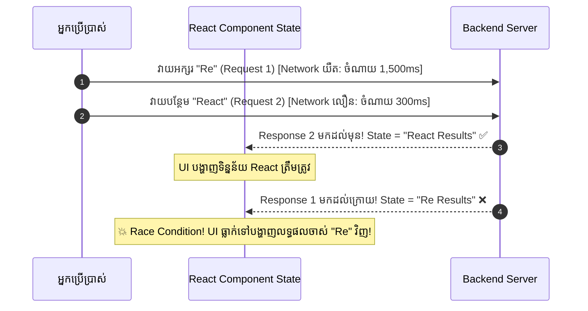

## 🏃‍♂️ ១. បញ្ហា Race Condition (The Race Condition Problem)

នៅក្នុង Single Page Application (SPA) នៅពេលដែល User វាយអក្សរស្វែងរក ឬចុចប្តូរ Tab យ៉ាងរហ័ស Network Requests ជាច្រើននឹងត្រូវបាញ់ចេញជាបន្តបន្ទាប់។

ដោយសារ **Network Latency មិនស្មើគ្នា** Request ដែលបាញ់ចេញមុន អាចត្រឡប់មកដល់ក្រោយគេបង្អស់ ធ្វើឱ្យទិន្នន័យចាស់មកសរសេរជាន់លើទិន្នន័យថ្មី ៖



---

## 🛡️ ២. ដំណោះស្រាយទី ១ ៖ The Boolean Ignore Flag Pattern

វិធីសាមញ្ញ និងមានប្រសិទ្ធភាពខ្ពស់បំផុតក្នុងការទប់ស្កាត់ Stale Response គឺប្រើប្រាស់ **Local Ignore Flag** ៖

```javascript
useEffect(() => {
  let isCurrent = true; // 🚩 ១. បញ្ជាក់ថា Effect បច្ចុប្បន្ននៅជាសកម្មភាពចុងក្រោយ

  const fetchUserData = async () => {
    try {
      const response = await fetch(`https://api.example.com/users/${userId}`);
      const data = await response.json();

      // 🛡️ ២. ពិនិត្យមើលថាតើ Effect នេះនៅតែជា Current ឬអត់?
      if (isCurrent) {
        setUser(data); // Update State តែពេលណា request នេះនៅជាចុងក្រោយ
      }
    } catch (err) {
      if (isCurrent) setError(err.message);
    }
  };

  fetchUserData();

  // 🧹 ៣. Cleanup: នៅពេល userId ផ្លាស់ប្តូរ React នឹង set isCurrent = false សម្រាប់ Effect ចាស់ភ្លាម!
  return () => {
    isCurrent = false;
  };
}, [userId]);
```

---

## 🛑 ៣. ដំណោះស្រាយទី ២ ៖ The AbortController Pattern

ជំនួសឱ្យការគ្រាន់តែ ignore response យើងអាច **កាត់ផ្តាច់ Network Stream ពី Browser ភ្លាមៗតែម្តង** ដើម្បីសន្សំ Bandwidth ៖

```javascript
useEffect(() => {
  const controller = new AbortController();

  const searchPosts = async () => {
    try {
      const res = await fetch(`https://api.example.com/search?q=${query}`, {
        signal: controller.signal, // 🔗 ភ្ជាប់ signal
      });
      const data = await res.json();
      setResults(data);
    } catch (err) {
      if (err.name !== 'AbortError') {
        setError(err.message);
      }
    }
  };

  searchPosts();

  // ✂️ Cleanup: Cancel request ចាស់ភ្លាមៗពេល user វាយ query ថ្មី
  return () => {
    controller.abort();
  };
}, [query]);
```

---

## ⏱️ ៤. Search Debouncing (ការបង្កើត Custom Hook `useDebounce`)

> [!TIP]
> **ហេតុអ្វីបានជាត្រូវប្រើ Debounce?**  
> ប្រសិនបើ User វាយពាក្យ *"FullStack"* រយៈពេល ២ វិនាទី App របស់អ្នកនឹងបាញ់ Request ចំនួន ៩ ដងទៅកាន់ Server។ ការ Debounce ជួយពន្យារពេល ៤០០ មីលីវិនាទី — App នឹងបាញ់ Request តែ **១ ដងគត់** នៅពេល User ឈប់វាយអក្សរ!

```javascript
// src/hooks/useDebounce.js
import { useState, useEffect } from 'react';

export function useDebounce(value, delay = 400) {
  const [debouncedValue, setDebouncedValue] = useState(value);

  useEffect(() => {
    // កំណត់ Timer រង់ចាំ
    const timer = setTimeout(() => {
      setDebouncedValue(value);
    }, delay);

    // ប្រសិនបើ value ផ្លាស់ប្តូរមុនពេល 400ms ផុតកំណត់ លុប Timer ចាស់ចោល!
    return () => {
      clearTimeout(timer);
    };
  }, [value, delay]);

  return debouncedValue;
}
```

---

## 💻 ៥. កូដពេញលេញ ៖ Live Search Engine (Debounce + Abort + History)

```jsx
// src/components/AdvancedLiveSearch.jsx
import { useState, useEffect } from 'react';
import { useDebounce } from '../hooks/useDebounce';

export default function AdvancedLiveSearch() {
  const [query, setQuery] = useState('');
  const debouncedQuery = useDebounce(query, 400); // ⏱️ ពន្យារពេល 400ms

  const [results, setResults] = useState([]);
  const [isLoading, setIsLoading] = useState(false);
  const [error, setError] = useState(null);
  const [searchCount, setSearchCount] = useState(0);

  useEffect(() => {
    if (!debouncedQuery.trim()) {
      setResults([]);
      setIsLoading(false);
      return;
    }

    const controller = new AbortController();
    setIsLoading(true);
    setError(null);

    const performSearch = async () => {
      try {
        const response = await fetch(
          `https://jsonplaceholder.typicode.com/posts?q=${encodeURIComponent(
            debouncedQuery
          )}`,
          { signal: controller.signal }
        );

        if (!response.ok) throw new Error(`Status: ${response.status}`);

        const data = await response.json();
        setResults(data);
        setSearchCount((c) => c + 1);
      } catch (err) {
        if (err.name !== 'AbortError') {
          setError(err.message || 'ស្វែងរកបរាជ័យ');
        }
      } finally {
        setIsLoading(false);
      }
    };

    performSearch();

    // ✂️ Cancel request ពេល debouncedQuery ផ្លាស់ប្តូរ ឬ Component Unmount
    return () => {
      controller.abort();
    };
  }, [debouncedQuery]);

  return (
    <div className="max-w-lg mx-auto p-6 bg-white dark:bg-slate-900 border border-slate-200 dark:border-slate-800 rounded-3xl shadow-xl space-y-5">
      <div>
        <h2 className="text-base font-black text-slate-800 dark:text-white flex items-center gap-2">
          <span>🔍</span> Advanced Live Search Engine
        </h2>
        <p className="text-xs text-slate-500 mt-0.5">
          ការពារ Race Conditions ជាមួយ Debounce (400ms) + AbortController
        </p>
      </div>

      {/* SEARCH INPUT */}
      <div className="relative">
        <input
          type="text"
          value={query}
          onChange={(e) => setQuery(e.target.value)}
          placeholder="សាកល្បងវាយស្វែងរក (ឧ. 'qui', 'optio', 'dolor')..."
          className="w-full pl-3.5 pr-10 py-2.5 border border-slate-200 dark:border-slate-700 rounded-2xl text-xs dark:bg-slate-800 dark:text-white focus:outline-none focus:ring-2 focus:ring-indigo-500"
        />
        {isLoading && (
          <div className="absolute right-3.5 top-3 w-4 h-4 border-2 border-indigo-500 border-t-transparent rounded-full animate-spin" />
        )}
      </div>

      {/* STATS */}
      <div className="flex justify-between items-center text-[11px] text-slate-500 px-1">
        <span>ពាក្យស្វែងរក: <b className="text-indigo-600">"{debouncedQuery || '...'}"</b></span>
        <span>ចំនួន Request បានបាញ់: <b>{searchCount}</b> ដង</span>
      </div>

      {/* ERROR BANNER */}
      {error && (
        <div className="p-3 bg-rose-50 border border-rose-200 text-rose-600 rounded-xl text-xs font-medium">
          ⚠️ {error}
        </div>
      )}

      {/* RESULTS LIST */}
      <div className="space-y-2 max-h-72 overflow-y-auto pr-1">
        {results.length === 0 && debouncedQuery && !isLoading && (
          <p className="text-center py-8 text-xs text-slate-400">
            រកមិនឃើញអត្ថបទដែលត្រូវនឹង "{debouncedQuery}" ឡើយ!
          </p>
        )}

        {results.map((post) => (
          <div
            key={post.id}
            className="p-3.5 bg-slate-50 dark:bg-slate-800/50 rounded-2xl border border-slate-100 dark:border-slate-800 text-xs space-y-1 hover:border-indigo-300 transition"
          >
            <h4 className="font-bold text-slate-800 dark:text-white capitalize">
              {post.title}
            </h4>
            <p className="text-[11px] text-slate-500 line-clamp-2">{post.body}</p>
          </div>
        ))}
      </div>
    </div>
  );
}
```

---

## 🧠 ៦. សង្ខេប Mental Model ងាយចាំ

| យុទ្ធសាស្ត្រ | របៀបដំណើរការ | ករណីប្រើប្រាស់ល្អបំផុត |
| :--- | :--- | :--- |
| **Ignore Flag** | `let isCurrent = true` ក្នុង Effect | Component Tab Switching, Pagination, User ID Change |
| **AbortController** | `controller.abort()` ក្នុង Cleanup | Auto-complete Search, Large File Downloads |
| **useDebounce** | `setTimeout` 400ms + `clearTimeout` | Real-time Search Inputs, Window Resize, Auto-save Forms |
