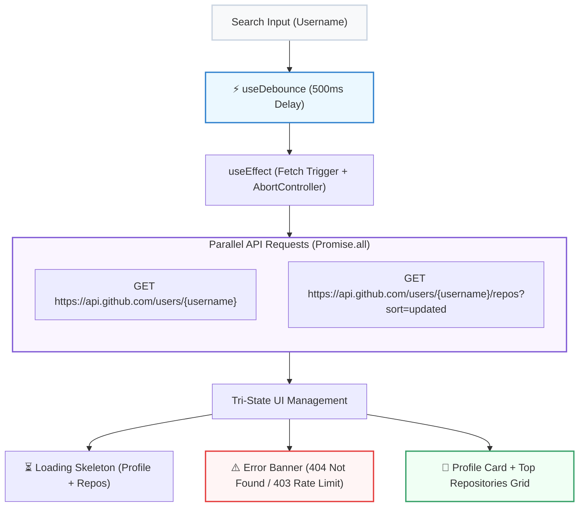

## 🐙 ១. ស្ថាបត្យកម្មប្រព័ន្ធ (Architecture Blueprint)

នៅក្នុងគម្រោងនេះ យើងនឹងបង្កើត **GitHub Explorer & Repo Inspector** ដែលមានសមត្ថភាពទាញយក Profile និង Top Repositories ពី GitHub Public API ៖



---

## 💻 ២. កូដពេញលេញនៃគម្រោង (`src/GitHubExplorer.jsx`)

```jsx
// src/GitHubExplorer.jsx
import { useState, useEffect } from 'react';

// ── ១. CUSTOM HOOK: useDebounce ──
function useDebounce(value, delay = 500) {
  const [debouncedValue, setDebouncedValue] = useState(value);

  useEffect(() => {
    const timer = setTimeout(() => setDebouncedValue(value), delay);
    return () => clearTimeout(timer);
  }, [value, delay]);

  return debouncedValue;
}

// ── ២. MAIN GITHUB EXPLORER COMPONENT ──
export default function GitHubExplorer() {
  const [username, setUsername] = useState('torvalds'); // Default: Linus Torvalds
  const debouncedUser = useDebounce(username.trim(), 500);

  const [profile, setProfile] = useState(null);
  const [repos, setRepos] = useState([]);
  const [isLoading, setIsLoading] = useState(false);
  const [error, setError] = useState(null);

  useEffect(() => {
    if (!debouncedUser) {
      setProfile(null);
      setRepos([]);
      setIsLoading(false);
      return;
    }

    const controller = new AbortController();
    setIsLoading(true);
    setError(null);

    const fetchGitHubData = async () => {
      try {
        // 🚀 Parallel Fetch ទាំង Profile និង Repos ក្នុងពេលតែមួយ
        const [userRes, reposRes] = await Promise.all([
          fetch(`https://api.github.com/users/${debouncedUser}`, {
            signal: controller.signal,
          }),
          fetch(
            `https://api.github.com/users/${debouncedUser}/repos?sort=updated&per_page=4`,
            { signal: controller.signal }
          ),
        ]);

        // 🛡️ ឆែក Error Status កូដ
        if (userRes.status === 404) {
          throw new Error(`រកមិនឃើញគណនី GitHub "${debouncedUser}" ឡើយ!`);
        }
        if (userRes.status === 403) {
          throw new Error('⚠️ អស់សិទ្ធិទាញយក (GitHub API Rate Limit Exceeded)! សូមរង់ចាំបន្តិច។');
        }
        if (!userRes.ok) {
          throw new Error(`HTTP Error Status: ${userRes.status}`);
        }

        const userData = await userRes.json();
        const reposData = reposRes.ok ? await reposRes.json() : [];

        setProfile(userData);
        setRepos(reposData);
      } catch (err) {
        if (err.name !== 'AbortError') {
          setError(err.message || 'មានបញ្ហាមិនអាចទាញយកទិន្នន័យបានទេ');
          setProfile(null);
          setRepos([]);
        }
      } finally {
        setIsLoading(false);
      }
    };

    fetchGitHubData();

    // Cleanup: Cancel request ពេល username ផ្លាស់ប្តូរ
    return () => {
      controller.abort();
    };
  }, [debouncedUser]);

  return (
    <div className="max-w-xl mx-auto p-4 sm:p-6 bg-white dark:bg-slate-900 border border-slate-200 dark:border-slate-800 rounded-3xl shadow-2xl space-y-6">
      
      {/* HEADER & SEARCH */}
      <div className="space-y-3">
        <div className="flex justify-between items-center">
          <h2 className="text-base font-black text-slate-800 dark:text-white flex items-center gap-2">
            <span>🐙</span> GitHub Enterprise Explorer
          </h2>
          <span className="text-[11px] font-bold text-slate-400">Live API</span>
        </div>

        <div className="relative">
          <input
            type="text"
            value={username}
            onChange={(e) => setUsername(e.target.value)}
            placeholder="បញ្ចូល GitHub username (ឧ. gaearon, vercel, antfu)..."
            className="w-full pl-4 pr-10 py-2.5 bg-slate-50 dark:bg-slate-800 border border-slate-200 dark:border-slate-700 rounded-2xl text-xs dark:text-white focus:outline-none focus:ring-2 focus:ring-indigo-500"
          />
          {isLoading && (
            <div className="absolute right-3.5 top-3 w-4 h-4 border-2 border-indigo-500 border-t-transparent rounded-full animate-spin" />
          )}
        </div>
      </div>

      {/* ── ១. LOADING SKELETON ── */}
      {isLoading && (
        <div className="space-y-4 animate-pulse">
          <div className="p-6 bg-slate-50 dark:bg-slate-800/40 rounded-2xl flex items-center gap-4">
            <div className="w-16 h-16 rounded-full bg-slate-200 dark:bg-slate-700" />
            <div className="flex-1 space-y-2">
              <div className="h-4 bg-slate-200 dark:bg-slate-700 rounded w-1/3" />
              <div className="h-3 bg-slate-200 dark:bg-slate-700 rounded w-1/2" />
            </div>
          </div>
          <div className="grid grid-cols-2 gap-3">
            {[1, 2].map((n) => (
              <div key={n} className="h-24 bg-slate-50 dark:bg-slate-800/40 rounded-2xl" />
            ))}
          </div>
        </div>
      )}

      {/* ── ២. ERROR BANNER ── */}
      {error && !isLoading && (
        <div className="p-6 bg-rose-50 dark:bg-rose-950/40 border border-rose-200 dark:border-rose-900 rounded-2xl text-center space-y-2">
          <span className="text-2xl">⚠️</span>
          <p className="text-xs font-bold text-rose-600 dark:text-rose-300">{error}</p>
        </div>
      )}

      {/* ── ៣. SUCCESS PROFILE & REPOSITORIES ── */}
      {profile && !isLoading && !error && (
        <div className="space-y-5">
          {/* PROFILE CARD */}
          <div className="p-6 bg-slate-50 dark:bg-slate-800/50 rounded-2xl border border-slate-100 dark:border-slate-800 space-y-4">
            <div className="flex items-start gap-4">
              
              <div className="flex-1">
                <div className="flex justify-between items-start">
                  <div>
                    <h3 className="font-bold text-sm text-slate-900 dark:text-white">
                      {profile.name || profile.login}
                    </h3>
                    <p className="text-xs font-mono text-indigo-600 dark:text-indigo-400">
                      @{profile.login}
                    </p>
                  </div>
                  <a
                    href={profile.html_url}
                    target="_blank"
                    rel="noreferrer"
                    className="px-3 py-1 bg-slate-900 dark:bg-slate-700 hover:bg-slate-800 text-white rounded-xl text-[11px] font-bold transition"
                  >
                    View on GitHub ↗
                  </a>
                </div>

                <p className="text-xs text-slate-600 dark:text-slate-300 mt-2">
                  {profile.bio || 'គណនីនេះមិនទាន់មានការពិពណ៌នា Bio នៅឡើយទេ។'}
                </p>
              </div>
            </div>

            {/* STATS BADGES */}
            <div className="grid grid-cols-3 gap-2 pt-3 border-t border-slate-200 dark:border-slate-700 text-center">
              <div className="p-2.5 bg-white dark:bg-slate-900 rounded-xl border border-slate-100 dark:border-slate-800">
                <span className="block text-[10px] text-slate-400 font-bold uppercase">Repos</span>
                <span className="font-black text-xs text-slate-800 dark:text-white">{profile.public_repos}</span>
              </div>
              <div className="p-2.5 bg-white dark:bg-slate-900 rounded-xl border border-slate-100 dark:border-slate-800">
                <span className="block text-[10px] text-slate-400 font-bold uppercase">Followers</span>
                <span className="font-black text-xs text-slate-800 dark:text-white">{profile.followers}</span>
              </div>
              <div className="p-2.5 bg-white dark:bg-slate-900 rounded-xl border border-slate-100 dark:border-slate-800">
                <span className="block text-[10px] text-slate-400 font-bold uppercase">Following</span>
                <span className="font-black text-xs text-slate-800 dark:text-white">{profile.following}</span>
              </div>
            </div>
          </div>

          {/* REPOSITORIES SECTION */}
          <div className="space-y-3">
            <h4 className="text-xs font-bold text-slate-500 uppercase tracking-wider">
              📦 Repositories ថ្មីៗ ({repos.length})
            </h4>

            <div className="grid grid-cols-1 sm:grid-cols-2 gap-2.5">
              {repos.map((repo) => (
                <a
                  key={repo.id}
                  href={repo.html_url}
                  target="_blank"
                  rel="noreferrer"
                  className="p-3.5 bg-white dark:bg-slate-800 rounded-2xl border border-slate-100 dark:border-slate-700/80 hover:border-indigo-400 dark:hover:border-indigo-500 transition flex flex-col justify-between space-y-2 group shadow-sm"
                >
                  <div>
                    <h5 className="font-bold text-xs text-slate-800 dark:text-slate-100 group-hover:text-indigo-600 transition truncate">
                      {repo.name}
                    </h5>
                    <p className="text-[11px] text-slate-500 line-clamp-2 mt-1">
                      {repo.description || 'គ្មានការពិពណ៌នា'}
                    </p>
                  </div>

                  <div className="flex justify-between items-center text-[10px] text-slate-400 pt-1 font-bold">
                    <span>{repo.language || 'Markdown'}</span>
                    <span>⭐ {repo.stargazers_count}</span>
                  </div>
                </a>
              ))}
            </div>
          </div>
        </div>
      )}

    </div>
  );
}
```

---

## 🔍 ៣. ការវិភាគចំណុចគន្លឹះនៃស្ថាបត្យកម្ម

1. **Parallel Fetching ជាមួយ `Promise.all`:**  
   ការហៅ `fetch` ទាំងពីរព្រមគ្នាជួយសន្សំពេលវេលា Network ដល់ទៅ 50% ធៀបនឹងការរង់ចាំ Profile ចប់ទើប Fetch Repositories តាមក្រោយ។
2. **ការគ្រប់គ្រង Rate Limit 403:**  
   GitHub API នឹងបោះកូដ 403 ពេលអស់កូតា។ ការឆែក `userRes.status === 403` ផ្តល់សារព្រមានច្បាស់លាស់ដល់ User ជំនួសឱ្យការធ្លាក់ចូល generic error។
3. **Debounce (500ms) + AbortController:**  
   រាល់ពេល User វាយអក្សរ វានឹងរង់ចាំ 500ms មុននឹងបាញ់ request ហើយប្រសិនបើ user វាយបន្តទៀត វានឹងកាត់ផ្តាច់ request ចាស់ចោលភ្លាមៗ។

---

## 🏆 ៤. បញ្ជីត្រួតពិនិត្យការអនុវត្ត (Checklist)

- [x] Search Input ដំណើរការជាមួយ `useDebounce(500ms)` និង `AbortController`
- [x] Profile និង Repositories ត្រូវបានទាញយកជា Parallel តាម `Promise.all`
- [x] គ្រប់គ្រង Tri-State UI ពេញលេញ (Skeleton Loading, 404/403 Errors, Success View)
- [x] បង្ហាញ Stats Badges, Repos Stars, និងតំណភ្ជាប់ Link ទៅកាន់ GitHub ផ្ទាល់
