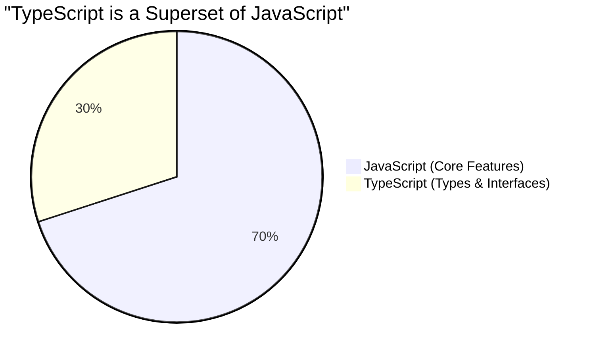

## 🤔 អ្វីទៅជា TypeScript?

**TypeScript (TS)** គឺជាភាសាសរសេរកម្មវិធីមួយ ដែលត្រូវបានបង្កើតឡើងដោយក្រុមហ៊ុន **Microsoft**។ 
គេហៅវាថាជា **"Superset របស់ JavaScript"**។ 

ពាក្យថា Superset មានន័យថា TypeScript គឺជា JavaScript ប៉ុន្តែវាមាន **"ថាមពលបន្ថែម"** ពីលើ! 
កូដ JavaScript ទាំងអស់របស់អ្នក គឺជាកូដ TypeScript ដ៏ត្រឹមត្រូវមួយ គ្រាន់តែ TypeScript អនុញ្ញាតអោយអ្នកកំណត់ **ប្រភេទ (Types)** អោយអថេររបស់អ្នកបាន។



---

## ❌ បញ្ហារបស់ JavaScript

សាកស្រមៃមើលថា អ្នកកំពុងសរសេរកម្មវិធីធំមួយដោយប្រើប្រាស់ JavaScript ធម្មតា៖

```js
function calculateTotal(price, tax) {
  return price + tax;
}

// ថ្ងៃមួយអ្នកភ្លេចខ្លួន អ្នកបញ្ចូលអក្សរជំនួសអោយលេខ
let myTotal = calculateTotal(100, "5");

console.log(myTotal); // លទ្ធផល: "1005" (ខុសស្រឡះ!)
```

JavaScript មិនលោតកំហុសប្រាប់អ្នកទេ! វាគ្រាន់តែបន្តដំណើរការទាំងខុសបែបនេះ។ ប្រសិនបើកូដនេះនៅលើកម្មវិធីធនាគារ នោះអ្នកនឹងមានបញ្ហាធំហើយ។ កំហុសបែបនេះច្រើនតែរត់ទៅដល់ដៃអតិថិជនពិតប្រាកដទើបយើងដឹង!

---

## ✨ ដំណោះស្រាយរបស់ TypeScript

TypeScript ដោះស្រាយបញ្ហានេះដោយបន្ថែម **Types (ប្រភេទ)**។

```ts
// យើងកំណត់យ៉ាងច្បាស់ថា price និង tax ត្រូវតែជា "លេខ" តែប៉ុណ្ណោះ!
function calculateTotal(price: number, tax: number) {
  return price + tax;
}

// បើអ្នកវាយបែបនេះ TypeScript នឹងគូសបន្ទាត់ក្រហមពីក្រោម "5" ភ្លាមៗ (Error)!
let myTotal = calculateTotal(100, "5"); 
```

**អត្ថប្រយោជន៍ ៣ យ៉ាងរបស់ TypeScript:**

1. **ចាប់កំហុសបានទាន់ពេលវេលា (Catch Errors Early):** វាចាប់កំហុសរបស់អ្នកភ្លាមៗនៅពេលអ្នកកំពុងសរសេរ (នៅក្នុង VS Code) មុនពេលអ្នកសាកល្បង Run កម្មវិធីទៅទៀត។
2. **ជំនួយការវាយកូដ (Intelligent Autocomplete):** ដោយសារ VS Code ដឹងច្បាស់ថាទិន្នន័យរបស់អ្នកមានរូបរាងបែបណា វានឹងលោតពាក្យអោយអ្នករើស (Suggest) បានយ៉ាងត្រឹមត្រូវ និងលឿន។ អ្នកលែងសូវវាយអក្ខរាវិរុទ្ធខុសទៀតហើយ។
3. **ការកែប្រែកូដចាស់ៗ (Safe Refactoring):** បើអ្នកចង់កែឈ្មោះអនុគមន៍ ឬអថេរណាមួយនៅក្នុងគម្រោងធំ TypeScript នឹងជួយបង្ហាញប្រាប់អ្នកគ្រប់កន្លែងដែលរងផលប៉ះពាល់ ធ្វើអោយអ្នកក្លាហានក្នុងការកែកូដ!

> 💡 **ចំណាំ:** Browser ដូចជា Chrome មិនស្គាល់ TypeScript ទេ! កូដ TypeScript របស់អ្នកត្រូវតែត្រូវបានបម្លែង (Compile) ទៅជាកូដ JavaScript សុទ្ធសិនទើបអាចដំណើរការបាន។ យើងនឹងរៀនពីរឿងនេះនៅមេរៀនបន្ទាប់។
