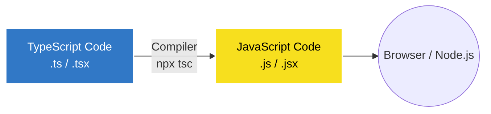

## ⚙️ ការដំឡើង TypeScript

ដោយសារ TypeScript មិនមែនជាភាសាដើមរបស់ Browser យើងត្រូវតែដំឡើងកម្មវិធីបកប្រែ (Compiler) របស់វា ដើម្បីអាចបម្លែងកូដ `.ts` ទៅជា `.js`។ យើងអាចដំឡើងវាបានតាមរយៈ `npm` (ត្រូវប្រាកដថាអ្នកបានដំឡើង Node.js រួចរាល់)។


បើក Terminal ហើយវាយពាក្យបញ្ជាខាងក្រោម ដើម្បីដំឡើង TypeScript ជាលក្ខណៈមូលដ្ឋាន (Local Dev Dependency) នៅក្នុងថតគម្រោងរបស់អ្នក។ ការដំឡើងបែបនេះត្រូវបានណែនាំជាងការដំឡើងជាសកល (Global)៖

```bash
npm install -D typescript
```

ដើម្បីផ្ទៀងផ្ទាត់ថាអ្នកបានដំឡើងវាដោយជោគជ័យ សូមវាយ៖
```bash
npx tsc -v
```
*(វានឹងបង្ហាញលេខ Version របស់ TypeScript ឧទាហរណ៍ `Version 5.x.x`)*

> 💡 **ចំណាំ:** នៅក្នុងគម្រោងចាស់ៗ គេច្រើនតែដំឡើង TypeScript ជាសកលដោយប្រើ `npm install -g typescript` ប៉ុន្តែបច្ចុប្បន្ន ការប្រើប្រាស់ Local Installation ជាមួយ `npx` គឺមានសុវត្ថិភាពជាង ព្រោះគម្រោងនីមួយៗអាចប្រើ TypeScript ជំនាន់ (Version) ផ្សេងៗគ្នាបាន។

---

## 🛠️ ការបម្លែងកូដ (Compile)

ឥឡូវនេះយើងសាកល្បងសរសេរកូដ TypeScript ទីមួយរបស់យើង! បង្កើតឯកសារមួយឈ្មោះថា `hello.ts` រួចសរសេរកូដខាងក្រោម៖

```ts
// ឯកសារ: hello.ts
const greeting: string = "សួស្តី TypeScript!";
console.log(greeting);
```

តើយើងរត់ (Run) កូដនេះយ៉ាងដូចម្តេច?
ដូចដែលបានបញ្ជាក់ពីមុន យើងមិនអាច Run កូដ `.ts` ដោយផ្ទាល់បានទេ។ យើងត្រូវប្រាប់អោយកម្មវិធីបកប្រែ TypeScript (TSC) បម្លែងវាទៅជា `.js` សិន។

បើក Terminal ក្នុងថត (Folder) តែមួយនោះ រួចវាយ (យើងប្រើ `npx` ពីមុខព្រោះយើងបានដំឡើងវាជាលក្ខណៈ Local)៖
```bash
npx tsc hello.ts
```

ភ្លាមៗនោះ អ្នកនឹងឃើញឯកសារថ្មីមួយទៀតបានលេចឡើងដោយស្វ័យប្រវត្តិឈ្មោះថា **`hello.js`**!
បើអ្នកបើកមើល `hello.js` អ្នកនឹងឃើញកូដបែបនេះ៖

```js
// ឯកសារ: hello.js
var greeting = "សួស្តី TypeScript!";
console.log(greeting);
```

ឃើញទេ? ពាក្យ `: string` ត្រូវបានលុបចេញបាត់ហើយ! នេះមានន័យថាកូដរបស់អ្នកឥឡូវនេះជាកូដ JavaScript សុទ្ធ ដែលអាចដំណើរការបានគ្រប់ទីកន្លែង!

ចុងក្រោយ យើងគ្រាន់តែ Run កូដ JavaScript នោះដោយប្រើ Node.js ធម្មតា៖
```bash
node hello.js
```
*(លទ្ធផលនឹងចេញមក: `សួស្តី TypeScript!`)*

> 💡 **គន្លឹះពិសេស:** អ្នកអាចប្រាប់អោយ TypeScript អង្គុយចាំមើលកូដរបស់អ្នក ហើយបម្លែងដោយស្វ័យប្រវត្តិរាល់ពេលដែលអ្នកចុច Save ដោយបន្ថែម `-w` (Watch mode):
> `npx tsc hello.ts -w`
