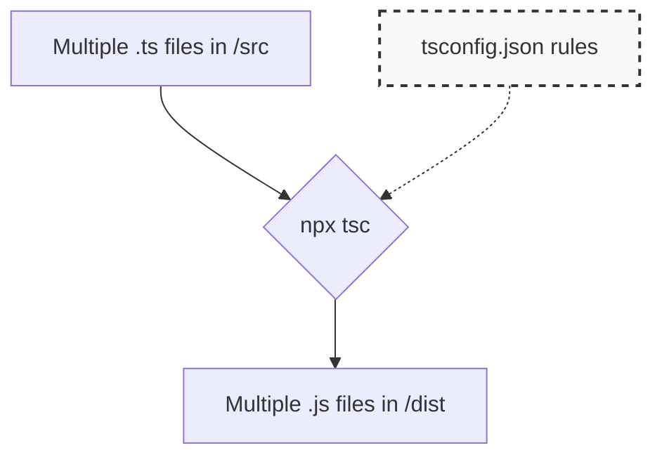

## 📄 អ្វីទៅជា tsconfig.json?

នៅក្នុងគម្រោងពិតប្រាកដ អ្នកមិនសរសេរកូដត្រឹមតែមួយឯកសារនោះទេ អ្នកប្រហែលជាមានឯកសារ `.ts` រាប់សិប។ ការវាយបញ្ជា `npx tsc file1.ts`, `npx tsc file2.ts` គ្រប់ឯកសារគឺមិនអាចទៅរួចទេ។

ដើម្បីអោយ TypeScript ដឹងពីរបៀបបម្លែងកូដ "ទាំងមូល" ក្នុងគម្រោងរបស់អ្នកដោយគ្រាន់តែវាយពាក្យថា `npx tsc` មួយម៉ាត់ នោះអ្នកត្រូវមានឯកសារកំណត់រចនាសម្ព័ន្ធមួយឈ្មោះថា **`tsconfig.json`**។



ដើម្បីបង្កើតឯកសារនេះ សូមវាយពាក្យបញ្ជាខាងក្រោមនៅក្នុង Folder គម្រោងរបស់អ្នក៖
```bash
npx tsc --init
```
វានឹងបង្កើតឯកសារ `tsconfig.json` មួយដែលមានផ្ទុកនូវការកំណត់រាប់រយ! ប៉ុន្តែកុំបារម្ភ យើងនឹងផ្តោតតែលើចំណុចសំខាន់ៗប៉ុណ្ណោះ។

---

## 🔧 ការកំណត់សំខាន់ៗដែលត្រូវដឹង

នៅពេលអ្នកបើកឯកសារ `tsconfig.json` អ្នកនឹងឃើញកូដបែបនេះ (ចំណុចខ្លះត្រូវបានបិទដោយ `//`):

```json
{
  "compilerOptions": {
    /* 1. Language and Environment */
    "target": "ES2022", // ប្រាប់អោយ TS បម្លែងកូដទៅជា JS ជំនាន់ណា (ឧ. ES2022 ជំនួសអោយ ES2016)
    
    /* 2. Modules */
    "module": "ESNext", // កំណត់ប្រភេទ Module System (ឧ. ESNext សម្រាប់ Import/Export ថ្មីៗ)
    "moduleResolution": "node", // របៀបដែល TS ស្វែងរកឯកសារពេលអ្នកប្រើពាក្យបញ្ជា import
    "rootDir": "./src", // ប្រាប់ថា Folder មួយណាដែលមានផ្ទុកកូដ .ts ដើមរបស់អ្នក
    
    /* 3. Emit */
    "outDir": "./dist", // ប្រាប់ថាពេលបម្លែងកូដជា .js រួច ត្រូវយកវាទៅទុកនៅ Folder ណា (ដើម្បីកុំអោយរញ៉េរញ៉ៃ)
    
    /* 4. Type Checking */
    "strict": true, // សំខាន់បំផុត! បើកច្បាប់វិន័យតឹងរ៉ឹងអោយ TS ចាប់កំហុសអោយបានច្រើនបំផុត។ គួរតែបើកជានិច្ច!
    "noImplicitAny": true, // មិនអនុញ្ញាតអោយមានអថេរដែលអត់ប្រាប់ Type (ត្រូវតែប្រាប់អោយច្បាស់)
    
    /* 5. Interop Constraints */
    "esModuleInterop": true, // ជួយសម្រួលការ Import Library ចាស់ៗ (CommonJS) មកប្រើក្នុងកូដថ្មី
    "skipLibCheck": true // រំលងការពិនិត្យ Types នៅក្នុង folder node_modules ដើម្បីអោយ Compile លឿន
  }
}
```

បន្ទាប់ពីអ្នកបានកែប្រែ (Uncomment) ឯកសារ `tsconfig.json` ដូចខាងលើរួចរាល់ហើយ របៀបធ្វើការរបស់អ្នកនឹងផ្លាស់ប្តូរទៅជាបែបនេះ៖

1. អ្នកដាក់កូដ `.ts` ទាំងអស់នៅក្នុងថត `src/`។
2. អ្នកបើក Terminal រួចវាយពាក្យថា៖
   ```bash
   npx tsc -w
   ```
3. នោះ TypeScript នឹងអានការកំណត់ក្នុង `tsconfig.json` រួចចាប់ផ្តើមបម្លែងកូដទាំងអស់ក្នុង `src/` យកទៅដាក់ក្នុងថត `dist/` ដោយស្វ័យប្រវត្តិ! 

> **ចំណាំ:** នៅក្នុងគម្រោងសម័យថ្មីដូចជា **Next.js** ឬ **Vite** ឯកសារ `tsconfig.json` នេះនឹងត្រូវបានបង្កើត និងរៀបចំអោយអ្នកដោយស្វ័យប្រវត្តិ តាំងពីពេលអ្នកបង្កើតគម្រោងដំបូងម្ល៉េះ។ ដូច្នេះអ្នកកម្រនឹងត្រូវកែវាដោយផ្ទាល់ណាស់ តែវាមានសារៈសំខាន់ដែលអ្នកត្រូវយល់ពីរបៀបដែលវាដំណើរការ។
