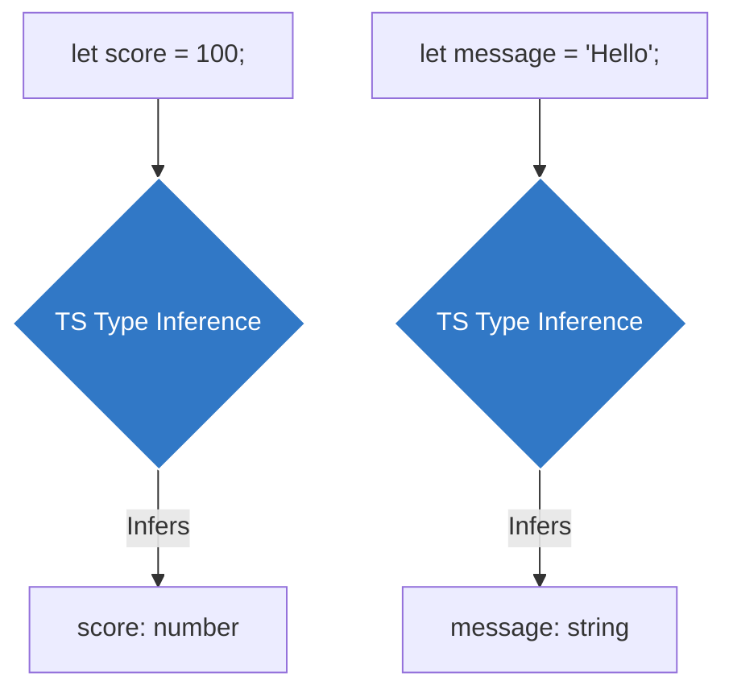

## 🧠 ភាពឆ្លាតវៃរបស់ TypeScript (Type Inference)

នៅពេលអ្នកទើបតែរៀន TypeScript ដំបូង អ្នកប្រហែលជាគិតថាវាពិបាក ព្រោះអ្នកត្រូវអង្គុយសរសេរប្រាប់ប្រភេទអថេរ (`: string`, `: number`) គ្រប់ទីកន្លែងទាំងអស់។

ប៉ុន្តែការពិតទៅ TypeScript ឆ្លាតជាងអ្វីដែលអ្នកគិត! វាមានសមត្ថភាពមួយហៅថា **Type Inference (ការទាញសេចក្តីសន្និដ្ឋាន)** ដែលមានន័យថាវាអាចមើលតម្លៃដែលអ្នកបញ្ចូល ហើយស្មានដឹងភ្លាមថាវាជាប្រភេទអ្វី ដោយអ្នកមិនបាច់ប្រាប់វាសូម្បីតែមួយម៉ាត់!


### ឧទាហរណ៍ទី ១៖ អថេរទូទៅ

```ts
// អ្នកមិនបាច់សរសេរ `: string` នោះទេ
let myName = "Ratha"; 

// ពេលក្រោយ បើអ្នកព្យាយាមប្តូរវាទៅជាលេខ TypeScript នឹងចាប់កំហុសភ្លាម!
myName = 100; // ❌ Error: Type 'number' is not assignable to type 'string'.
```

ក្នុងឧទាហរណ៍ខាងលើ TypeScript បានឃើញពាក្យ `"Ratha"` ដូច្នេះវាបានទាញសេចក្តីសន្និដ្ឋាន (Infer) ថា `myName` គឺត្រូវតែជាប្រភេទអក្សរជានិច្ច។

### ឧទាហរណ៍ទី ២៖ អនុគមន៍ (Functions)

វាក៏អាចស្មានដឹងពីលទ្ធផល (Return type) របស់អនុគមន៍បានផងដែរ៖

```ts
// វាដឹងច្បាស់ថា បើលេខបូកលេខ លទ្ធផលប្រាកដជាចេញមក "លេខ" (number)
function add(a: number, b: number) {
  return a + b;
}

// ដូច្នេះ `total` ត្រូវបានវាយតម្លៃថាជា number ដោយស្វ័យប្រវត្តិ
const total = add(10, 5); 
```

---

## 🤷‍♂️ ពេលណាដែលយើងត្រូវសរសេរ Type បញ្ជាក់?

ប្រសិនបើ TypeScript ឆ្លាតម្លឹងៗ ហេតុអ្វីបានជាយើងនៅតែត្រូវរៀនពីការសរសេរ Types?
ចម្លើយគឺ យើងត្រូវសរសេរ Types បញ្ជាក់នៅពេលដែល៖

**1. អ្នកមិនទាន់អោយតម្លៃវាភ្លាមៗទេ:**
```ts
// ❌ ខុសហើយ! TS មិនដឹងថាអ្នកចង់អោយវាជាអ្វីទេ ដូច្នេះវាចាត់ទុកជា 'any' (អីក៏បាន)
let score; 
score = 100;
score = "Hello";

// ✅ ត្រូវ! បើមិនទាន់អោយតម្លៃ អ្នកត្រូវប្រាប់វាអោយច្បាស់
let correctScore: number; 
correctScore = 100;
// correctScore = "Hello"; // Error! 
```

**2. ប៉ារ៉ាម៉ែត្ររបស់អនុគមន៍ (Function Parameters):**
ដូចដែលអ្នកបានឃើញខាងលើ ទោះបីជា TS អាចស្មានដឹងពី Return Type ក៏ដោយ ប៉ុន្តែសម្រាប់ Parameters អ្នក **ដាច់ខាត** ត្រូវតែប្រាប់វា ព្រោះវាគ្មានតម្លៃដំបូងសម្រាប់អោយវាស្មាននោះទេ!
```ts
// ត្រូវតែប្រាប់ថា `message` ជាអ្វី
function printMessage(message: string) {
  console.log(message.toUpperCase());
}
```

> **សេចក្តីសន្និដ្ឋាន:** ដើម្បីសរសេរកូដអោយបានស្អាត កុំព្យាយាមសរសេរ Types ប្រាប់វាគ្រប់កន្លែងពេកអី (កូដមើលទៅរញ៉េរញ៉ៃណាស់)។ ចូរទុកអោយ Type Inference ធ្វើការងាររបស់វាចុះ លើកលែងតែកន្លែងដែលវាស្មានមិនដឹង!
