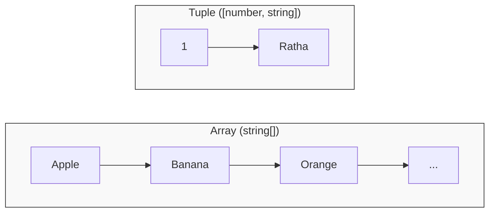

## 📚 Arrays (បញ្ជី)



ដើម្បីបង្កើតបញ្ជីមួយដែលមានផ្ទុកតែ "អក្សរ" ឬ "លេខ" សុទ្ធ យើងអាចសរសេរ Type របស់វាដោយបន្ថែមសញ្ញា `[]` នៅពីក្រោយប្រភេទ។

```ts
// បញ្ជីនេះអាចផ្ទុកបានតែ 'អក្សរ' ប៉ុណ្ណោះ
let fruits: string[] = ["Apple", "Banana", "Orange"];

// បញ្ជីនេះអាចផ្ទុកបានតែ 'លេខ' ប៉ុណ្ណោះ
let scores: number[] = [100, 95, 80];

// បើអ្នកព្យាយាមដាក់ 'លេខ' ចូលទៅក្នុងបញ្ជីអក្សរ វានឹងលោត Error
// fruits.push(5); // Error!
```

> 💡 **ចំណាំ:** យើងក៏អាចសរសេរក្នុងទម្រង់មួយទៀតហៅថា Generic Array ផងដែរ ឧទាហរណ៍ `Array<string>` ដែលវាមានអត្ថន័យដូចគ្នាទៅនឹង `string[]` បេះបិទ។ ប៉ុន្តែការប្រើ `[]` គឺពេញនិយមជាងព្រោះវាខ្លី។

---

## 👯‍♂️ Tuples (បញ្ជីចងក្រង)

ចុះប្រសិនបើយើងចង់បានបញ្ជីមួយដែលអាចផ្ទុកទាំង **អក្សរផង និង លេខផង** ប៉ុន្តែត្រូវមានលំដាប់លំដោយច្បាស់លាស់?
ឧទាហរណ៍៖ ទិន្នន័យអំពីបុគ្គលិកដែលមានទម្រង់ `[លេខរៀង, ឈ្មោះ]`។

នៅទីនេះហើយដែល **Tuple** ចូលមកជួយអ្នក! 
Tuple គឺជា Array ពិសេសមួយរបស់ TypeScript ដែលអនុញ្ញាតអោយអ្នកកំណត់ **"ប្រវែង"** និង **"ប្រភេទជាក់លាក់នៅតាមតំណែងនីមួយៗ"**។

```ts
// កំណត់ថា Tuple នេះមានប្រវែង ២
// តំណែងទី 1 ត្រូវតែជា លេខ, តំណែងទី 2 ត្រូវតែជា អក្សរ
let employee: [number, string] = [1, "Ratha"];

// ❌ Error! ដោយសារតែដាក់ខុសតំណែង (អក្សរមុន លេខក្រោយ)
// let wrongEmployee: [number, string] = ["Ratha", 1];

// ❌ Error! ដោយសារតែប្រវែងរបស់វាលើសពី ២
// let extraEmployee: [number, string] = [1, "Ratha", "Developer"];
```

### ពេលណាត្រូវប្រើ Tuples?
Tuples កម្រត្រូវបានប្រើប្រាស់ណាស់បើប្រៀបធៀបជាមួយ Objects។ ប៉ុន្តែវាមានប្រយោជន៍ខ្លាំងបំផុតនៅពេលសរសេរ **React Hooks**! 
ឧទាហរណ៍នៅពេលអ្នកប្រើ `useState` វាប្រគល់តម្លៃត្រលប់មកវិញជាទម្រង់ Tuple ដែលមានតម្លៃទី១ ជា State និងទី២ ជាអនុគមន៍សម្រាប់ប្តូរ State:
`const [name, setName] = useState("Ratha");`

---

## 🔒 Readonly Arrays (បញ្ជីមិនអាចកែប្រែបាន)

ពេលខ្លះអ្នកចង់ការពារបញ្ជីរបស់អ្នកមិនអោយនរណាម្នាក់អាច `push`, `pop`, ឬផ្លាស់ប្តូរតម្លៃរបស់វាបានឡើយ។ អ្នកអាចប្រើប្រាស់ `readonly` modifier ពីមុខប្រភេទ Array ឬ Tuple បាន។

```ts
// មិនអាចបន្ថែម ឬដកទិន្នន័យបានទេ
const colors: readonly string[] = ["Red", "Green", "Blue"];

// colors.push("Yellow"); // ❌ Error! Property 'push' does not exist on type 'readonly string[]'
// colors[0] = "Black";   // ❌ Error! Index signature in type 'readonly string[]' only permits reading.

// សម្រាប់ Tuples ក៏ដូចគ្នា
const point: readonly [number, number] = [10, 20];
```
