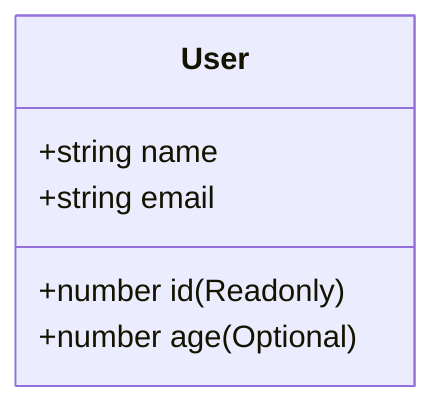

## 📦 Object Types (ប្រភេទវត្ថុ)

នៅក្នុង JavaScript, Object គឺជាវិធីទូទៅបំផុតសម្រាប់ប្រមូលផ្តុំទិន្នន័យដែលទាក់ទងគ្នា។ នៅក្នុង TypeScript យើងត្រូវពិពណ៌នាពីរូបរាង (Shape) របស់ Object នោះអោយបានច្បាស់លាស់។



ដើម្បីបង្កើត Type សម្រាប់ Object យើងប្រើរចនាសម្ព័ន្ធស្រដៀងទៅនឹងការបង្កើត Object ធម្មតាដែរ គ្រាន់តែជំនួសតម្លៃដោយ **ឈ្មោះប្រភេទ (Type)**។

```ts
let user: { id: number; name: string; email: string } = {
  id: 1,
  name: "Ratha",
  email: "ratha@example.com"
};

// ❌ Error! ព្រោះ Object នេះខ្វះ `email`
// let invalidUser: { id: number; name: string; email: string } = {
//   id: 2,
//   name: "Dara"
// };
```

---

## 🏗️ Nested Objects (Object ត្រួតគ្នា)

Object អាចមាន Object តូចៗផ្សេងទៀតនៅខាងក្នុងវា។ អ្នកអាចសរសេរ Type បញ្ជាក់ទៅតាមឋានានុក្រមរបស់វា៖

```ts
let product: {
  id: string;
  price: number;
  details: {
    title: string;
    description: string;
  }
} = {
  id: "p1",
  price: 29.99,
  details: {
    title: "Mouse",
    description: "Wireless mouse"
  }
};
```

---

## ❓ Optional Properties (ទិន្នន័យអាចមានឫមិនមាន)

ពេលខ្លះ ទិន្នន័យមួយចំនួនក្នុង Object គឺមិនចាំបាច់មានជានិច្ចនោះទេ (ឧទាហរណ៍៖ លេខទូរស័ព្ទ)។ ដើម្បីប្រាប់ TypeScript ថាទិន្នន័យនេះ "អាចមានឫមិនមាន" (Optional) អ្នកគ្រាន់តែបន្ថែមសញ្ញា `?` នៅពីក្រោយឈ្មោះវា។

```ts
let customer: { 
  name: string; 
  phone?: string; // អាចមានឫមិនមានក៏បាន
} = {
  name: "Sok" // ត្រឹមត្រូវ ទោះបីអត់មាន phone ក៏ដោយ
};

console.log(customer.phone); // undefined
```

---

## 🔒 Readonly Properties (ទិន្នន័យហាមកែប្រែ)

បើសិនជាអ្នកមានទិន្នន័យមួយដែលអ្នកចង់អោយវានៅថេរជានិច្ចបន្ទាប់ពីបានបង្កើតរួច (ឧទាហរណ៍៖ លេខកូដសម្គាល់ `id`) អ្នកអាចប្រើពាក្យ `readonly` នៅពីមុខវាបាន។

```ts
let employee: {
  readonly id: number;
  name: string;
} = {
  id: 101,
  name: "Bopha"
};

employee.name = "Bopha Thmey"; // ✅ កែឈ្មោះបាន
// employee.id = 102; // ❌ Error! មិនអាចកែប្រែ Readonly property បានទេ!
```

---

## 🚫 Excess Property Checking (ការចាប់កំហុសទិន្នន័យលើស)

មានលក្ខណៈពិសេសមួយរបស់ TypeScript គឺវាមានភាពតឹងរ៉ឹងខ្លាំងនៅពេលអ្នកបង្កើត Object ភ្លាមៗ (Object Literals)។ វានឹងមិនអនុញ្ញាតអោយអ្នកបញ្ជូលទិន្នន័យ "លើស" ពីអ្វីដែលបានកំណត់ក្នុង Type ឡើយ!

```ts
let book: { title: string; price: number } = {
  title: "TypeScript Guide",
  price: 15,
  // ❌ Error! 'author' មិនមាននៅក្នុង Type ដែលបានប្រកាសនោះទេ
  // author: "Ratha" 
};
```

កំហុសនេះជួយការពារយើងកុំអោយវាយអក្ខរាវិរុទ្ធខុស ដូចជាអ្នកចង់សរសេរ `colour` តែវាយខុសជា `color` នោះ TypeScript នឹងប្រាប់អ្នកភ្លាមៗ!
