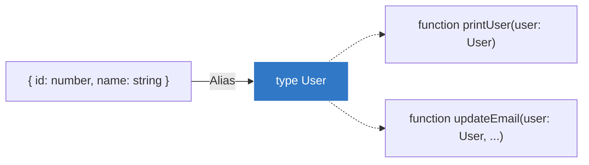

## 🏷️ អ្វីទៅជា Type Aliases?

**Type Alias** គឺគ្រាន់តែជាការបង្កើត **"ឈ្មោះហៅក្រៅ"** ផ្ទាល់ខ្លួនរបស់អ្នក សម្រាប់ប្រភេទទិន្នន័យណាមួយ ដើម្បីកុំអោយអ្នកសរសេរវាដដែលៗ។



ស្រមៃមើលថាអ្នកមាន Function មួយដែលទទួលទិន្នន័យអ្នកប្រើប្រាស់ (User) ដែលមានលក្ខណៈស្មុគស្មាញ៖

```ts
// ❌ របៀបដែលពិបាកអាន (Inline Type)
function printUser(user: { id: number, name: string, email: string }) {
  console.log(user.name);
}

// ចុះបើអ្នកមាន Function មួយទៀតដែលត្រូវការ User ដូចគ្នា? អ្នកត្រូវចម្លងវាម្តងទៀត?
function updateEmail(user: { id: number, name: string, email: string }, newEmail: string) {
  // ...
}
```

ការសរសេរបែបនេះគឺហត់ និងកខ្វក់ណាស់។ ដំណោះស្រាយគឺការប្រើប្រាស់ពាក្យគន្លឹះ **`type`**!

---

## 1. ការបង្កើត Type សម្រាប់ Object

យើងអាចប្រមូលរូបរាងនៃ Object នោះមកផ្តុំគ្នា រួចដាក់ឈ្មោះអោយវា (ត្រូវចាំថាឈ្មោះ Type គួរតែផ្តើមដោយអក្សរធំជានិច្ច ឧ. `User`)។

```ts
// ✅ របៀបដែលស្អាត (ប្រើ Type Alias)
type User = {
  id: number;
  name: string;
  email: string;
};

// ឥឡូវនេះយើងគ្រាន់តែហៅឈ្មោះវាមកប្រើប៉ុណ្ណោះ!
function printUser(user: User) {
  console.log(user.name);
}

function updateEmail(user: User, newEmail: string) {
  // ...
}
```

ប្រសិនបើថ្ងៃក្រោយអ្នកចង់បន្ថែម `phone: string` ទៅអោយ User នោះអ្នកគ្រាន់តែកែតែមួយកន្លែង (នៅក្នុង Type User) នោះ Function ទាំងអស់នឹងស្គាល់ការផ្លាស់ប្តូរនេះដោយស្វ័យប្រវត្តិ! នេះហៅថា Reusability។

---

## 2. ការប្រើប្រាស់ Type ជា Union

Type Alias មិនមែនប្រើសម្រាប់តែ Object នោះទេ វាអាចប្រើសម្រាប់តំណាងអោយការបូកបញ្ចូលគ្នា (Union) ក៏បាន។

```ts
// យើងបង្កើតឈ្មោះ ID ដែលវាអាចជា លេខ ក៏បាន អក្សរ ក៏បាន
type ID = number | string;

function getUserInfo(id: ID) {
  // ...
}

getUserInfo(123);    // ត្រូវ ✅
getUserInfo("ABC");  // ត្រូវ ✅
// getUserInfo(true); // ខុស ❌
```

> 💡 **ចំណាំ:** នៅក្នុងមេរៀនក្រោយៗ យើងនឹងរៀនពី `interface` ដែលវាមានតួនាទីស្រដៀងគ្នាបេះបិទទៅនឹង `type` សម្រាប់បង្កើតរូបរាងអោយ Object។ អ្នកសរសេរកូដខ្លះចូលចិត្ត `type` ខ្លះចូលចិត្ត `interface` ប៉ុន្តែនៅក្នុងសម័យថ្មីនេះ គេនិយមប្រើ `type` ច្រើនជាងព្រោះវាអាចធ្វើការជាមួយ Union បាន (ដូចជា Type `ID` ខាងលើ)។
