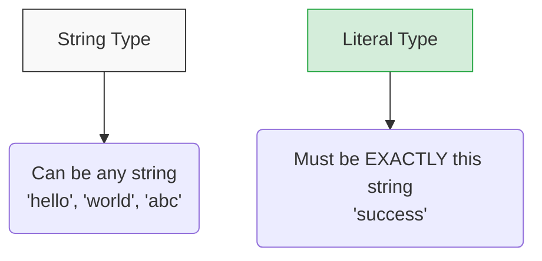

## 🎯 អ្វីទៅជា Literal Types?

នៅក្នុង TypeScript អ្នកមិនត្រឹមតែអាចប្រាប់ថាអថេរមួយជា `string` ឫ `number` ប៉ុណ្ណោះទេ តែអ្នកថែមទាំងអាច **កំណត់តម្លៃជាក់លាក់ណាមួយ** ធ្វើជា Type តែម្តង! នេះហៅថា **Literal Type**។



```ts
// ពេលអ្នកប្រាប់ថាវាជា 'Ratha' វាមិនអាចក្លាយជាអក្សរផ្សេងបានទៀតទេ!
let myName: "Ratha";

myName = "Ratha"; // ✅ ត្រឹមត្រូវ
// myName = "Dara"; // ❌ Error! Type '"Dara"' is not assignable to type '"Ratha"'
```

មើលមួយភ្លែត វាហាក់ដូចជាគ្មានប្រយោជន៍សោះ ព្រោះវាប្រៀបដូចជាការប្រើប្រាស់ `const` អញ្ចឹង។ ប៉ុន្តែថាមពលពិតប្រាកដរបស់ Literal Types គឺនៅពេលដែលអ្នក **ផ្សំវាជាមួយ Union Types (`|`)**!

---

## 🚦 ការបង្កើតជម្រើសជាក់លាក់ (Union of Literals)

ជារឿយៗ នៅក្នុងកម្មវិធីរបស់អ្នក (ជាពិសេស Frontend), អថេរមួយចំនួនគួរតែមានតម្លៃត្រឹមតែប៉ុន្មានជម្រើសប៉ុណ្ណោះ។ 
ឧទាហរណ៍៖ ទំហំប៊ូតុង, ស្ថានភាពការទាញយកទិន្នន័យ ឫ ទីតាំងនៃធាតុណាមួយ។

```ts
// status មិនមែនជា string ទូទៅទេ គឺត្រូវតែជាពាក្យ ៣ នេះប៉ុណ្ណោះ
type Status = "pending" | "success" | "failed";

let currentStatus: Status = "pending";

currentStatus = "success"; // ✅ ត្រឹមត្រូវ
// currentStatus = "loading"; // ❌ Error! 'loading' is not assignable to type 'Status'
```

អត្ថប្រយោជន៍ដ៏ធំមួយទៀតនោះគឺ **Autocomplete**។ នៅពេលអ្នកវាយពាក្យ `currentStatus = "` នៅក្នុង VS Code, វានឹងលោតពាក្យទាំង ៣ នោះមកអោយអ្នកជ្រើសរើសភ្លាមៗ! អ្នកលែងភ័យរឿងវាយអក្ខរាវិរុទ្ធខុស (Typo) ទៀតហើយ។

### ឧទាហរណ៍ជាមួយលេខ (Number Literals)

អ្នកក៏អាចធ្វើបែបនេះជាមួយលេខបានដែរ៖

```ts
// ឧទាហរណ៍៖ ការវាយតម្លៃពី ១ ដល់ ៥ ផ្កាយ
type Rating = 1 | 2 | 3 | 4 | 5;

let myRating: Rating = 4;
// myRating = 6; // ❌ Error!
```

---

## ⚛️ ហេតុអ្វីវាសំខាន់សម្រាប់ React/Next.js?

នៅពេលអ្នកបង្កើត UI Components (ឧទាហរណ៍ `Button`), Literal Types គឺជាវិធីដ៏ល្អបំផុតក្នុងការកំណត់ Props របស់វា។

```tsx
// ឧទាហរណ៍ក្នុង React
type ButtonProps = {
  size: "small" | "medium" | "large";
  variant: "primary" | "secondary" | "danger";
}

// ពេលអ្នកហៅ Button មកប្រើ VS Code នឹងបង្ខំអោយអ្នករើសទំហំ និងម៉ូតអោយបានត្រឹមត្រូវ។
```

សរុបមក Literal Types ជួយកាត់បន្ថយ Bug ដែលបណ្តាលមកពីការសរសេរពាក្យខុស និងជួយអោយការសរសេរកូដ (Developer Experience) មានភាពរលូន។
