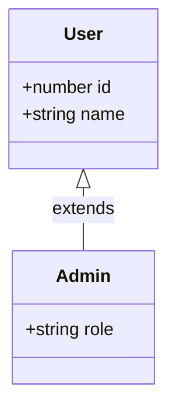

## 🏗️ អ្វីទៅជា Interfaces?

នៅក្នុងមេរៀនមុនៗ អ្នកបានរៀនពីការប្រើប្រាស់ `type` ដើម្បីដាក់ឈ្មោះអោយរូបរាងរបស់ Object មួយ។ **Interface** គឺជាមធ្យោបាយមួយផ្សេងទៀត (មធ្យោបាយទី ២) ដែល TypeScript ផ្តល់អោយអ្នកសម្រាប់ធ្វើរឿង **ដូចគ្នា** នោះ។



```ts
// ប្រើប្រាស់ interface (មិនចាំបាច់មានសញ្ញា = ទេ)
interface User {
  id: number;
  name: string;
  email: string;
}

const myUser: User = {
  id: 1,
  name: "Ratha",
  email: "ratha@example.com"
};
```

ដូចដែលអ្នកឃើញ, ការប្រើប្រាស់ `interface` គឺវាមានរចនាសម្ព័ន្ធ (Syntax) ស្ទើរតែដូចគ្នាទៅនឹង `type` បេះបិទ! វាក៏គាំទ្រ `readonly` និង `?` (Optional) ដូចគ្នាផងដែរ។

---

## 🧬 ការពង្រីក (Extending Interfaces)

ចំណុចពិសេស និងមានអំណាចបំផុតរបស់ Interface គឺសមត្ថភាពរបស់វាក្នុងការបន្តមរតក (Inherit) ពីគ្នាទៅវិញទៅមក តាមរយៈពាក្យគន្លឹះ **`extends`**។

ឧបមាថាអ្នកចង់បង្កើតប្រភេទ Admin មួយដែលមានលក្ខណៈសម្បត្តិដូច User ទាំងអស់ ហើយមានថែម `role` មួយទៀត៖

```ts
interface User {
  name: string;
  email: string;
}

// Admin នឹងទទួលបានទាំង name និង email ពី User ដោយស្វ័យប្រវត្តិ!
interface Admin extends User {
  role: string;
}

const myAdmin: Admin = {
  name: "Dara",
  email: "dara@test.com",
  role: "SuperAdmin"
};
```

វាមានដំណើរការស្រដៀងទៅនឹងការប្រើប្រាស់ `&` (Intersection) នៅក្នុង `type` ដែរ។

---

## ⚖️ Interface vs Type Alias

នេះគឺជាសំណួរដែលអ្នកសរសេរ TypeScript គ្រប់រូបតែងតែសួរ៖ *"តើខ្ញុំគួរប្រើមួយណា?"* 

បច្ចុប្បន្នភាពខុសគ្នារវាងវាទាំងពីរគឺតិចតួចមែនទែន។ អ្នកអាចប្រើប្រាស់មួយណាក៏បានសម្រាប់ Object ធម្មតា។ 

**ភាពខុសគ្នាសំខាន់ៗមានដូចជា៖**

1. **Union Types:** `interface` អាចតំណាងអោយតែ Object ប៉ុណ្ណោះ។ បើអ្នកចង់បង្កើត Union (ឧ. `string | number`) អ្នក **ត្រូវតែ** ប្រើ `type`។
   ```ts
   type ID = string | number; // ✅
   // interface ID = string | number; // ❌ មិនអាចធ្វើបានទេ
   ```
2. **Extending:** 
   - `interface` ប្រើ `extends` ដែលធ្វើអោយកូដងាយអាន និងដំណើរការលឿនជាងបន្តិច (Performance) ពេលអ្នកមាន Object ធំៗ។
   - `type` ប្រើ `&` ដើម្បីបូកបញ្ចូលគ្នា។
3. **Declaration Merging:** (នឹងរៀននៅ Module 3) 
   - បើអ្នកបង្កើត `interface` ដែលមានឈ្មោះដូចគ្នាពីរដង TypeScript នឹងបូកវាបញ្ចូលគ្នាជាតែមួយដោយស្វ័យប្រវត្តិ។
   - បើអ្នកធ្វើបែបនេះជាមួយ `type` វានឹងលោត Error!

> 💡 **ការណែនាំ:** ជាទូទៅ នៅក្នុងការអភិវឌ្ឍន៍កម្មវិធី React/Next.js គេនិយមប្រើប្រាស់ `type` សម្រាប់ Components Props (ព្រោះវាងាយស្រួល និងអាចប្រើជាមួយ Union បាន) ប៉ុន្តែសម្រាប់បណ្ណាល័យ (Libraries) ឫ APIs ធំៗ គេនិយមសរសេរវាជាទម្រង់ `interface`។ ជម្រើសដ៏ល្អបំផុតគឺ **"ជ្រើសរើសមួយណា ក៏ប្រើមួយហ្នឹងអោយជាប់"** នៅក្នុងគម្រោងរបស់អ្នកទាំងមូល។
