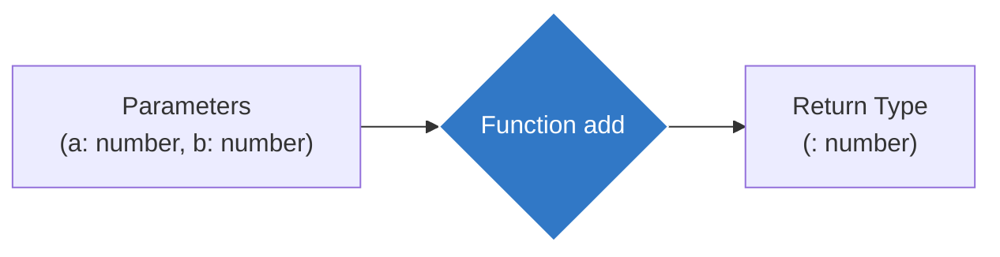

## ⚙️ ការកំណត់ Type ដល់ Function

នៅក្នុង TypeScript អ្នកអាចកំណត់ប្រភេទទិន្នន័យ (Types) ទាំង **ទិន្នន័យចូល (Parameters)** និង **ទិន្នន័យចេញ (Return Type)** របស់អនុគមន៍ (Function)។



### របៀបសរសេរ Function ធម្មតា

```ts
// a និង b ត្រូវតែជាលេខ, ហើយលទ្ធផល (Return) ក៏ត្រូវតែជាលេខដែរ
function add(a: number, b: number): number {
  return a + b;
}

let result = add(10, 20); 
// add("10", 20); // ❌ Error! ព្រោះ "10" ជាអក្សរ
```

### របៀបសរសេរ Arrow Function

ទម្រង់គឺដូចគ្នាគ្រាន់តែប្តូរទីតាំងបន្តិចបន្តួចប៉ុណ្ណោះ៖

```ts
const multiply = (x: number, y: number): number => {
  return x * y;
};
```

---

## ❓ Optional & Default Parameters

ពេលខ្លះ ប៉ារ៉ាម៉ែត្រខ្លះគឺ **មិនចាំបាច់មានក៏បាន** ឫ មាន **តម្លៃដើម (Default)** របស់វា។

### Optional Parameters (ប្រើសញ្ញា `?`)
ត្រូវចាំថា Optional Parameters ត្រូវតែនៅខាងចុងគេជានិច្ច។

```ts
function greet(firstName: string, lastName?: string) {
  if (lastName) {
    console.log(`Hello ${firstName} ${lastName}`);
  } else {
    console.log(`Hello ${firstName}`);
  }
}

greet("Sok"); // ✅ ត្រូវ
greet("Sok", "San"); // ✅ ក៏ត្រូវ
```

### Default Parameters (ការផ្តល់តម្លៃដើម)
ប្រសិនបើអ្នកផ្តល់តម្លៃដើមអោយវា (Default) អ្នកមិនចាំបាច់ប្រើសញ្ញា `?` ទេ ព្រោះ TypeScript នឹងដឹងដោយស្វ័យប្រវត្តិ (Infer)។

```ts
function greetWithDefault(name: string, greeting: string = "Hello") {
  console.log(`${greeting}, ${name}`);
}

greetWithDefault("Ratha"); // លទ្ធផល: Hello, Ratha
greetWithDefault("Ratha", "Hi"); // លទ្ធផល: Hi, Ratha
```

---

## 🎯 Function Types & Callbacks

ចុះប្រសិនបើអ្នកចង់បង្កើត Type Alias សម្រាប់ Function ទាំងមូល ដើម្បីអោយងាយស្រួលបញ្ជូនវាជា Parameter ទៅអោយ Function ផ្សេងទៀត (ហៅថា Callback)? 
អ្នកអាចប្រើសញ្ញាព្រួញ `=>` នៅក្នុង Type របស់វា។

```ts
// បង្កើត Type តំណាងអោយ Function ណាក៏ដោយ ដែលទទួលលេខ ២ និងបញ្ចេញលេខ ១ មកវិញ
type MathOperation = (a: number, b: number) => number;

// អថេរ add ត្រូវបានចងភ្ជាប់នឹង Type នេះ ដូច្នេះយើងមិនបាច់សរសេរ Types ខាងក្នុងវាម្តងទៀតទេ!
const myAdd: MathOperation = (x, y) => {
  return x + y;
};
```

**ការប្រើប្រាស់ជាមួយ Callbacks:**

```ts
// Function នេះទទួលយកអក្សរមួយ និង Function មួយទៀតជា Parameter
function processName(name: string, callback: (result: string) => void) {
  const upperName = name.toUpperCase();
  callback(upperName);
}

processName("ratha", (res) => {
  console.log(res); // លទ្ធផល: RATHA
});
```
*(ចំណាំ៖ ពាក្យ `void` មានន័យថា Function នោះមិនបញ្ចេញតម្លៃអ្វីមកវិញទេ ដែលយើងនឹងរៀនច្បាស់នៅមេរៀនបន្ទាប់)*
