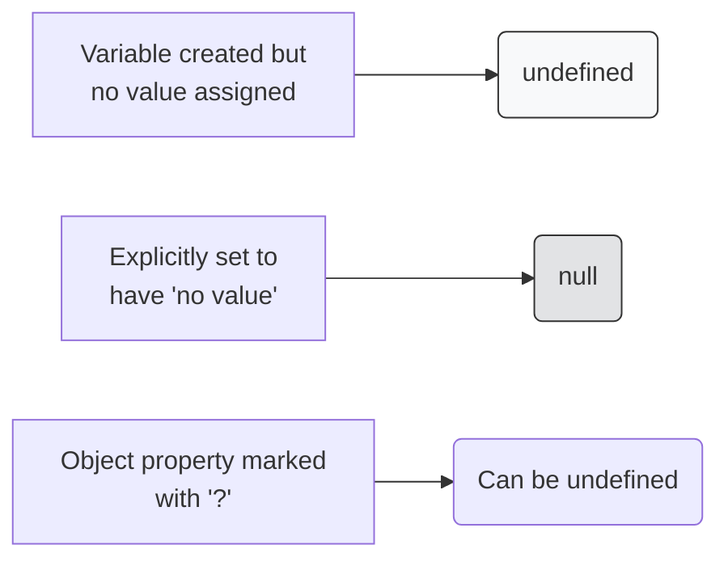

## 🤷‍♂️ អាថ៌កំបាំងនៃភាពទទេស្អាត

នៅក្នុង JavaScript និង TypeScript យើងមានពាក្យពិសេសចំនួន ២ សម្រាប់តំណាងអោយ "គ្មានអ្វីទាំងអស់" ឬ "ទទេស្អាត"។ ពួកវាគឺ `null` និង `undefined`។ តើពួកវាខុសគ្នាដូចម្តេច?



### 1. `undefined` (មិនទាន់បញ្ជាក់)
វាកើតឡើងដោយស្វ័យប្រវត្តិនៅពេលអ្នកបង្កើតអថេរមួយ ប៉ុន្តែមិនទាន់បានផ្តល់តម្លៃអោយវា។ វាដូចជាប្រអប់មួយដែលអ្នកបានទិញមក តែអ្នកមិនទាន់បានដាក់អ្វីចូលសូម្បីតែខ្យល់។
```ts
let userAge; 
console.log(userAge); // លទ្ធផល: undefined
```

### 2. `null` (គ្មានតម្លៃដោយចេតនា)
នេះគឺជាតម្លៃមួយដែលអ្នកសរសេរកូដ (Developer) កំណត់ដោយផ្ទាល់ដៃ ដើម្បីបញ្ជាក់យ៉ាងច្បាស់លាស់ថា "អថេរនេះគឺទទេ វាមិនមានផ្ទុកទិន្នន័យអ្វីឡើយ"។ 
```ts
let loggedInUser = null; // បញ្ជាក់ថានៅពេលនេះមិនទាន់មាននរណា Login ទេ
```

---

## ❓ Optional Properties (ទិន្នន័យអាចមានឫមិនមាន)

ជាញឹកញាប់ `undefined` កើតឡើងនៅពេលដែលយើងធ្វើការជាមួយ Object ដែលមាន Optional Properties។
នៅពេលអ្នកដាក់សញ្ញា `?` នៅពីក្រោយឈ្មោះ Property, TypeScript យល់ថាវាអាចជាប្រភេទដើមរបស់វា ឬអាចជា `undefined`។

```ts
type User = {
  name: string;
  email?: string; // ស្មើនឹង string | undefined
};

const user1: User = { name: "Ratha" };
console.log(user1.email); // លទ្ធផល: undefined
```

ការប្រើប្រាស់ `?` នេះគឺជាវិធីដែលស្របច្បាប់និងមានសុវត្ថិភាពបំផុតក្នុងការប្រាប់ថាទិន្នន័យនេះមិនចាំបាច់មានជានិច្ចនោះទេ។

---

## 🛡️ ការពារកំហុសជាមួយ `strictNullChecks`

កាលពីមុន (ឫនៅក្នុងកូដ JS) `null` និង `undefined` គឺជាប្រភពនៃកំហុសដ៏ធំបំផុតដែលធ្វើអោយកម្មវិធីគាំង (Crash) ព្រោះយើងតែងតែភ្លេចឆែកមើលវា! 
ឧទាហរណ៍ អ្នកប្រហែលជាធ្លាប់ឃើញ Error នេះនៅក្នុង Browser របស់អ្នក: `Uncaught TypeError: Cannot read property 'name' of undefined`។

ប៉ុន្តែនៅក្នុង TypeScript ប្រសិនបើអ្នកបើកមុខងារ `strict: true` នៅក្នុងឯកសារ `tsconfig.json` (ដែលជាធម្មតាវាបើកស្រាប់) នោះ TypeScript នឹងការពារអ្នកយ៉ាងតឹងរ៉ឹងបំផុត!

```ts
// មុខងារនេះអាចប្រគល់មកវិញនូវ "អក្សរ" ឫ "null" បើរកមិនឃើញ
function getUserName(id: number): string | null {
  if (id === 1) return "Ratha";
  return null;
}

const myName = getUserName(2); // myName អាចជា null

// ❌ Error! TypeScript មិនអោយអ្នកហៅ toUpperCase ទេ ព្រោះ myName អាចជា null (បើ null វានឹង Crash!)
// console.log(myName.toUpperCase()); 

// ✅ ត្រូវ! អ្នកត្រូវឆែកវាជាមុនសិនទើបវាអនុញ្ញាត
if (myName !== null) {
  console.log(myName.toUpperCase()); // ដំណើរការបានយ៉ាងរលូន
}
```

ដោយសារតែការបង្ខំអោយឆែកលក្ខខណ្ឌបែបនេះហើយ ទើបកូដ TypeScript មានសុវត្ថិភាពខ្ពស់ និងមិនងាយគាំងនៅពេលដាក់អោយដំណើរការ (Production)!
