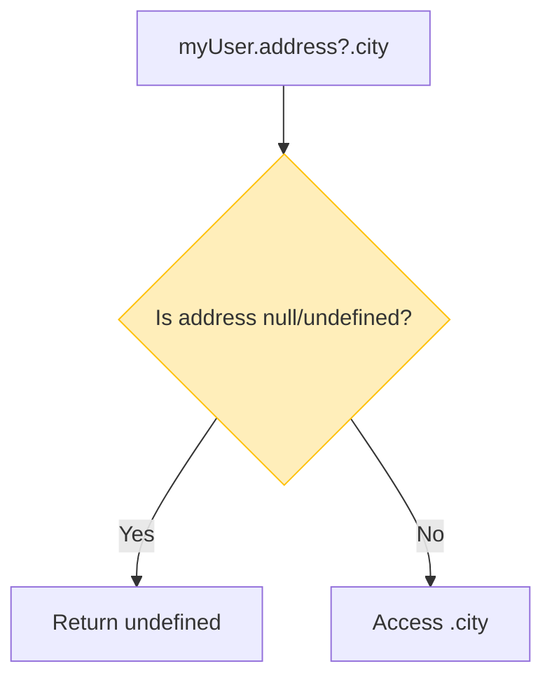

## 🔗 Optional Chaining (`?.`)

នៅពេលយើងធ្វើការជាមួយ Object ដែលមានជម្រៅជ្រៅៗ (Nested Objects) ជាពិសេសទិន្នន័យដែលបានមកពី API កូដរបស់អ្នកងាយនឹងគាំងណាស់ ប្រសិនបើអ្នកព្យាយាមអានទិន្នន័យដែលមិនមាន។



```ts
type User = {
  name: string;
  address?: {
    city: string;
    street?: string;
  };
};

const myUser: User = { name: "Ratha" }; // អ្នកប្រើប្រាស់នេះអត់មាន address ទេ
```

កាលពីមុន ដើម្បីចង់ដឹងថាគាត់នៅទីក្រុងណាដោយមិនអោយកូដគាំង យើងត្រូវសរសេរលក្ខខណ្ឌវែងឆ្ងាយ៖
```ts
// របៀបចាស់: ឆែកមើលម្តងមួយៗអោយប្រាកដថាវាមានសិន!
const city = myUser.address !== undefined ? myUser.address.city : undefined;
```

**ដំណោះស្រាយទំនើប `?.`**
ឥឡូវនេះយើងគ្រាន់តែបន្ថែមសញ្ញាសួរនៅពីមុខចុច (`?.`) នោះវាចប់រឿង! វាមានន័យថា "បើមាន `address` ចាំចូលទៅអាន `city` បើគ្មានទេ កុំចូលអានអី (បញ្ឈប់ត្រឹមនេះហើយ return `undefined` មកវិញមក)។"
```ts
// របៀបថ្មី (ខ្លី និងមានសុវត្ថិភាព)
const city = myUser.address?.city; 
```

---

## 🛡️ Nullish Coalescing (`??`)

ជាញឹកញាប់ បន្ទាប់ពីយើងប្រើ Optional Chaining រួច យើងទទួលបានតម្លៃ `undefined`។ ចុះបើបើយើងចង់បង្ហាញពាក្យថា "មិនមានទីក្រុង" ជំនួសអោយពាក្យ `undefined` វិញ តើត្រូវធ្វើដូចម្តេច?

នៅទីនេះហើយដែលសញ្ញា **`??`** ចូលខ្លួនមកជួយ! វាមានន័យថា "យកតម្លៃដែលនៅខាងឆ្វេង ប៉ុន្តែបើខាងឆ្វេងជា `null` ឬ `undefined` ត្រូវយកតម្លៃជំនួសដែលនៅខាងស្តាំវិញ!"។

```ts
// បើ myUser.address?.city ជា undefined នោះវានឹងយកពាក្យ "Unknown City" ជំនួសវិញ
const userCity = myUser.address?.city ?? "Unknown City";

console.log(userCity); // លទ្ធផល: "Unknown City"
```

> 💡 **ចំណាំ:** ហេតុអ្វីមិនប្រើសញ្ញា `||` (OR) ដែលអ្នកធ្លាប់រៀនពីមុន?
> ការប្រើ `||` មានបញ្ហាមួយ គឺវានឹងយកតម្លៃខាងស្តាំជានិច្ចប្រសិនបើខាងឆ្វេងជាតម្លៃ Falsy (ដូចជាលេខ `0`, អក្សរទទេ `""`, ឫ `false`)។ 
> ឧទាហរណ៍ `let speed = 0 || 50;` (លទ្ធផលចេញមក 50 ទាំងដែលគេចង់បានលេខ 0 សោះ)។ 
> ចំណែក `let speed = 0 ?? 50;` លទ្ធផលចេញមក 0 ត្រឹមត្រូវ! ដូច្នេះសូមទម្លាប់ប្រើ `??` សម្រាប់កំណត់ Default Value។
